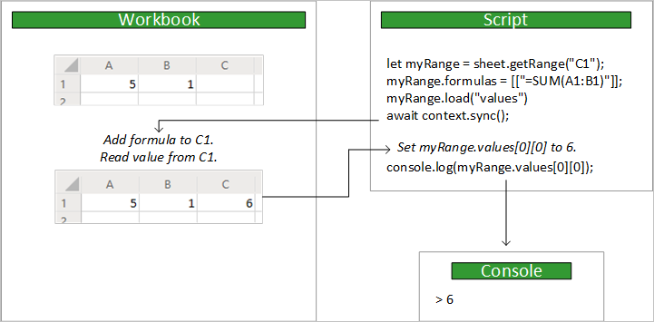

# <a name="support-older-office-scripts-that-use-the-async-apis"></a><span data-ttu-id="1cb20-103">Поддержка старых сценариев Office, использующих асинхронные API</span><span class="sxs-lookup"><span data-stu-id="1cb20-103">Support older Office Scripts that use the async APIs</span></span>

<span data-ttu-id="1cb20-104">В этой статье описывается поддержка и обновление скриптов, использующих асинхронные интерфейсы API модели предыдущих версий.</span><span class="sxs-lookup"><span data-stu-id="1cb20-104">This article will teach you how to maintain and update scripts that use the older model's async APIs.</span></span> <span data-ttu-id="1cb20-105">Эти API имеют те же основные функциональные возможности, что и стандартные, синхронные API сценариев Office, но для управления синхронизацией данных между сценарием и книгой требуется ваш сценарий.</span><span class="sxs-lookup"><span data-stu-id="1cb20-105">These APIs have the same core functionality as the now-standard, synchronous Office Scripts APIs, but they require your script to control the data synchronization between the script and the workbook.</span></span>

> [!IMPORTANT]
> <span data-ttu-id="1cb20-106">Асинхронную модель можно использовать только со скриптами, созданными до реализации текущей [модели API](scripting-fundamentals.md?view=office-scripts).</span><span class="sxs-lookup"><span data-stu-id="1cb20-106">The async model can only be used with scripts created before the implementation of the current [API model](scripting-fundamentals.md?view=office-scripts).</span></span> <span data-ttu-id="1cb20-107">Скрипты окончательно блокируются до модели API, созданной им после создания.</span><span class="sxs-lookup"><span data-stu-id="1cb20-107">Scripts are permanently locked to the API model they have upon creation.</span></span> <span data-ttu-id="1cb20-108">Это также означает, что если вы хотите преобразовать старый скрипт в новую модель, необходимо создать новый сценарий.</span><span class="sxs-lookup"><span data-stu-id="1cb20-108">This also means that if you want to convert an old script to the new model, you must create a brand new script.</span></span> <span data-ttu-id="1cb20-109">Мы рекомендуем обновлять старые сценарии в новой модели при внесении изменений, так как использование текущей модели упрощается.</span><span class="sxs-lookup"><span data-stu-id="1cb20-109">We recommend you update your old scripts to the new model when making changes, since the current model is easier to use.</span></span> <span data-ttu-id="1cb20-110">[Преобразование асинхронных скриптов в текущий раздел модели](#converting-async-scripts-to-the-current-model) содержит советы по переходу на эту стадию.</span><span class="sxs-lookup"><span data-stu-id="1cb20-110">The [Converting async scripts to the current model](#converting-async-scripts-to-the-current-model) section has advice on how to make this transition.</span></span>

## <a name="main-function"></a><span data-ttu-id="1cb20-111">Функция `main`</span><span class="sxs-lookup"><span data-stu-id="1cb20-111">`main` function</span></span>

<span data-ttu-id="1cb20-112">Скрипты, использующие асинхронные API, имеют различные `main` функции.</span><span class="sxs-lookup"><span data-stu-id="1cb20-112">Scripts that use the async APIs have a different `main` function.</span></span> <span data-ttu-id="1cb20-113">Это `async` функция, которая является `Excel.RequestContext` первым параметром.</span><span class="sxs-lookup"><span data-stu-id="1cb20-113">It's an `async` function that has an `Excel.RequestContext` as the first parameter.</span></span>

```TypeScript
async function main(context: Excel.RequestContext) {
    // Your async Office Script
}
```

## <a name="context"></a><span data-ttu-id="1cb20-114">Context</span><span class="sxs-lookup"><span data-stu-id="1cb20-114">Context</span></span>

<span data-ttu-id="1cb20-115">Функция `main` принимает `Excel.RequestContext` параметра с именем `context`.</span><span class="sxs-lookup"><span data-stu-id="1cb20-115">The `main` function accepts an `Excel.RequestContext` parameter, named `context`.</span></span> <span data-ttu-id="1cb20-116">Думайте о `context` как о мосте между вашим сценарием и книгой.</span><span class="sxs-lookup"><span data-stu-id="1cb20-116">Think of `context` as the bridge between your script and the workbook.</span></span> <span data-ttu-id="1cb20-117">Ваш сценарий обращается к книге с помощью `context` объекта и использует этот `context` для отправки данных туда и обратно.</span><span class="sxs-lookup"><span data-stu-id="1cb20-117">Your script accesses the workbook with the `context` object and uses that `context` to send data back and forth.</span></span>

<span data-ttu-id="1cb20-118">Объект `context` необходим, потому что скрипт и Excel работают в разных процессах и местах.</span><span class="sxs-lookup"><span data-stu-id="1cb20-118">The `context` object is necessary because the script and Excel are running in different processes and locations.</span></span> <span data-ttu-id="1cb20-119">Сценарий должен будет внести изменения или запросить данные из рабочей книги в облаке.</span><span class="sxs-lookup"><span data-stu-id="1cb20-119">The script will need to make changes to or query data from the workbook in the cloud.</span></span> <span data-ttu-id="1cb20-120">Объект `context` управляет этими транзакциями.</span><span class="sxs-lookup"><span data-stu-id="1cb20-120">The `context` object manages those transactions.</span></span>

## <a name="sync-and-load"></a><span data-ttu-id="1cb20-121">Синхронизация и загрузка</span><span class="sxs-lookup"><span data-stu-id="1cb20-121">Sync and Load</span></span>

<span data-ttu-id="1cb20-122">Поскольку ваш сценарий и рабочая книга работают в разных местах, любая передача данных между ними занимает много времени.</span><span class="sxs-lookup"><span data-stu-id="1cb20-122">Because your script and workbook run in different locations, any data transfer between the two takes time.</span></span> <span data-ttu-id="1cb20-123">В асинхронном API команды ставятся в очередь до тех пор, пока не будет явно вызвана `sync` операция синхронизации скрипта и рабочей книги.</span><span class="sxs-lookup"><span data-stu-id="1cb20-123">In the async API, commands are queued up until the script explicitly calls the `sync` operation to synchronize the script and workbook.</span></span> <span data-ttu-id="1cb20-124">Ваш скрипт может работать независимо, пока он не выполнит одно из следующих действий:</span><span class="sxs-lookup"><span data-stu-id="1cb20-124">Your script can work independently until it needs to do either of the following:</span></span>

- <span data-ttu-id="1cb20-125">Прочитайте данные из рабочей книги (с помощью операции `load` или метода возвращения [ClientResult](/javascript/api/office-scripts/excelscript/excelscript.clientresult?view=office-scripts-async)).</span><span class="sxs-lookup"><span data-stu-id="1cb20-125">Read data from the workbook (following a `load` operation or method that returns a [ClientResult](/javascript/api/office-scripts/excelscript/excelscript.clientresult?view=office-scripts-async)).</span></span>
- <span data-ttu-id="1cb20-126">Запишите данные в рабочую книгу (обычно потому, что сценарий завершен).</span><span class="sxs-lookup"><span data-stu-id="1cb20-126">Write data to the workbook (usually because the script has finished).</span></span>

<span data-ttu-id="1cb20-127">На следующем рисунке показан пример потока управления между сценарием и книгой:</span><span class="sxs-lookup"><span data-stu-id="1cb20-127">The following image shows an example control flow between the script and workbook:</span></span>



### <a name="sync"></a><span data-ttu-id="1cb20-129">Синхронизировать</span><span class="sxs-lookup"><span data-stu-id="1cb20-129">Sync</span></span>

<span data-ttu-id="1cb20-130">Когда сценарий Async должен считывать данные из книги или записывать данные в нее, вызовите метод, `RequestContext.sync` как показано ниже:</span><span class="sxs-lookup"><span data-stu-id="1cb20-130">Whenever your async script needs to read data from or write data to the workbook, call the `RequestContext.sync` method as shown here:</span></span>

```TypeScript
await context.sync();
```

> [!NOTE]
> <span data-ttu-id="1cb20-131">`context.sync()` неявно вызывается, когда скрипт заканчивается.</span><span class="sxs-lookup"><span data-stu-id="1cb20-131">`context.sync()` is implicitly called when a script ends.</span></span>

<span data-ttu-id="1cb20-132">После завершения операции `sync` книга обновляется, чтобы отразить все операции записи, указанные сценарием.</span><span class="sxs-lookup"><span data-stu-id="1cb20-132">After the `sync` operation completes, the workbook updates to reflect any write operations that script has specified.</span></span> <span data-ttu-id="1cb20-133">Операция записи задает свойство для объекта Excel (например, `range.format.fill.color = "red"` ) или вызывает метод, который изменяет свойство (например, `range.format.autoFitColumns()` ).</span><span class="sxs-lookup"><span data-stu-id="1cb20-133">A write operation is setting any property on a Excel object (e.g., `range.format.fill.color = "red"`) or calling a method that changes a property (e.g., `range.format.autoFitColumns()`).</span></span> <span data-ttu-id="1cb20-134">Операция `sync` также считывает любые значения из рабочей книги, запрошенные сценарием с помощью операции `load` или метода возвращения `ClientResult` (как описано в следующих разделах).</span><span class="sxs-lookup"><span data-stu-id="1cb20-134">The `sync` operation also reads any values from the workbook that the script requested by using a `load` operation or a method that returns a `ClientResult` (as discussed in the next sections).</span></span>

<span data-ttu-id="1cb20-135">Синхронизация вашего сценария с книгой может занять некоторое время, в зависимости от вашей сети.</span><span class="sxs-lookup"><span data-stu-id="1cb20-135">Synchronizing your script with the workbook can take time, depending on your network.</span></span> <span data-ttu-id="1cb20-136">Минимизируйте количество `sync` вызовов, чтобы ускорить выполнение сценария.</span><span class="sxs-lookup"><span data-stu-id="1cb20-136">Minimize the number of `sync` calls to help your script run fast.</span></span> <span data-ttu-id="1cb20-137">В противном случае асинхронные API не будут быстрее стандартными, синхронными API.</span><span class="sxs-lookup"><span data-stu-id="1cb20-137">Otherwise, the async APIs are not faster the standard, synchronous APIs.</span></span>

### <a name="load"></a><span data-ttu-id="1cb20-138">Load</span><span class="sxs-lookup"><span data-stu-id="1cb20-138">Load</span></span>

<span data-ttu-id="1cb20-139">Асинхронный скрипт должен загружать данные из книги, прежде чем считывать их.</span><span class="sxs-lookup"><span data-stu-id="1cb20-139">An async script must load data from the workbook before reading it.</span></span> <span data-ttu-id="1cb20-140">Однако загрузка данных из всей книги значительно сокращает скорость сценария.</span><span class="sxs-lookup"><span data-stu-id="1cb20-140">However, loading data from the entire workbook would greatly reduce the script's speed.</span></span> <span data-ttu-id="1cb20-141">`load`Метод позволяет скрипту указать, какие данные следует извлечь из книги.</span><span class="sxs-lookup"><span data-stu-id="1cb20-141">The `load` method lets your script specifically state what data should be retrieved from the workbook.</span></span>

<span data-ttu-id="1cb20-142">Метод `load` доступен для каждого объекта Excel.</span><span class="sxs-lookup"><span data-stu-id="1cb20-142">The `load` method is available on every Excel object.</span></span> <span data-ttu-id="1cb20-143">Ваш скрипт должен загрузить свойства объекта, прежде чем он сможет их прочитать.</span><span class="sxs-lookup"><span data-stu-id="1cb20-143">Your script must load an object's properties before it can read them.</span></span> <span data-ttu-id="1cb20-144">Это не приведет к ошибке.</span><span class="sxs-lookup"><span data-stu-id="1cb20-144">Not doing so results in an error.</span></span>

<span data-ttu-id="1cb20-145">В следующих примерах объект `Range` используется для демонстрации трех способов использования метода `load` для загрузки данных.</span><span class="sxs-lookup"><span data-stu-id="1cb20-145">The following examples use a `Range` object to show the three ways the `load` method can be used to load data.</span></span>

|<span data-ttu-id="1cb20-146">Intent</span><span class="sxs-lookup"><span data-stu-id="1cb20-146">Intent</span></span> |<span data-ttu-id="1cb20-147">Пример команды</span><span class="sxs-lookup"><span data-stu-id="1cb20-147">Example Command</span></span> | <span data-ttu-id="1cb20-148">Эффект</span><span class="sxs-lookup"><span data-stu-id="1cb20-148">Effect</span></span> |
|:--|:--|:--|
|<span data-ttu-id="1cb20-149">Загрузить одно свойство</span><span class="sxs-lookup"><span data-stu-id="1cb20-149">Load one property</span></span> |`myRange.load("values");` | <span data-ttu-id="1cb20-150">Загружает одно свойство, в данном случае двумерный массив значений в этом диапазоне.</span><span class="sxs-lookup"><span data-stu-id="1cb20-150">Loads a single property, in this case the two-dimensional array of values in this range.</span></span> |
|<span data-ttu-id="1cb20-151">Загрузить несколько свойств</span><span class="sxs-lookup"><span data-stu-id="1cb20-151">Load multiple properties</span></span> |`myRange.load("values, rowCount, columnCount");`| <span data-ttu-id="1cb20-152">Загружает все свойства из списка, разделенного запятыми, в этом примере значения, количество строк и количество столбцов.</span><span class="sxs-lookup"><span data-stu-id="1cb20-152">Loads all the properties from a comma-delimited list, in this example the values, row count, and column count.</span></span> |
|<span data-ttu-id="1cb20-153">Загрузить все</span><span class="sxs-lookup"><span data-stu-id="1cb20-153">Load everything</span></span> | `myRange.load();`|<span data-ttu-id="1cb20-154">Загружает все свойства в диапазоне.</span><span class="sxs-lookup"><span data-stu-id="1cb20-154">Loads all the properties on the range.</span></span> <span data-ttu-id="1cb20-155">Это не рекомендуемое решение, так как оно замедляет выполнение скрипта, получая ненужные данные.</span><span class="sxs-lookup"><span data-stu-id="1cb20-155">This isn't a recommended solution, since it will slow down your script by getting unnecessary data.</span></span> <span data-ttu-id="1cb20-156">Используйте его только при тестировании скрипта или при необходимости для каждого свойства объекта.</span><span class="sxs-lookup"><span data-stu-id="1cb20-156">Only use this while testing your script or if you need every property from the object.</span></span> |

<span data-ttu-id="1cb20-157">Ваш скрипт должен вызывать `context.sync()` перед чтением любых загруженных значений.</span><span class="sxs-lookup"><span data-stu-id="1cb20-157">Your script must call `context.sync()` before reading any loaded values.</span></span>

```TypeScript
/**
 * This script uses the async API to get the row count for a range.
 * It shows how to load a property in the async model.
 */
async function main(context: Excel.RequestContext) {
    let selectedSheet = context.workbook.worksheets.getActiveWorksheet();
    let range = selectedSheet.getRange("A1:B3");

    // Load the property.
    range.load("rowCount");

    // Synchronize with the workbook to get the property.
    await context.sync();

    // Read and log the property value (3).
    console.log(range.rowCount);
}
```

<span data-ttu-id="1cb20-158">Вы также можете загрузить свойства всей коллекции.</span><span class="sxs-lookup"><span data-stu-id="1cb20-158">You can also load properties across an entire collection.</span></span> <span data-ttu-id="1cb20-159">Каждый объект Collection в асинхронном API имеет `items` свойство, которое представляет собой массив, содержащий объекты в этой коллекции.</span><span class="sxs-lookup"><span data-stu-id="1cb20-159">Every collection object in the async API has an `items` property that is an array containing the objects in that collection.</span></span> <span data-ttu-id="1cb20-160">Использование `items` в качестве начала иерархического вызова (`items\myProperty`) для `load` загружает указанные свойства для каждого из этих элементов.</span><span class="sxs-lookup"><span data-stu-id="1cb20-160">Using `items` as the start of a hierarchical call (`items\myProperty`) to `load` loads the specified properties on each of those items.</span></span> <span data-ttu-id="1cb20-161">В следующем примере загружается свойство `resolved` для каждых `Comment` объектов в `CommentCollection` объекте рабочего листа.</span><span class="sxs-lookup"><span data-stu-id="1cb20-161">The following example loads the `resolved` property on every `Comment` object in the `CommentCollection` object of a worksheet.</span></span>

```TypeScript
/**
 * This script uses the async API to get resolved property on every comment in the worksheet.
 * It shows how to load a property from every object in a collection.
 */
async function main(context: Excel.RequestContext){
    let selectedSheet = context.workbook.worksheets.getActiveWorksheet();
    let comments = selectedSheet.comments;

    // Load the `resolved` property from every comment in this collection.
    comments.load("items/resolved");

    // Synchronize with the workbook to get the properties.
    await context.sync();
}
```

### <a name="clientresult"></a><span data-ttu-id="1cb20-162">ClientResult</span><span class="sxs-lookup"><span data-stu-id="1cb20-162">ClientResult</span></span>

<span data-ttu-id="1cb20-163">Методы в асинхронном API, возвращающие сведения из книги, имеют похожий шаблон для `load` / `sync` парадигмы.</span><span class="sxs-lookup"><span data-stu-id="1cb20-163">Methods in the async API that return information from the workbook have a similar pattern to the `load`/`sync` paradigm.</span></span> <span data-ttu-id="1cb20-164">Например, `TableCollection.getCount` получает количество таблиц в коллекции.</span><span class="sxs-lookup"><span data-stu-id="1cb20-164">As an example, `TableCollection.getCount` gets the number of tables in the collection.</span></span> <span data-ttu-id="1cb20-165">`getCount`Возвращает значение `ClientResult<number>` , означающее, что `value` возвращаемое свойство [`ClientResult`](/javascript/api/office-scripts/excelscript/excelscript.clientresult?view=office-scripts-async) является числом.</span><span class="sxs-lookup"><span data-stu-id="1cb20-165">`getCount` returns a `ClientResult<number>`, meaning the `value` property in the returned [`ClientResult`](/javascript/api/office-scripts/excelscript/excelscript.clientresult?view=office-scripts-async) is a number.</span></span> <span data-ttu-id="1cb20-166">Скрипт не может получить доступ к этому значению, пока не вызовет `context.sync()`.</span><span class="sxs-lookup"><span data-stu-id="1cb20-166">Your script can't access that value until `context.sync()` is called.</span></span> <span data-ttu-id="1cb20-167">По аналогии с загрузкой свойства, `value` — это локальное пустое значение до вызова `sync`.</span><span class="sxs-lookup"><span data-stu-id="1cb20-167">Much like loading a property, the `value` is a local "empty" value until that `sync` call.</span></span>

<span data-ttu-id="1cb20-168">Следующий сценарий получает общее количество таблиц в рабочей книге и записывает его в консоль.</span><span class="sxs-lookup"><span data-stu-id="1cb20-168">The following script gets the total number of tables in the workbook and logs that number to the console.</span></span>

```TypeScript
/**
 * This script uses the async API to get the table count of the workbook.
 * It shows how ClientResult objects return workbook information.
 */
async function main(context: Excel.RequestContext) {
    let tableCount = context.workbook.tables.getCount();

    // This sync call implicitly loads tableCount.value.
    // Any other ClientResult values are loaded too.
    await context.sync();

    // Trying to log the value before calling sync would throw an error.
    console.log(tableCount.value);
}
```

## <a name="converting-async-scripts-to-the-current-model"></a><span data-ttu-id="1cb20-169">Преобразование асинхронных скриптов в текущую модель</span><span class="sxs-lookup"><span data-stu-id="1cb20-169">Converting async scripts to the current model</span></span>

<span data-ttu-id="1cb20-170">В текущей модели API не используется `load` , `sync` или `RequestContext` .</span><span class="sxs-lookup"><span data-stu-id="1cb20-170">The current API model doesn't use `load`, `sync`, or a `RequestContext`.</span></span> <span data-ttu-id="1cb20-171">Благодаря этому скрипты значительно упрощают процесс записи и обслуживания.</span><span class="sxs-lookup"><span data-stu-id="1cb20-171">This makes the scripts much easier to write and maintain.</span></span> <span data-ttu-id="1cb20-172">Лучший ресурс для преобразования старых сценариев — [переполнение стека](https://stackoverflow.com/questions/tagged/office-scripts).</span><span class="sxs-lookup"><span data-stu-id="1cb20-172">Your best resource for converting old scripts is [Stack Overflow](https://stackoverflow.com/questions/tagged/office-scripts).</span></span> <span data-ttu-id="1cb20-173">В этом случае вы можете обратиться к сообществу для получения справки по определенным сценариям.</span><span class="sxs-lookup"><span data-stu-id="1cb20-173">There, you can ask the community for help with specific scenarios.</span></span> <span data-ttu-id="1cb20-174">Следующие рекомендации должны помочь в структурировании общих действий, которые необходимо выполнить.</span><span class="sxs-lookup"><span data-stu-id="1cb20-174">The following guidance should help outline the general steps you'll need to take.</span></span>

1. <span data-ttu-id="1cb20-175">Создайте новый скрипт и скопируйте в него старый асинхронный код.</span><span class="sxs-lookup"><span data-stu-id="1cb20-175">Create a new script and copy the old async code into it.</span></span> <span data-ttu-id="1cb20-176">Не включайте старую `main` подпись метода, используя `function main(workbook: ExcelScript.Workbook)` вместо нее текущую.</span><span class="sxs-lookup"><span data-stu-id="1cb20-176">Be sure not to include the old `main` method signature, using the current `function main(workbook: ExcelScript.Workbook)` instead.</span></span>

2. <span data-ttu-id="1cb20-177">Удаление всех `load` вызовов и `sync` вызовов.</span><span class="sxs-lookup"><span data-stu-id="1cb20-177">Remove all the `load` and `sync` calls.</span></span> <span data-ttu-id="1cb20-178">Они больше не нужны.</span><span class="sxs-lookup"><span data-stu-id="1cb20-178">They are no longer necessary.</span></span>

3. <span data-ttu-id="1cb20-179">Удалены все свойства.</span><span class="sxs-lookup"><span data-stu-id="1cb20-179">All properties have been removed.</span></span> <span data-ttu-id="1cb20-180">Теперь вы получаете доступ к этим объектам `get` и `set` методам, поэтому вам потребуется переключить ссылки этих свойств на вызовы методов.</span><span class="sxs-lookup"><span data-stu-id="1cb20-180">You now access those objects through `get` and `set` methods, so you'll need to switch those property references to method calls.</span></span> <span data-ttu-id="1cb20-181">Например, вместо настройки цвета заливки ячейки с помощью доступа к свойству, как показано ниже: `mySheet.getRange("A2:C2").format.fill.color = "blue";` , вы можете использовать такие методы, как:`mySheet.getRange("A2:C2").getFormat().getFill().setColor("blue");`</span><span class="sxs-lookup"><span data-stu-id="1cb20-181">For example, instead of setting a cell's fill color through property access like this: `mySheet.getRange("A2:C2").format.fill.color = "blue";`, you'll now use methods like this: `mySheet.getRange("A2:C2").getFormat().getFill().setColor("blue");`</span></span>

4. <span data-ttu-id="1cb20-182">Классы коллекций заменены на массивы.</span><span class="sxs-lookup"><span data-stu-id="1cb20-182">Collection classes have been replaced by arrays.</span></span> <span data-ttu-id="1cb20-183">`add`Методы и для `get` этих классов коллекций были перемещены в объект, который владеет коллекцией, поэтому ваши ссылки должны быть соответствующим образом обновлены.</span><span class="sxs-lookup"><span data-stu-id="1cb20-183">The `add` and `get` methods of those collection classes were moved to the object that owned the collection, so your references must be updated accordingly.</span></span> <span data-ttu-id="1cb20-184">Например, чтобы получить диаграмму с именем "myChart устанавливается подпись" на первом листе книги, используйте следующий код: `workbook.getWorksheets()[0].getChart("MyChart");` .</span><span class="sxs-lookup"><span data-stu-id="1cb20-184">For example, to get a chart named "MyChart" from the first worksheet in the workbook, use the following code: `workbook.getWorksheets()[0].getChart("MyChart");`.</span></span> <span data-ttu-id="1cb20-185">Обратите внимание на то, что `[0]` нужно получить доступ к первому значению, `Worksheet[]` возвращенному методом `getWorksheets()` .</span><span class="sxs-lookup"><span data-stu-id="1cb20-185">Note the `[0]` to access the first value of the `Worksheet[]` returned by `getWorksheets()`.</span></span>

5. <span data-ttu-id="1cb20-186">Некоторые методы были переименованы для ясности и добавлены для удобства.</span><span class="sxs-lookup"><span data-stu-id="1cb20-186">Some methods have been renamed for clarity and added for convenience.</span></span> <span data-ttu-id="1cb20-187">Дополнительные сведения см. в [справочнике по API сценариев Office](/javascript/api/office-scripts/overview?view=office-scripts) .</span><span class="sxs-lookup"><span data-stu-id="1cb20-187">Please consult the [Office Scripts API reference](/javascript/api/office-scripts/overview?view=office-scripts) for more details.</span></span>

## <a name="office-scripts-async-api-reference-documentation"></a><span data-ttu-id="1cb20-188">Справочная документация по асинхронному API для сценариев Office</span><span class="sxs-lookup"><span data-stu-id="1cb20-188">Office Scripts Async API reference documentation</span></span>

[!INCLUDE [Async reference documentation](../includes/async-reference-documentation-link.md)]
