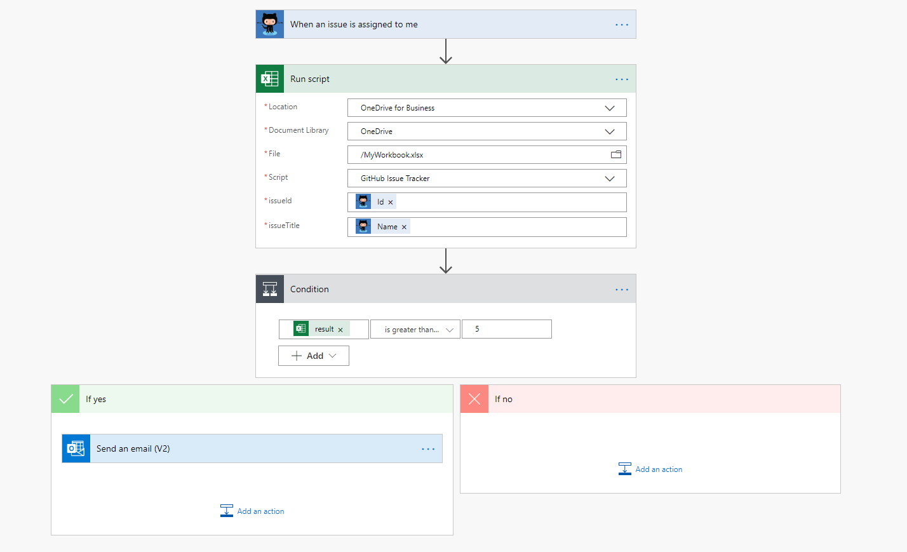

# <a name="run-office-scripts-with-power-automate"></a><span data-ttu-id="f79be-103">Запуск сценариев Office с помощью автоматизации управления питанием</span><span class="sxs-lookup"><span data-stu-id="f79be-103">Run Office Scripts with Power Automate</span></span>

<span data-ttu-id="f79be-104">[Power автоматизиру](https://flow.microsoft.com) позволяет добавлять скрипты Office в более крупный автоматизированный рабочий процесс.</span><span class="sxs-lookup"><span data-stu-id="f79be-104">[Power Automate](https://flow.microsoft.com) lets you add Office Scripts to a larger, automated workflow.</span></span> <span data-ttu-id="f79be-105">Вы можете использовать автоматизацию управления питанием, например добавить содержимое электронной почты в таблицу листа или создать действия в средствах управления проектами на основе комментариев к книгам.</span><span class="sxs-lookup"><span data-stu-id="f79be-105">You can use Power Automate do things like add the contents of an email to a worksheet's table or create actions in your project management tools based on workbook comments.</span></span> <span data-ttu-id="f79be-106">Если вы впервые используете автоматизированное управление питанием, рекомендуем [ознакомиться со статьей "начать автоматизацию](/power-automate/getting-started)".</span><span class="sxs-lookup"><span data-stu-id="f79be-106">If you are new to Power Automate, we recommend visiting [Get started with Power Automate](/power-automate/getting-started).</span></span> <span data-ttu-id="f79be-107">Здесь вы можете узнать больше об автоматизации рабочих процессов для нескольких служб.</span><span class="sxs-lookup"><span data-stu-id="f79be-107">There, you can learn more about automating your workflows across multiple services.</span></span>

> [!IMPORTANT]
> <span data-ttu-id="f79be-108">В настоящее время вы не можете запускать сценарии Office из [общего потока](/power-automate/share-buttons).</span><span class="sxs-lookup"><span data-stu-id="f79be-108">Currently, you can't run Office Scripts from a [shared flow](/power-automate/share-buttons).</span></span> <span data-ttu-id="f79be-109">Только пользователь, создавший сценарий, может запускать его, даже если вы автоматизируем Power.</span><span class="sxs-lookup"><span data-stu-id="f79be-109">Only the user who created a script can run it, even through Power Automate.</span></span>

## <a name="getting-started"></a><span data-ttu-id="f79be-110">Начало работы</span><span class="sxs-lookup"><span data-stu-id="f79be-110">Getting started</span></span>

<span data-ttu-id="f79be-111">Чтобы приступить к объединению сценариев Power автоматизированного и Office, следуйте рекомендациям, описанным в разделе [starting Scripts with Power Автоматизация](../tutorials/excel-power-automate-manual.md).</span><span class="sxs-lookup"><span data-stu-id="f79be-111">To begin combining Power Automate and Office Scripts, follow the tutorial [Start using scripts with Power Automate](../tutorials/excel-power-automate-manual.md).</span></span> <span data-ttu-id="f79be-112">С его помощью вы узнаете, как создать последовательность, вызывающую простой сценарий.</span><span class="sxs-lookup"><span data-stu-id="f79be-112">This will teach you how to create a flow that calls a simple script.</span></span> <span data-ttu-id="f79be-113">После выполнения этого руководства и [автоматического запуска сценариев с помощью автоматизированных автоматизированных потоков управления](../tutorials/excel-power-automate-trigger.md) вернитесь сюда, чтобы получить подробные сведения о подключении сценариев Office к автоматизированным потокам.</span><span class="sxs-lookup"><span data-stu-id="f79be-113">After you've completed that tutorial and the [Automatically run scripts with automated Power Automate flows](../tutorials/excel-power-automate-trigger.md) tutorial, return here for detailed information about connecting Office Scripts to Power Automate flows.</span></span>

## <a name="excel-online-business-connector"></a><span data-ttu-id="f79be-114">Соединитель Excel Online (Business)</span><span class="sxs-lookup"><span data-stu-id="f79be-114">Excel Online (Business) connector</span></span>

<span data-ttu-id="f79be-115">[Соединители](/connectors/connectors) — это мосты между автоматизированной автоматизацией и приложениями.</span><span class="sxs-lookup"><span data-stu-id="f79be-115">[Connectors](/connectors/connectors) are the bridges between Power Automate and applications.</span></span> <span data-ttu-id="f79be-116">[Соединитель Excel Online (Business)](/connectors/excelonlinebusiness) предоставляет потокам доступ к книгам Excel.</span><span class="sxs-lookup"><span data-stu-id="f79be-116">The [Excel Online (Business) connector](/connectors/excelonlinebusiness) gives your flows access to Excel workbooks.</span></span> <span data-ttu-id="f79be-117">Действие "Запуск скрипта" позволяет вызывать любой сценарий Office, доступный через выбранную книгу.</span><span class="sxs-lookup"><span data-stu-id="f79be-117">The "Run script" action lets you call any Office Script accessible through the selected workbook.</span></span> <span data-ttu-id="f79be-118">Вы не можете выполнять сценарии с помощью потока, вы можете передавать данные в книгу и из нее с помощью скриптов.</span><span class="sxs-lookup"><span data-stu-id="f79be-118">Not only can you run scripts through a flow, you can pass data to and from the workbook with the flow through the scripts.</span></span>

> [!IMPORTANT]
> <span data-ttu-id="f79be-119">Действие "Запуск скрипта" дает пользователям, использующим Microsoft Connector, значительный доступ к книге и ее данным.</span><span class="sxs-lookup"><span data-stu-id="f79be-119">The "Run script" action gives people who use the Excel connector significant access to your workbook and its data.</span></span> <span data-ttu-id="f79be-120">Кроме того, существуют риски, связанные с безопасностью, с помощью скриптов, которые выполняют внешние вызовы API, как описано во [внешних вызовах от автоматизации Powering](external-calls.md).</span><span class="sxs-lookup"><span data-stu-id="f79be-120">Additionally, there are security risks with scripts that make external API calls, as explained in [External calls from Power Automate](external-calls.md).</span></span> <span data-ttu-id="f79be-121">Если администратор имеет дело с очень конфиденциальными данными, он может либо отключить Microsoft Excel Online Connector, либо ограничить доступ к сценариям Office с помощью [сценариев Office](https://support.microsoft.com/office/19d3c51a-6ca2-40ab-978d-60fa49554dcf).</span><span class="sxs-lookup"><span data-stu-id="f79be-121">If your admin is concerned with the exposure of highly sensitive data, they can either turn off the Excel Online connector or restrict access to Office Scripts through the [Office Scripts administrator controls](https://support.microsoft.com/office/19d3c51a-6ca2-40ab-978d-60fa49554dcf).</span></span>

## <a name="data-transfer-in-flows-for-scripts"></a><span data-ttu-id="f79be-122">Передача данных в потоках для сценариев</span><span class="sxs-lookup"><span data-stu-id="f79be-122">Data transfer in flows for scripts</span></span>

<span data-ttu-id="f79be-123">Power автоматизиру позволяет передавать фрагменты данных между действиями в рамках своего процесса.</span><span class="sxs-lookup"><span data-stu-id="f79be-123">Power Automate lets you pass pieces of data between steps of your flow.</span></span> <span data-ttu-id="f79be-124">Сценарии можно настроить так, чтобы они принимали нужные вам типы сведений и возвращать что угодно из вашей книги, которую вы хотите использовать в вашем движении.</span><span class="sxs-lookup"><span data-stu-id="f79be-124">Scripts can be configured to accept whatever types of information you need and return anything from your workbook that you want in your flow.</span></span> <span data-ttu-id="f79be-125">Входные данные для вашего скрипта задаются путем добавления параметров в `main` функцию (в дополнение к `workbook: ExcelScript.Workbook` ).</span><span class="sxs-lookup"><span data-stu-id="f79be-125">Input for your script is specified by adding parameters to the `main` function (in addition to `workbook: ExcelScript.Workbook`).</span></span> <span data-ttu-id="f79be-126">Выходные данные сценария объявляются путем добавления типа возвращаемого значения в `main` .</span><span class="sxs-lookup"><span data-stu-id="f79be-126">Output from the script is declared by adding a return type to `main`.</span></span>

> [!NOTE]
> <span data-ttu-id="f79be-127">Когда вы передаете блок "Run script", будут заполнены допустимые параметры и возвращаемые типы.</span><span class="sxs-lookup"><span data-stu-id="f79be-127">When you create a "Run Script" block in you flow, the accepted parameters and returned types are populated.</span></span> <span data-ttu-id="f79be-128">Если вы изменяете параметры или типы возвращаемых данных в вашем сценарии, вам потребуется повторить блок потока "Run script".</span><span class="sxs-lookup"><span data-stu-id="f79be-128">If you change the parameters or return types of your script, you'll need to redo the "Run script" block of your flow.</span></span> <span data-ttu-id="f79be-129">Это гарантирует, что данные анализируются правильно.</span><span class="sxs-lookup"><span data-stu-id="f79be-129">This ensure the data is being parsed correctly.</span></span>

<span data-ttu-id="f79be-130">В следующих разделах рассматриваются входные и выходные данные для сценариев, используемых в автоматизации Powering.</span><span class="sxs-lookup"><span data-stu-id="f79be-130">The following sections cover the details of input and output for scripts used in Power Automate.</span></span> <span data-ttu-id="f79be-131">Если вы хотите получить практический подход для изучения этого раздела, ознакомьтесь со статьей " [Автоматический запуск сценариев с автоматизированным автоматизированным циклом управления](../tutorials/excel-power-automate-trigger.md) " или изучите пример сценария [автоматизированной задачи "напоминания](../resources/scenarios/task-reminders.md) ".</span><span class="sxs-lookup"><span data-stu-id="f79be-131">If you'd like a hands-on approach to learning this topic, try out the [Automatically run scripts with automated Power Automate flows](../tutorials/excel-power-automate-trigger.md) tutorial or explore the [Automated task reminders](../resources/scenarios/task-reminders.md) sample scenario.</span></span>

### <a name="main-parameters-passing-data-to-a-script"></a><span data-ttu-id="f79be-132">`main`Параметры: передача данных в скрипт</span><span class="sxs-lookup"><span data-stu-id="f79be-132">`main` Parameters: Passing data to a script</span></span>

<span data-ttu-id="f79be-133">Все входные данные сценария указываются как дополнительные параметры `main` функции.</span><span class="sxs-lookup"><span data-stu-id="f79be-133">All script input is specified as additional parameters for the `main` function.</span></span> <span data-ttu-id="f79be-134">Например, если вы хотите, чтобы сценарий принимал объект `string` , представляющий имя в качестве входных данных, вы можете изменить `main` подпись на `function main(workbook: ExcelScript.Workbook, name: string)` .</span><span class="sxs-lookup"><span data-stu-id="f79be-134">For example, if you wanted a script to accept a `string` that represents a name as input, you would change the `main` signature to `function main(workbook: ExcelScript.Workbook, name: string)`.</span></span>

<span data-ttu-id="f79be-135">Когда вы настраиваете потоки в Power Автоматизация, вы можете указать входные данные скрипта в виде статических значений, [выражений](/power-automate/use-expressions-in-conditions)или динамического содержимого.</span><span class="sxs-lookup"><span data-stu-id="f79be-135">When you're configuring a flow in Power Automate, you can specify script input as static values, [expressions](/power-automate/use-expressions-in-conditions), or dynamic content.</span></span> <span data-ttu-id="f79be-136">Подробные сведения о соединителе отдельных служб можно найти в [документации Power автоматизиру Connector](/connectors/).</span><span class="sxs-lookup"><span data-stu-id="f79be-136">Details on an individual service's connector can be found in the [Power Automate Connector documentation](/connectors/).</span></span>

<span data-ttu-id="f79be-137">При добавлении входных параметров в функцию сценария `main` учитывайте следующие ограничения и ограничения.</span><span class="sxs-lookup"><span data-stu-id="f79be-137">When adding input parameters to a script's `main` function, consider the following allowances and restrictions.</span></span>

1. <span data-ttu-id="f79be-138">Первый параметр должен иметь тип `ExcelScript.Workbook` .</span><span class="sxs-lookup"><span data-stu-id="f79be-138">The first parameter must be of type `ExcelScript.Workbook`.</span></span> <span data-ttu-id="f79be-139">Имя параметра не имеет значения.</span><span class="sxs-lookup"><span data-stu-id="f79be-139">Its parameter name does not matter.</span></span>

2. <span data-ttu-id="f79be-140">Каждый параметр должен иметь тип.</span><span class="sxs-lookup"><span data-stu-id="f79be-140">Every parameter must have a type.</span></span>

3. <span data-ttu-id="f79be-141">Основные типы,,,,,, `string` `number` `boolean` `any` `unknown` `object` и `undefined` поддерживаются.</span><span class="sxs-lookup"><span data-stu-id="f79be-141">The basic types `string`, `number`, `boolean`, `any`, `unknown`, `object`, and `undefined` are supported.</span></span>

4. <span data-ttu-id="f79be-142">Массивы приведенных выше базовых типов поддерживаются.</span><span class="sxs-lookup"><span data-stu-id="f79be-142">Arrays of the previously listed basic types are supported.</span></span>

5. <span data-ttu-id="f79be-143">Вложенные массивы поддерживаются в качестве параметров (но не как типы возвращаемого значения).</span><span class="sxs-lookup"><span data-stu-id="f79be-143">Nested arrays are supported as parameters (but not as return types).</span></span>

6. <span data-ttu-id="f79be-144">Типы Union разрешены, если они являются объединением литералов, принадлежащих одному типу ( `string` , `number` или `boolean` ).</span><span class="sxs-lookup"><span data-stu-id="f79be-144">Union types are allowed if they are a union of literals belonging to a single type (`string`, `number`, or `boolean`).</span></span> <span data-ttu-id="f79be-145">Также поддерживаются объединения поддерживаемого типа с неопределенными.</span><span class="sxs-lookup"><span data-stu-id="f79be-145">Unions of a supported type with undefined are also supported.</span></span>

7. <span data-ttu-id="f79be-146">Типы объектов разрешены, если они содержат свойства типа `string` , `number` , `boolean` , поддерживаемых массивов или других поддерживаемых объектов.</span><span class="sxs-lookup"><span data-stu-id="f79be-146">Object types are allowed if they contain properties of type `string`, `number`, `boolean`, supported arrays, or other supported objects.</span></span> <span data-ttu-id="f79be-147">В следующем примере показаны вложенные объекты, которые поддерживаются как типы параметров:</span><span class="sxs-lookup"><span data-stu-id="f79be-147">The following example shows nested objects that are supported as parameter types:</span></span>

    ```TypeScript
    // Office Scripts can return an Employee object because Position only contains strings and numbers.
    interface Employee {
        name: string;
        job: Position;
    }

    interface Position {
        id: number;
        title: string;
    }
    ```

8. <span data-ttu-id="f79be-148">Объекты должны иметь определение интерфейса или класса, определенное в сценарии.</span><span class="sxs-lookup"><span data-stu-id="f79be-148">Objects must have their interface or class definition defined in the script.</span></span> <span data-ttu-id="f79be-149">Объект также может быть определен анонимно, как показано в следующем примере:</span><span class="sxs-lookup"><span data-stu-id="f79be-149">An object can also be defined anonymously inline, as in the following example:</span></span>

    ```TypeScript
    function main(workbook: ExcelScript.Workbook): {name: string, email: string}
    ```

9. <span data-ttu-id="f79be-150">Необязательные параметры разрешены и могут быть отмечены с помощью необязательного модификатора `?` (например, `function main(workbook: ExcelScript.Workbook, Name?: string)` ).</span><span class="sxs-lookup"><span data-stu-id="f79be-150">Optional parameters are allowed and can be denoted as such by using the optional modifier `?` (for example, `function main(workbook: ExcelScript.Workbook, Name?: string)`).</span></span>

10. <span data-ttu-id="f79be-151">Допустимые значения параметров по умолчанию (например `async function main(workbook: ExcelScript.Workbook, Name: string = 'Jane Doe')` ,.</span><span class="sxs-lookup"><span data-stu-id="f79be-151">Default parameter values are allowed (for example `async function main(workbook: ExcelScript.Workbook, Name: string = 'Jane Doe')`.</span></span>

## <a name="returning-data-from-a-script"></a><span data-ttu-id="f79be-152">Возвращение данных из скрипта</span><span class="sxs-lookup"><span data-stu-id="f79be-152">Returning data from a script</span></span>

<span data-ttu-id="f79be-153">Скрипты могут возвращать данные из книги для использования в качестве динамического контента в автоматизированном блоке управления питанием.</span><span class="sxs-lookup"><span data-stu-id="f79be-153">Scripts can return data from the workbook to be used as dynamic content in a Power Automate flow.</span></span> <span data-ttu-id="f79be-154">Как и в случае с входными параметрами, Автоматизация управления питанием применяет некоторые ограничения к типу возвращаемого значения.</span><span class="sxs-lookup"><span data-stu-id="f79be-154">As with input parameters, Power Automate places some restrictions on the return type.</span></span>

1. <span data-ttu-id="f79be-155">Поддерживаются основные типы,,,, `string` `number` `boolean` `void` и `undefined` .</span><span class="sxs-lookup"><span data-stu-id="f79be-155">The basic types `string`, `number`, `boolean`, `void`, and `undefined` are supported.</span></span>

2. <span data-ttu-id="f79be-156">Типы объединения, используемые в качестве возвращаемых типов, действуют с теми же ограничениями, что и при использовании в качестве параметров сценария.</span><span class="sxs-lookup"><span data-stu-id="f79be-156">Union types used as return types follow the same restrictions as they do when used as script parameters.</span></span>

3. <span data-ttu-id="f79be-157">Типы массивов разрешены, если они имеют тип `string` , `number` или `boolean` .</span><span class="sxs-lookup"><span data-stu-id="f79be-157">Array types are allowed if they are of type `string`, `number`, or `boolean`.</span></span> <span data-ttu-id="f79be-158">Они также разрешены, если тип является поддерживаемым объединением или поддерживаемым типом литерала.</span><span class="sxs-lookup"><span data-stu-id="f79be-158">They are also allowed if the type is a supported union or supported literal type.</span></span>

4. <span data-ttu-id="f79be-159">Типы объектов, используемые в качестве возвращаемых типов, действуют с теми же ограничениями, что и при использовании в качестве параметров сценария.</span><span class="sxs-lookup"><span data-stu-id="f79be-159">Object types used as return types follow the same restrictions as they do when used as script parameters.</span></span>

5. <span data-ttu-id="f79be-160">Неявная типизация поддерживается, несмотря на то, что они должны следовать тем же правилам, что и определенный тип.</span><span class="sxs-lookup"><span data-stu-id="f79be-160">Implicit typing is supported, though it must follow the same rules as a defined type.</span></span>

## <a name="avoid-using-relative-references"></a><span data-ttu-id="f79be-161">Избегайте использования относительных ссылок</span><span class="sxs-lookup"><span data-stu-id="f79be-161">Avoid using relative references</span></span>

<span data-ttu-id="f79be-162">Power автоматизирует выполнение вашего сценария в выбранной книге Excel от вашего имени.</span><span class="sxs-lookup"><span data-stu-id="f79be-162">Power Automate runs your script in the chosen Excel workbook on your behalf.</span></span> <span data-ttu-id="f79be-163">В этом случае книга может быть закрыта.</span><span class="sxs-lookup"><span data-stu-id="f79be-163">The workbook might be closed when this happens.</span></span> <span data-ttu-id="f79be-164">Любой API, зависящий от текущего состояния пользователя (например `Workbook.getActiveWorksheet` ,), не будет работать при использовании автоматизации Powering.</span><span class="sxs-lookup"><span data-stu-id="f79be-164">Any API that relies on the user's current state, such as `Workbook.getActiveWorksheet`, will fail when run through Power Automate.</span></span> <span data-ttu-id="f79be-165">При проектировании скриптов обязательно используйте абсолютные ссылки на листы и диапазоны.</span><span class="sxs-lookup"><span data-stu-id="f79be-165">When designing your scripts, be sure to use absolute references for worksheets and ranges.</span></span>

<span data-ttu-id="f79be-166">Приведенные ниже функции вызовут ошибку и завершатся ошибкой при вызове из скрипта в блоке автоматизации Power.</span><span class="sxs-lookup"><span data-stu-id="f79be-166">The following functions will throw an error and fail when called from a script in a Power Automate flow.</span></span>

- `Chart.activate`
- `Range.select`
- `Workbook.getActiveCell`
- `Workbook.getActiveChart`
- `Workbook.getActiveChartOrNullObject`
- `Workbook.getActiveSlicer`
- `Workbook.getActiveSlicerOrNullObject`
- `Workbook.getActiveWorksheet`
- `Workbook.getSelectedRange`
- `Workbook.getSelectedRanges`
- `Worksheet.activate`

## <a name="example"></a><span data-ttu-id="f79be-167">Пример</span><span class="sxs-lookup"><span data-stu-id="f79be-167">Example</span></span>

<span data-ttu-id="f79be-168">На следующем снимке экрана показан процесс автоматизации Power, который срабатывает при назначении вопроса [GitHub](https://github.com/) .</span><span class="sxs-lookup"><span data-stu-id="f79be-168">The following screenshot shows a Power Automate flow that's triggered whenever a [GitHub](https://github.com/) issue is assigned to you.</span></span> <span data-ttu-id="f79be-169">Поток выполняет сценарий, который добавляет ошибку в таблицу в книге Excel.</span><span class="sxs-lookup"><span data-stu-id="f79be-169">The flow runs a script that adds the issue to a table in an Excel workbook.</span></span> <span data-ttu-id="f79be-170">Если в этой таблице имеется пять или более проблем, посылается напоминание по электронной почте.</span><span class="sxs-lookup"><span data-stu-id="f79be-170">If there are five or more issues in that table, the flow sends an email reminder.</span></span>



<span data-ttu-id="f79be-172">`main`Функция скрипта ЗАДАЕТ идентификатор вопроса и заголовок вопроса в качестве входных параметров, а скрипт возвращает количество строк в таблице "ошибка".</span><span class="sxs-lookup"><span data-stu-id="f79be-172">The `main` function of the script specifies the issue ID and issue title as input parameters, and the script returns the number of rows in the issue table.</span></span>

```TypeScript
function main(
  workbook: ExcelScript.Workbook,
  issueId: string,
  issueTitle: string): number {
  // Get the "GitHub" worksheet.
  let worksheet = workbook.getWorksheet("GitHub");

  // Get the first table in this worksheet, which contains the table of GitHub issues.
  let issueTable = worksheet.getTables()[0];

  // Add the issue ID and issue title as a row.
  issueTable.addRow(-1, [issueId, issueTitle]);

  // Return the number of rows in the table, which represents how many issues are assigned to this user.
  return issueTable.getRangeBetweenHeaderAndTotal().getRowCount();
}
```

## <a name="see-also"></a><span data-ttu-id="f79be-173">См. также</span><span class="sxs-lookup"><span data-stu-id="f79be-173">See also</span></span>

- [<span data-ttu-id="f79be-174">Запуск сценариев Office в Excel в Интернете с помощью Power автоматизиру</span><span class="sxs-lookup"><span data-stu-id="f79be-174">Run Office Scripts in Excel on the web with Power Automate</span></span>](../tutorials/excel-power-automate-manual.md)
- [<span data-ttu-id="f79be-175">Автоматический запуск сценариев с автоматизированными потоками автоматизации управления</span><span class="sxs-lookup"><span data-stu-id="f79be-175">Automatically run scripts with automated Power Automate flows</span></span>](../tutorials/excel-power-automate-trigger.md)
- [<span data-ttu-id="f79be-176">Основы сценариев для сценариев Office в Excel в Интернете</span><span class="sxs-lookup"><span data-stu-id="f79be-176">Scripting fundamentals for Office Scripts in Excel on the web</span></span>](scripting-fundamentals.md)
- [<span data-ttu-id="f79be-177">Начало работы с Power Automate</span><span class="sxs-lookup"><span data-stu-id="f79be-177">Get started with Power Automate</span></span>](/power-automate/getting-started)
- [<span data-ttu-id="f79be-178">Справочная документация по Microsoft Online Connector (бизнес)</span><span class="sxs-lookup"><span data-stu-id="f79be-178">Excel Online (Business) connector reference documentation</span></span>](/connectors/excelonlinebusiness/)
