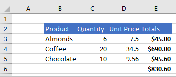
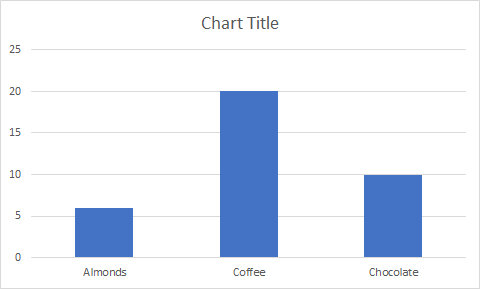

# <a name="scripting-fundamentals-for-office-scripts-in-excel-on-the-web-preview"></a><span data-ttu-id="efb97-103">Основы сценариев для сценариев Office в Excel в Интернете (предварительная версия)</span><span class="sxs-lookup"><span data-stu-id="efb97-103">Scripting fundamentals for Office Scripts in Excel on the web (preview)</span></span>

<span data-ttu-id="efb97-104">Эта статья познакомит вас с техническими аспектами сценариев Office.</span><span class="sxs-lookup"><span data-stu-id="efb97-104">This article will introduce you to the technical aspects of Office Scripts.</span></span> <span data-ttu-id="efb97-105">Вы узнаете, как объекты Excel работают вместе и как редактор кода синхронизируется с книгой.</span><span class="sxs-lookup"><span data-stu-id="efb97-105">You'll learn how the Excel objects work together and how the Code Editor synchronizes with a workbook.</span></span>

[!INCLUDE [Preview note](../includes/preview-note.md)]

## <a name="main-function"></a><span data-ttu-id="efb97-106">Функция `main`</span><span class="sxs-lookup"><span data-stu-id="efb97-106">`main` function</span></span>

<span data-ttu-id="efb97-107">Каждый сценарий Office должен содержать функцию `main` с типом `ExcelScript.Workbook` в качестве первого параметра.</span><span class="sxs-lookup"><span data-stu-id="efb97-107">Each Office Script must contain the `main` function with the `ExcelScript.Workbook` type as its first parameter.</span></span> <span data-ttu-id="efb97-108">При выполнении этой функции приложение Excel вызывает эту функцию `main`, предоставляя книгу в качестве ее первого параметра.</span><span class="sxs-lookup"><span data-stu-id="efb97-108">When the function is executed, Excel application invokes this `main` function by providing the workbook as its first parameter.</span></span> <span data-ttu-id="efb97-109">Поэтому важно не изменять базовую подпись функции `main` после записи сценария или создания нового сценария в редакторе кода.</span><span class="sxs-lookup"><span data-stu-id="efb97-109">Hence, it is important to not modify the basic signature of the `main` function once you have either recorded the script or created a new script from the code editor.</span></span>

```typescript
function main(workbook: ExcelScript.Workbook) {
// Your code goes here
}
```

<span data-ttu-id="efb97-110">Код внутри `main` функции запускается при запуске скрипта.</span><span class="sxs-lookup"><span data-stu-id="efb97-110">The code inside the `main` function runs when the script is run.</span></span> <span data-ttu-id="efb97-111">`main` может вызывать другие функции в вашем скрипте, но код, который не содержится в функции, не будет работать.</span><span class="sxs-lookup"><span data-stu-id="efb97-111">`main` can call other functions in your script, but code that's not contained in a function will not run.</span></span>

> [!CAUTION]
> <span data-ttu-id="efb97-112">Если ваша функция `main` выглядит как `async function main(context: Excel.RequestContext)`, то сценарий использует устаревшую асинхронную модель API.</span><span class="sxs-lookup"><span data-stu-id="efb97-112">If your `main` function looks like `async function main(context: Excel.RequestContext)`, then your script is using the legacy, async API model.</span></span> <span data-ttu-id="efb97-113">Дополнительные сведения, включая сведения о преобразовании устаревших сценариев в текущую модель API, см. в статье [Использование асинхронных API сценариев Office для поддержки устаревших сценариев](excel-async-model.md).</span><span class="sxs-lookup"><span data-stu-id="efb97-113">Please refer to [Using the Office Scripts Async APIs to support legacy scripts](excel-async-model.md) for more information, including how to convert your older script to the current API model.</span></span>

## <a name="object-model"></a><span data-ttu-id="efb97-114">Объектная модель</span><span class="sxs-lookup"><span data-stu-id="efb97-114">Object model</span></span>

<span data-ttu-id="efb97-115">Чтобы написать сценарий, необходимо знать, как устроены API Office Script.</span><span class="sxs-lookup"><span data-stu-id="efb97-115">To write a script, you need to understand how the Office Script APIs fit together.</span></span> <span data-ttu-id="efb97-116">Компоненты книги определенным образом взаимосвязаны друг с другом.</span><span class="sxs-lookup"><span data-stu-id="efb97-116">The components of a workbook have specific relations to one another.</span></span> <span data-ttu-id="efb97-117">Эти взаимосвязи во многом схожи с пользовательским интерфейсом Excel.</span><span class="sxs-lookup"><span data-stu-id="efb97-117">In many ways, these relations match those of the Excel UI.</span></span>

- <span data-ttu-id="efb97-118">**Рабочая книга** содержит одну или несколько **рабочих листов**.</span><span class="sxs-lookup"><span data-stu-id="efb97-118">A **Workbook** contains one or more **Worksheets**.</span></span>
- <span data-ttu-id="efb97-119">**Рабочий лист** предоставляет доступ к ячейкам через объекты **Range**.</span><span class="sxs-lookup"><span data-stu-id="efb97-119">A **Worksheet** gives access to cells through **Range** objects.</span></span>
- <span data-ttu-id="efb97-120">**Range** представляет группу смежных клеток.</span><span class="sxs-lookup"><span data-stu-id="efb97-120">A **Range** represents a group of contiguous cells.</span></span>
- <span data-ttu-id="efb97-121">**Диапазоны** используются для создания и размещения **таблиц**, **диаграмм**, **фигур** и других объектов визуализации данных или организации.</span><span class="sxs-lookup"><span data-stu-id="efb97-121">**Ranges** are used to create and place **Tables**, **Charts**, **Shapes**, and other data visualization or organization objects.</span></span>
- <span data-ttu-id="efb97-122">**Рабочий лист** содержит коллекции тех объектов данных, которые присутствуют на отдельном листе.</span><span class="sxs-lookup"><span data-stu-id="efb97-122">A **Worksheet** contains collections of those data objects that are present in the individual sheet.</span></span>
- <span data-ttu-id="efb97-123">**Рабочие книги** содержат коллекции некоторых из этих объектов данных (таких как **таблицы**) для всей **рабочей книги**.</span><span class="sxs-lookup"><span data-stu-id="efb97-123">**Workbooks** contain collections of some of those data objects (such as **Tables**) for the entire **Workbook**.</span></span>

### <a name="workbook"></a><span data-ttu-id="efb97-124">Книга</span><span class="sxs-lookup"><span data-stu-id="efb97-124">Workbook</span></span>

<span data-ttu-id="efb97-125">Для каждого сценария предоставляется объект `workbook` типа `Workbook`, он предоставляется функцией `main`.</span><span class="sxs-lookup"><span data-stu-id="efb97-125">Every script is provided a `workbook` object of type `Workbook` by the `main` function.</span></span> <span data-ttu-id="efb97-126">Это объект верхнего уровня, через который сценарий взаимодействует с книгой Excel.</span><span class="sxs-lookup"><span data-stu-id="efb97-126">This represents the top level object through which your script interacts with the Excel workbook.</span></span>

<span data-ttu-id="efb97-127">Следующий сценарий получает активный лист из книги и записывает его имя.</span><span class="sxs-lookup"><span data-stu-id="efb97-127">The following script gets the active worksheet from the workbook and logs its name.</span></span>

```typescript
function main(workbook: ExcelScript.Workbook) {
    // Get the active worksheet.
    let sheet = workbook.getActiveWorksheet();

    // Display the current worksheet's name.
    console.log(sheet.getName());
}
```

### <a name="ranges"></a><span data-ttu-id="efb97-128">Диапазоны</span><span class="sxs-lookup"><span data-stu-id="efb97-128">Ranges</span></span>

<span data-ttu-id="efb97-129">Диапазон - это группа непрерывных ячеек в рабочей книге.</span><span class="sxs-lookup"><span data-stu-id="efb97-129">A range is a group of contiguous cells in the workbook.</span></span> <span data-ttu-id="efb97-130">В сценариях обычно используется нотация в стиле A1 (например, **B3** для отдельной ячейки в столбце **B** и строке **3** или **C2:F4** для ячеек из столбцов с **C** по **F** и строк с **2** по **4**) для определения диапазонов.</span><span class="sxs-lookup"><span data-stu-id="efb97-130">Scripts typically use A1-style notation (e.g. **B3** for the single cell in column **B** and row **3** or **C2:F4** for the cells from columns **C** through **F** and rows **2** through **4**) to define ranges.</span></span>

<span data-ttu-id="efb97-131">У диапазонов три основных свойства: значения, формулы и формат.</span><span class="sxs-lookup"><span data-stu-id="efb97-131">Ranges have three core properties: values, formulas, and format.</span></span> <span data-ttu-id="efb97-132">Эти свойства получают или устанавливают значения ячеек, формулы для вычисления и визуальное форматирование ячеек.</span><span class="sxs-lookup"><span data-stu-id="efb97-132">These properties get or set the cell values, formulas to be evaluated, and the visual formatting of the cells.</span></span> <span data-ttu-id="efb97-133">Для доступа к ним используются `getValues`, `getFormulas` и `getFormat`.</span><span class="sxs-lookup"><span data-stu-id="efb97-133">They are accessed through `getValues`, `getFormulas`, and `getFormat`.</span></span> <span data-ttu-id="efb97-134">Значения и формулы можно изменять с помощью `setValues` и `setFormulas`, а формат является объектом `RangeFormat`, который состоит из нескольких меньших объектов, задаваемых по отдельности.</span><span class="sxs-lookup"><span data-stu-id="efb97-134">Values and formulas can be changed with `setValues` and `setFormulas`, while the format is a `RangeFormat` object that's comprised of several smaller objects that are individually set.</span></span>

<span data-ttu-id="efb97-135">Диапазоны используют двухмерные массивы для управления информацией.</span><span class="sxs-lookup"><span data-stu-id="efb97-135">Ranges use two-dimensional arrays to manage information.</span></span> <span data-ttu-id="efb97-136">Дополнительные сведения об обработке этих массивов на платформе сценариев Office см. в разделе ["Работа с диапазонами" статьи "Использование встроенных объектов JavaScript в сценариях Office"](javascript-objects.md#working-with-ranges).</span><span class="sxs-lookup"><span data-stu-id="efb97-136">Read the [Working with ranges section of Using built-in JavaScript objects in Office Scripts](javascript-objects.md#working-with-ranges) for more information on handling those arrays in the Office Scripts framework.</span></span>

#### <a name="range-sample"></a><span data-ttu-id="efb97-137">Образец диапазона</span><span class="sxs-lookup"><span data-stu-id="efb97-137">Range sample</span></span>

<span data-ttu-id="efb97-138">В следующем примере показано, как создавать записи продаж.</span><span class="sxs-lookup"><span data-stu-id="efb97-138">The following sample shows how to create sales records.</span></span> <span data-ttu-id="efb97-139">В этом сценарии используются объекты `Range` для установки значений, формул и частей формата.</span><span class="sxs-lookup"><span data-stu-id="efb97-139">This script uses `Range` objects to set the values, formulas, and parts of the format.</span></span>

```TypeScript
function main(workbook: ExcelScript.Workbook) {
    // Get the active worksheet.
    let sheet = workbook.getActiveWorksheet();

    // Create the headers and format them to stand out.
    let headers = [["Product", "Quantity", "Unit Price", "Totals"]];
    let headerRange = sheet.getRange("B2:E2");
    headerRange.setValues(headers);
    headerRange.getFormat().getFill().setColor("#4472C4");
    headerRange.getFormat().getFont().setColor("white");

    // Create the product data rows.
    let productData = [
        ["Almonds", 6, 7.5],
        ["Coffee", 20, 34.5],
        ["Chocolate", 10, 9.56],
    ];
    let dataRange = sheet.getRange("B3:D5");
    dataRange.setValues(productData);

    // Create the formulas to total the amounts sold.
    let totalFormulas = [
        ["=C3 * D3"],
        ["=C4 * D4"],
        ["=C5 * D5"],
        ["=SUM(E3:E5)"],
    ];
    let totalRange = sheet.getRange("E3:E6");
    totalRange.setFormulas(totalFormulas);
    totalRange.getFormat().getFont().setBold(true);

    // Display the totals as US dollar amounts.
    totalRange.setNumberFormat("$0.00");
}
```

<span data-ttu-id="efb97-140">Выполнение этого скрипта создает следующие данные в текущей рабочей таблице:</span><span class="sxs-lookup"><span data-stu-id="efb97-140">Running this script creates the following data in the current worksheet:</span></span>



### <a name="charts-tables-and-other-data-objects"></a><span data-ttu-id="efb97-142">Диаграммы, таблицы и другие объекты данных</span><span class="sxs-lookup"><span data-stu-id="efb97-142">Charts, tables, and other data objects</span></span>

<span data-ttu-id="efb97-143">Скрипты могут создавать и управлять структурами данных и визуализациями в Excel.</span><span class="sxs-lookup"><span data-stu-id="efb97-143">Scripts can create and manipulate the data structures and visualizations within Excel.</span></span> <span data-ttu-id="efb97-144">Таблицы и диаграммы являются двумя наиболее часто используемыми объектами, но API поддерживают сводные таблицы, фигуры, изображения и многое другое.</span><span class="sxs-lookup"><span data-stu-id="efb97-144">Tables and charts are two of the more commonly used objects, but the APIs support PivotTables, shapes, images, and more.</span></span> <span data-ttu-id="efb97-145">Они сохраняются в коллекциях, которые рассматриваются далее в этой статье.</span><span class="sxs-lookup"><span data-stu-id="efb97-145">These are stored in collections, which will be discussed later in this article.</span></span>

#### <a name="creating-a-table"></a><span data-ttu-id="efb97-146">Создание таблицы</span><span class="sxs-lookup"><span data-stu-id="efb97-146">Creating a table</span></span>

<span data-ttu-id="efb97-147">Создавайте таблицы, используя заполненные данными диапазоны.</span><span class="sxs-lookup"><span data-stu-id="efb97-147">Create tables by using data-filled ranges.</span></span> <span data-ttu-id="efb97-148">Элементы управления форматированием и таблицами (например, фильтры) автоматически применяются к диапазону.</span><span class="sxs-lookup"><span data-stu-id="efb97-148">Formatting and table controls (such as filters) are automatically applied to the range.</span></span>

<span data-ttu-id="efb97-149">Следующий скрипт создает таблицу с использованием диапазонов из предыдущего примера.</span><span class="sxs-lookup"><span data-stu-id="efb97-149">The following script creates a table using the ranges from the previous sample.</span></span>

```TypeScript
function main(workbook: ExcelScript.Workbook) {
    // Get the active worksheet.
    let sheet = workbook.getActiveWorksheet();

    // Add a table that has headers using the data from B2:E5.
    sheet.addTable("B2:E5", true);
}
```

<span data-ttu-id="efb97-150">Выполнение этого сценария на листе с предыдущими данными создает следующую таблицу:</span><span class="sxs-lookup"><span data-stu-id="efb97-150">Running this script on the worksheet with the previous data creates the following table:</span></span>


#### <a name="creating-a-chart"></a><span data-ttu-id="efb97-152">Создание диаграммы</span><span class="sxs-lookup"><span data-stu-id="efb97-152">Creating a chart</span></span>

<span data-ttu-id="efb97-153">Создайте диаграммы для визуализации данных в диапазоне.</span><span class="sxs-lookup"><span data-stu-id="efb97-153">Create charts to visualize the data in a range.</span></span> <span data-ttu-id="efb97-154">Сценарии позволяют создавать десятки разновидностей диаграмм, каждая из которых может быть настроена в соответствии с вашими потребностями.</span><span class="sxs-lookup"><span data-stu-id="efb97-154">Scripts allow for dozens of chart varieties, each of which can be customized to suit your needs.</span></span>

<span data-ttu-id="efb97-155">Следующий скрипт создает простую столбчатую диаграмму для трех элементов и размещает ее на 100 пикселей ниже верхней части листа.</span><span class="sxs-lookup"><span data-stu-id="efb97-155">The following script creates a simple column chart for three items and places it 100 pixels below the top of the worksheet.</span></span>

```TypeScript
function main(workbook: ExcelScript.Workbook) {
    // Get the active worksheet.
    let sheet = workbook.getActiveWorksheet();

    // Create a column chart using the data from B3:C5.
    let chart = sheet.addChart(
        ExcelScript.ChartType.columnStacked,
        sheet.getRange("B3:C5")
    );

    // Set the margin of the chart to be 100 pixels from the top of the screen.
    chart.setTop(100);
}
```

<span data-ttu-id="efb97-156">Запуск этого скрипта на листе с предыдущей таблицей создает следующую диаграмму:</span><span class="sxs-lookup"><span data-stu-id="efb97-156">Running this script on the worksheet with the previous table creates the following chart:</span></span>



### <a name="collections-and-other-object-relations"></a><span data-ttu-id="efb97-158">Коллекции и другие отношения объектов</span><span class="sxs-lookup"><span data-stu-id="efb97-158">Collections and other object relations</span></span>

<span data-ttu-id="efb97-159">Доступ к любому дочернему объекту осуществляется через его родительский объект.</span><span class="sxs-lookup"><span data-stu-id="efb97-159">Any child object can be accessed through its parent object.</span></span> <span data-ttu-id="efb97-160">Например, можно прочесть `Worksheets` из объекта `Workbook`.</span><span class="sxs-lookup"><span data-stu-id="efb97-160">For example, you can read `Worksheets` from the `Workbook` object.</span></span> <span data-ttu-id="efb97-161">Будет доступен связанный метод `get` родительского класса (например, `Workbook.getWorksheets()` или `Workbook.getWorksheet(name)`).</span><span class="sxs-lookup"><span data-stu-id="efb97-161">There will be a related `get` method on the parent class that (e.g. `Workbook.getWorksheets()` or `Workbook.getWorksheet(name)`).</span></span> <span data-ttu-id="efb97-162">Одиночные методы `get` возвращают один объект, им требуется идентификатор или имя конкретного объекта (например, имя листа).</span><span class="sxs-lookup"><span data-stu-id="efb97-162">`get` methods that are singular return a single object and require an ID or name for the specific object (such as the name of a worksheet).</span></span> <span data-ttu-id="efb97-163">Множественные методы `get` возвращают всю коллекцию объектов в качестве массива.</span><span class="sxs-lookup"><span data-stu-id="efb97-163">`get` methods that are plural return the entire object collection as an array.</span></span> <span data-ttu-id="efb97-164">Если коллекция пуста, возвращается пустой массив (`[]`).</span><span class="sxs-lookup"><span data-stu-id="efb97-164">If the collection is empty, you'll get an empty array (`[]`).</span></span>

<span data-ttu-id="efb97-165">После получения коллекции можно использовать обычные операции с массивами, такие как получение его `length` или использование циклов `for`, `for..of`, `while` для итерации. Также можно использовать методы массивов TypeScript, такие как `map`, `forEach`.</span><span class="sxs-lookup"><span data-stu-id="efb97-165">Once the collection is retrieved, you can use regular array operations such as getting its `length` or use `for`, `for..of`, `while` loops for iteration or use TypeScript array methods such as `map`, `forEach` on them.</span></span> <span data-ttu-id="efb97-166">Также можно получить доступ к отдельным объектам внутри коллекции с помощью значения индекса массива.</span><span class="sxs-lookup"><span data-stu-id="efb97-166">You can also access individual objects within the collection using the array index value.</span></span> <span data-ttu-id="efb97-167">Например, `workbook.getTables()[0]` возвращает первую таблицу в коллекции.</span><span class="sxs-lookup"><span data-stu-id="efb97-167">For example, `workbook.getTables()[0]` returns the first table in the collection.</span></span> <span data-ttu-id="efb97-168">Дополнительные сведения об использовании встроенной функциональности массивов платформы сценариев Office см. в разделе ["Работа с коллекциями" статьи "Использование встроенных объектов JavaScript в сценариях Office"](javascript-objects.md#working-with-collections).</span><span class="sxs-lookup"><span data-stu-id="efb97-168">Read the [Working with collections section of Using built-in JavaScript objects in Office Scripts](javascript-objects.md#working-with-collections) to learn more about using built-in array functionality with the Office Scripts framework.</span></span>

<span data-ttu-id="efb97-169">Следующий сценарий возвращает все таблицы в книге.</span><span class="sxs-lookup"><span data-stu-id="efb97-169">The following script gets all tables in the workbook.</span></span> <span data-ttu-id="efb97-170">При этом отображаются заголовки, видны кнопки фильтров, а для таблицы устанавливается стиль "TableStyleLight1".</span><span class="sxs-lookup"><span data-stu-id="efb97-170">It then ensures the headers are displays, the filter buttons are visible, and the table style is set to "TableStyleLight1".</span></span>

```typescript
function main(workbook: ExcelScript.Workbook) {
  /* Get table collection */
  const tables = workbook.getTables();
  /* Set table formatting properties */
  tables.forEach(table => {
    table.setShowHeaders(true);
    table.setShowFilterButton(true);
    table.setPredefinedTableStyle("TableStyleLight1");
  })
}
```

#### <a name="adding-excel-objects-with-a-script"></a><span data-ttu-id="efb97-171">Добавление объектов Excel с помощью сценария</span><span class="sxs-lookup"><span data-stu-id="efb97-171">Adding Excel objects with a script</span></span>

<span data-ttu-id="efb97-172">Можно программным образом добавлять объекты документов, например таблицы или диаграммы, путем вызова соответствующего метода `add`, доступного для родительского объекта.</span><span class="sxs-lookup"><span data-stu-id="efb97-172">You can programmatically add document objects, such as tables or charts, by calling the corresponding `add` method available on the parent object.</span></span>

> [!NOTE]
> <span data-ttu-id="efb97-173">Не следует вручную добавлять объекты в массивы коллекций.</span><span class="sxs-lookup"><span data-stu-id="efb97-173">Do not manually add objects to collection arrays.</span></span> <span data-ttu-id="efb97-174">Используйте методы `add` для родительских объектов. Например, можно добавить `Table` к `Worksheet` методом `Worksheet.addTable`.</span><span class="sxs-lookup"><span data-stu-id="efb97-174">Use the `add` methods on the parent objects For example, add a `Table` to a `Worksheet` with the `Worksheet.addTable` method.</span></span>

<span data-ttu-id="efb97-175">Следующий сценарий создает таблицу в Excel на первом листе книги.</span><span class="sxs-lookup"><span data-stu-id="efb97-175">The following script creates a table in Excel on the first worksheet in the workbook.</span></span> <span data-ttu-id="efb97-176">Обратите внимание, что метод `addTable` возвращает созданную таблицу.</span><span class="sxs-lookup"><span data-stu-id="efb97-176">Note that the created table is returned by the `addTable` method.</span></span>

```typescript
function main(workbook: ExcelScript.Workbook) {
    // Get the first worksheet.
    let sheet = workbook.getWorksheets()[0];

    // Add a table that uses the data in C3:G10.
    let table = sheet.addTable(
      "C3:G10",
       true /* True because the table has headers. */
    );
}
```

## <a name="removing-excel-objects-with-a-script"></a><span data-ttu-id="efb97-177">Удаление объектов Excel с помощью сценария</span><span class="sxs-lookup"><span data-stu-id="efb97-177">Removing Excel objects with a script</span></span>

<span data-ttu-id="efb97-178">Чтобы удалить объект, вызовите метод `delete` этого объекта.</span><span class="sxs-lookup"><span data-stu-id="efb97-178">To delete an object, call the object's `delete` method.</span></span>

> [!NOTE]
> <span data-ttu-id="efb97-179">Как и в случае добавления объектов, не следует вручную удалять объекты из массивов коллекций.</span><span class="sxs-lookup"><span data-stu-id="efb97-179">As with adding objects, do not manually remove objects from collection arrays.</span></span> <span data-ttu-id="efb97-180">Используйте методы `delete` для объектов типа коллекции.</span><span class="sxs-lookup"><span data-stu-id="efb97-180">Use the `delete` methods on the collection-type objects.</span></span> <span data-ttu-id="efb97-181">Например, для удаления `Table` из `Worksheet` используйте `Table.delete`.</span><span class="sxs-lookup"><span data-stu-id="efb97-181">For example, remove a `Table` from a `Worksheet` using `Table.delete`.</span></span>

<span data-ttu-id="efb97-182">Следующий сценарий удаляет первый лист в книге.</span><span class="sxs-lookup"><span data-stu-id="efb97-182">The following script removes the first worksheet in the workbook.</span></span>

```typescript
function main(workbook: ExcelScript.Workbook) {
    // Get first worksheet.
    let sheet = workbook.getWorksheets()[0];

    // Remove that worksheet from the workbook.
    sheet.delete();
}
```

### <a name="further-reading-on-the-object-model"></a><span data-ttu-id="efb97-183">Дальнейшее чтение по объектной модели</span><span class="sxs-lookup"><span data-stu-id="efb97-183">Further reading on the object model</span></span>

<span data-ttu-id="efb97-184">[Справочная документация по API сценариев Office](/javascript/api/office-scripts/overview) представляет собой полный список объектов, используемых в сценариях Office.</span><span class="sxs-lookup"><span data-stu-id="efb97-184">The [Office Scripts API reference documentation](/javascript/api/office-scripts/overview) is a comprehensive listing of the objects used in Office Scripts.</span></span> <span data-ttu-id="efb97-185">Там вы можете использовать оглавление, чтобы перейти к любому классу, о котором вы хотите узнать больше.</span><span class="sxs-lookup"><span data-stu-id="efb97-185">There, you can use the table of contents to navigate to any class you'd like to learn more about.</span></span> <span data-ttu-id="efb97-186">Ниже приведены несколько часто просматриваемых страниц.</span><span class="sxs-lookup"><span data-stu-id="efb97-186">The following are several commonly viewed pages.</span></span>

- [<span data-ttu-id="efb97-187">Chart</span><span class="sxs-lookup"><span data-stu-id="efb97-187">Chart</span></span>](/javascript/api/office-scripts/excelscript/excelscript.chart)
- [<span data-ttu-id="efb97-188">Comment</span><span class="sxs-lookup"><span data-stu-id="efb97-188">Comment</span></span>](/javascript/api/office-scripts/excelscript/excelscript.comment)
- [<span data-ttu-id="efb97-189">PivotTable</span><span class="sxs-lookup"><span data-stu-id="efb97-189">PivotTable</span></span>](/javascript/api/office-scripts/excelscript/excelscript.pivottable)
- [<span data-ttu-id="efb97-190">Range</span><span class="sxs-lookup"><span data-stu-id="efb97-190">Range</span></span>](/javascript/api/office-scripts/excelscript/excelscript.range)
- [<span data-ttu-id="efb97-191">RangeFormat</span><span class="sxs-lookup"><span data-stu-id="efb97-191">RangeFormat</span></span>](/javascript/api/office-scripts/excelscript/excelscript.rangeformat)
- [<span data-ttu-id="efb97-192">Shape</span><span class="sxs-lookup"><span data-stu-id="efb97-192">Shape</span></span>](/javascript/api/office-scripts/excelscript/excelscript.shape)
- [<span data-ttu-id="efb97-193">Table</span><span class="sxs-lookup"><span data-stu-id="efb97-193">Table</span></span>](/javascript/api/office-scripts/excelscript/excelscript.table)
- [<span data-ttu-id="efb97-194">Workbook</span><span class="sxs-lookup"><span data-stu-id="efb97-194">Workbook</span></span>](/javascript/api/office-scripts/excelscript/excelscript.workbook)
- [<span data-ttu-id="efb97-195">Worksheet</span><span class="sxs-lookup"><span data-stu-id="efb97-195">Worksheet</span></span>](/javascript/api/office-scripts/excelscript/excelscript.worksheet)

## <a name="see-also"></a><span data-ttu-id="efb97-196">См. также</span><span class="sxs-lookup"><span data-stu-id="efb97-196">See also</span></span>

- [<span data-ttu-id="efb97-197">Запись, редактирование и создание сценариев Office в Excel в Интернете</span><span class="sxs-lookup"><span data-stu-id="efb97-197">Record, edit, and create Office Scripts in Excel on the web</span></span>](../tutorials/excel-tutorial.md)
- [<span data-ttu-id="efb97-198">Чтение данных рабочей книги с помощью сценариев Office в Excel в Интернете</span><span class="sxs-lookup"><span data-stu-id="efb97-198">Read workbook data with Office Scripts in Excel on the web</span></span>](../tutorials/excel-read-tutorial.md)
- [<span data-ttu-id="efb97-199">Справочник API для сценариев Office</span><span class="sxs-lookup"><span data-stu-id="efb97-199">Office Scripts API reference</span></span>](/javascript/api/office-scripts/overview)
- [<span data-ttu-id="efb97-200">Использование встроенных объектов JavaScript в сценариях Office</span><span class="sxs-lookup"><span data-stu-id="efb97-200">Using built-in JavaScript objects in Office Scripts</span></span>](javascript-objects.md)
