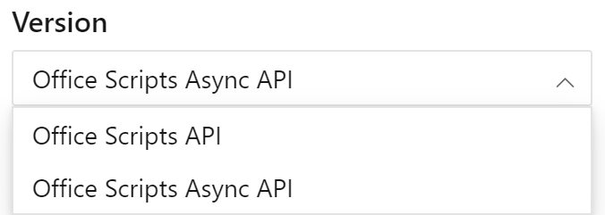

Используйте [эту ссылку для просмотра асинхронной справочной документации по API](/javascript/api/office-scripts/excelscript?view=office-scripts-async). В справочной документации вы можете переключаться между стандартными интерфейсами API и асинхронными версиями с помощью элемента управления выбор версий над оглавлением.

