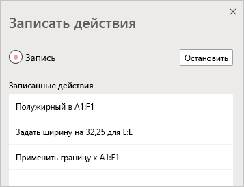
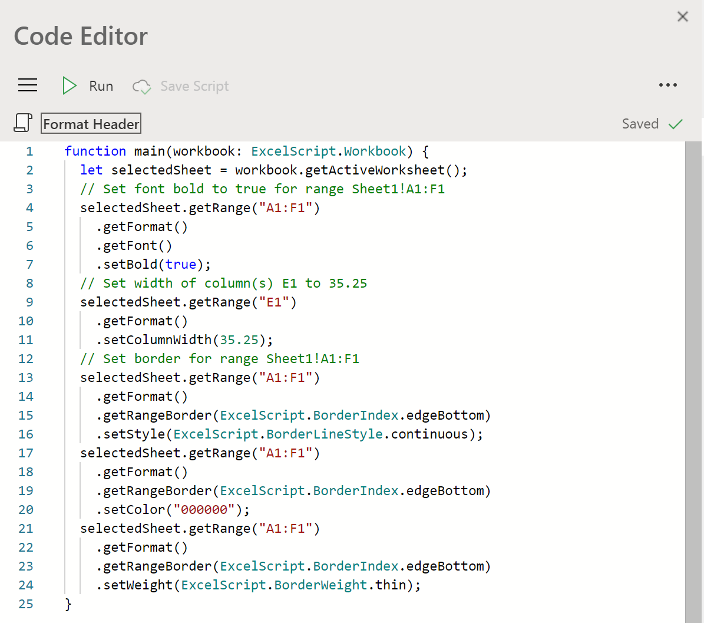
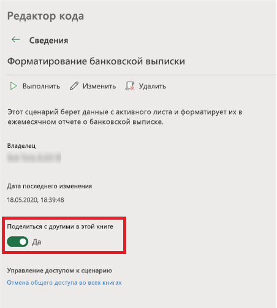

# Сценарии Office в Excel в Интернете (предварительный просмотр)

Сценарии Office в Excel в Интернете позволяют автоматизировать повседневные задачи. Вы можете записывать свои действия в Excel с помощью Action Recorder, который создает скрипт. Вы также можете создавать и редактировать сценарии с помощью редактора кода. После этого можно поделиться сценариями в организации, чтобы ваши коллеги также могли автоматизировать свои рабочие процессы.

Эта серия документов научит вас, как использовать эти инструменты. Вы познакомитесь с регистратором действий и узнаете, как записывать ваши частые действия в Excel. Вы также узнаете, как создавать или обновлять свои собственные сценарии с помощью редактора кода.

 

> [!VIDEO https://www.microsoft.com/videoplayer/embed/RE4qdFF]

## Требования

[!INCLUDE [Preview note](../includes/preview-note.md)]

Для использования сценариев Office вам потребуются следующие компоненты.

1. [Excel в Интернете](https://www.office.com/launch/excel) (другие платформы, например классическая версия, не поддерживаются).
1. Сценарии Office, [включенные администратором](/microsoft-365/admin/manage/manage-office-scripts-settings).
1. Любая коммерческая или образовательная лицензия Microsoft 365 с доступом к классическим приложениям Microsoft 365 Office, таким как:

    - Office 365 бизнес
    - Office 365 бизнес премиум
    - Office 365 профессиональный плюс
    - Office 365 профессиональный плюс для устройств
    - Office 365 корпоративный E3
    - Office 365 корпоративный E5
    - Office 365 A3
    - Office 365 A5

## Когда использовать офисные сценарии

Скрипты позволяют записывать и воспроизводить ваши действия Excel в различных рабочих книгах и таблицах. Если вы замечаете, что раз за разом повторяете одинаковые действия, вы можете превратить их в простой сценарий Office. Запускайте свой сценарий нажатием кнопки в Excel или объедините его с Power Automate, чтобы ускорить весь свой рабочий процесс.

Например, скажем, вы начинаете свой рабочий день, открыв файл .csv с сайта учета в Excel. Затем вы тратите несколько минут на удаление ненужных столбцов, форматирование таблицы, добавление формул и создание сводной таблицы на новом листе. Те действия, которые вы повторяете ежедневно, можно записать один раз с помощью регистратора действий. В дальнейшем запуск скрипта позаботится обо всей конвертации CSV. Вы не только устраните риск забывания шагов, но и сможете поделиться своим процессом с другими, не обучая их чему-либо. Сценарии Office автоматизируют ваши общие задачи, чтобы вы и ваше рабочее место могли быть более эффективными и продуктивными.

## Рекордер действий

Средство записи действий записывает действия, выполняемые вами в Excel, и сохраняет их в виде сценария. Когда запущен рекордер действий, вы можете захватывать действия Excel при редактировании ячеек, изменении форматирования и создании таблиц. Полученный сценарий можно запускать на других листах и рабочих книгах, чтобы воссоздать исходные действия.

## Редактор кода

Все сценарии, записанные с помощью Action Recorder, можно редактировать с помощью редактора кода. Это позволяет настроить и настроить скрипт, чтобы он лучше соответствовал вашим потребностям. Вы также можете добавить логику и функциональные возможности, которые напрямую недоступны через пользовательский интерфейс Excel, такие как условные операторы (если / еще) и циклы.

Один из простых способов начать изучение возможностей Office Scripts - это запись сценариев в Excel в Интернете и просмотр полученного кода. Другой вариант заключается в том, чтобы следовать нашим [учебным пособиям](../tutorials/excel-tutorial.md), чтобы учиться более структурированным образом.

## Общий доступ к сценариям

Сценариями Office можно поделиться с другими пользователям книги Excel. Когда вы делитесь сценарием с другими пользователями в книге, он прикрепляется к книге. Ваши сценарии хранятся в вашем хранилище OneDrive, а когда вы делитесь сценарием, в книге, которую вы открыли, создается ссылка на него.

Дополнительные сведения об общем доступе и отмене общего доступа к сценариям см. в статье [Общий доступ к сценариям Office в веб-программе Excel](https://support.microsoft.com/office/sharing-office-scripts-in-excel-for-the-web-226eddbc-3a44-4540-acfe-fccda3d1122b?storagetype=live&ui=en-US&rs=en-US&ad=US).

## Подключение сценариев Office к Power Automate

[Power Automate](https://flow.microsoft.com/) — это служба, которая помогает создавать автоматизированные рабочие процессы между различными приложениями и службами. Сценарии Office можно использовать в этих рабочих процессах, что позволит вам управлять своими сценариями за пределами книги. Вы можете выполнять сценарии по расписанию, активировать их в ответ на сообщения электронной почты и т. д. Чтобы получить основные сведения о подключении этих служб автоматизации, ознакомьтесь с руководством [Выполнение сценариев Office в Excel в Интернете](../tutorials/excel-power-automate-manual.md).

## Дальнейшие действия

Завершите [руководство по сценариям Office в Microsoft Excel в Интернете](../tutorials/excel-tutorial.md), чтобы узнать, как создавать свои первые сценарии Office.

## См. также

- [Основные сведения о сценариях Office в Excel в Интернете](../develop/scripting-fundamentals.md)
- [Справочник API для сценариев Office](/javascript/api/office-scripts/overview)
- [Устранение неполадок в сценариях Office](../testing/troubleshooting.md)
- [Параметры сценариев Office в M365](https://support.office.com/article/office-scripts-settings-in-m365-19d3c51a-6ca2-40ab-978d-60fa49554dcf)
- [Общие сведения о сценариях Office в Excel (на сайте support.office.com)](https://support.office.com/article/introduction-to-office-scripts-in-excel-9fbe283d-adb8-4f13-a75b-a81c6baf163a)
- [Общий доступ к сценариям Office в веб-программе Excel](https://support.microsoft.com/office/sharing-office-scripts-in-excel-for-the-web-226eddbc-3a44-4540-acfe-fccda3d1122b?storagetype=live&ui=en-US&rs=en-US&ad=US)
