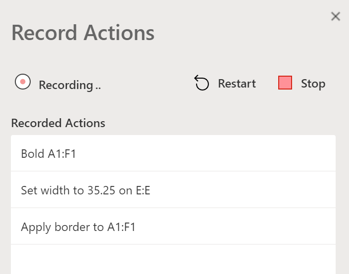

# Сценарии Office в Excel в Интернете (предварительный просмотр)Office Scripts in Excel on the web (preview)

Сценарии Office в Excel в Интернете позволяют автоматизировать повседневные задачи.Office Scripts in Excel on the web let you automate your day-to-day tasks. Вы можете записывать свои действия в Excel с помощью Action Recorder, который создает скрипт.You can record your Excel actions with the Action Recorder, which creates a script. Вы также можете создавать и редактировать сценарии с помощью редактора кода.You can also create and edit scripts with the Code Editor. Эта серия документов научит вас, как использовать эти инструменты.This series of documents teaches you how to use these tools. Вы познакомитесь с регистратором действий и узнаете, как записывать ваши частые действия в Excel.You'll be introduced to the Action Recorder and see how to record your frequent Excel actions. Вы также узнаете, как создавать или обновлять свои собственные сценарии с помощью редактора кода.You'll also learn how to make or update your own scripts with the Code Editor.

 

> [!VIDEO https://www.microsoft.com/videoplayer/embed/RE4qdFF]

[!INCLUDE [Preview note](../includes/preview-note.md)]

## Когда использовать офисные сценарииWhen to use Office Scripts

Скрипты позволяют записывать и воспроизводить ваши действия Excel в различных рабочих книгах и таблицах.Scripts allow you to record and replay your Excel actions on different workbooks and worksheets. Если вы обнаружите, что снова и снова делаете одни и те же вещи, сценарий Office может помочь вам, сводя весь рабочий процесс к нажатию одной кнопки.If you find yourself doing the same things over and over again, an Office Script can help you by reducing your whole workflow to a single button press.

Например, скажем, вы начинаете свой рабочий день, открыв файл CSV с сайта учета в Excel.As an example, say you start your work day by opening a .csv file from an accounting site in Excel. Затем вы тратите несколько минут на удаление ненужных столбцов, форматирование таблицы, добавление формул и создание сводной таблицы на новом листе.You then spend several minutes deleting unnecessary columns, formatting a table, adding formulas, and creating a PivotTable in a new worksheet. Те действия, которые вы повторяете ежедневно, можно записать один раз с помощью регистратора действий.Those actions you repeat daily can be recorded once with the Action Recorder. В дальнейшем запуск скрипта позаботится обо всей конвертации CSV.From then on, running the script will take care of your entire .csv conversion. Вы не только устраните риск забывания шагов, но и сможете поделиться своим процессом с другими, не обучая их чему-либо.You'll not only remove the risk of forgetting steps, but be able to share your process with others without having to teach them anything. Сценарии Office автоматизируют ваши общие задачи, чтобы вы и ваше рабочее место могли быть более эффективными и продуктивными.Office Scripts automate your common tasks so you and your workplace can be more efficient and productive.

## Рекордер действийAction Recorder

Рекордер действий записывает действия, которые вы выполняете в Excel, и переводит их в сценарий.The Action Recorder records actions you take in Excel and translates them into a script. Когда запущен рекордер действий, вы можете захватывать действия Excel при редактировании ячеек, изменении форматирования и создании таблиц.With the Action recorder running, you can capture the Excel actions as you edit cells, change formatting, and create tables. Полученный сценарий можно запускать на других листах и рабочих книгах, чтобы воссоздать исходные действия.The resulting script can be run on other worksheets and workbooks to recreate your original actions.

## Редактор кодаCode Editor

Все сценарии, записанные с помощью Action Recorder, можно редактировать с помощью редактора кода.All scripts recorded with the Action Recorder can be edited through the Code Editor. Это позволяет настроить и настроить скрипт, чтобы он лучше соответствовал вашим потребностям.This lets you tweak and customize the script to better suit your exact needs. Вы также можете добавить логику и функциональные возможности, которые напрямую недоступны через пользовательский интерфейс Excel, такие как условные операторы (если / еще) и циклы.You can also add logic and functionality that is not directly accessible through the Excel UI, such as conditional statements (if/else) and loops.

Один из простых способов начать изучение возможностей Office Scripts - это запись сценариев в Excel в Интернете и просмотр полученного кода.One easy way to start learning the capabilities of Office Scripts is to record scripts in Excel on the web and view the resulting code. Другой вариант заключается в том, чтобы следовать нашим [учебным пособиям](../tutorials/excel-tutorial.md), чтобы учиться более структурированным образом.Another option is to follow our [tutorials](../tutorials/excel-tutorial.md) to learn in a more guided and structured way.

## Дальнейшие действияNext steps

Завершите [руководство по сценариям Office в Microsoft Excel в Интернете](../tutorials/excel-tutorial.md), чтобы узнать, как создавать свои первые сценарии Office.Complete the [Office Scripts in Excel on the web tutorial](../tutorials/excel-tutorial.md) to learn how to create your first Office Scripts.

## См. такжеSee also

- [Основные сведения о сценариях Office в Excel в ИнтернетеScripting fundamentals for Office Script in Excel on the web](../develop/scripting-fundamentals.md)
- [Справочник API для сценариев OfficeOffice Scripts API reference](/javascript/api/office-scripts/overview)
- [Устранение неполадок в сценариях OfficeTroubleshooting Office Scripts](../testing/troubleshooting.md)
- [Параметры сценариев Office в M365Office Scripts settings in M365](https://support.office.com/article/office-scripts-settings-in-m365-19d3c51a-6ca2-40ab-978d-60fa49554dcf)
- [Общие сведения о сценариях Office в Excel (на сайте support.office.com)Introduction to Office Scripts in Excel (on support.office.com)](https://support.office.com/article/introduction-to-office-scripts-in-excel-9fbe283d-adb8-4f13-a75b-a81c6baf163a)
