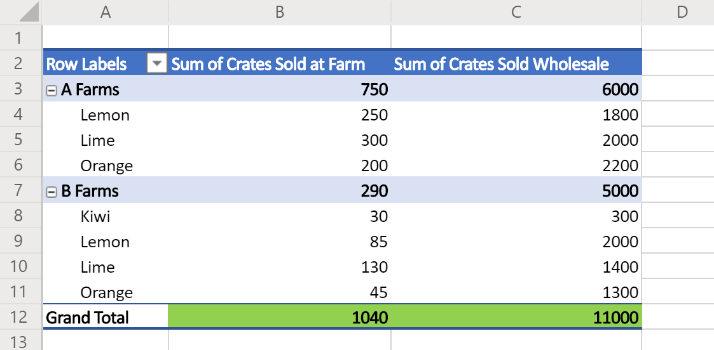

# <a name="sample-scripts-for-office-scripts-in-excel-on-the-web-preview"></a>Примеры сценариев для сценариев Office в Excel в Интернете (Предварительная версия)

Ниже приведены примеры простых сценариев, которые можно использовать в собственных книгах. Чтобы использовать их в Excel в Интернете, выполните следующие действия:

1. Откройте вкладку **Автоматизировать**.
2. Нажмите клавишу **Редактор кода**.
3. Нажмите **новый скрипт** в области задач редактора кода.
4. Замените весь сценарий выбранным образцом.
5. В области задач редактора кода нажмите кнопку **запустить** .

[!INCLUDE [Preview note](../includes/preview-note.md)]

## <a name="scripting-basics"></a>Основные сведения о сценариях

В этих примерах демонстрируются основные конструктивные блоки для сценариев Office. Добавьте их в скрипты, чтобы расширить решение и устранить распространенные проблемы.

### <a name="read-and-log-one-cell"></a>Чтение и запись в журнал одной ячейки

В этом примере считывается значение **a1** и выводится на консоль.

```typescript
function main(workbook: ExcelScript.Workbook) {
  // Get the current worksheet.
  let selectedSheet = workbook.getActiveWorksheet();

  // Get the value of cell A1.
  let range = selectedSheet.getRange("A1");
  
  // Print the value of A1.
  console.log(range.getValue());
}
```

### <a name="read-the-active-cell"></a>Чтение активной ячейки

Этот сценарий записывает в журнал значение текущей активной ячейки. Если выбрано несколько ячеек, в журнал заносится левая верхняя ячейка.

```typescript
function main(workbook: ExcelScript.Workbook) {
  // Get the current active cell in the workbook.
  let cell = workbook.getActiveCell();

  // Log that cell's value.
  console.log(`The current cell's value is ${cell.getValue()}`);
}
```

### <a name="change-an-adjacent-cell"></a>Изменение смежной ячейки

Этот сценарий получает смежные ячейки, используя относительные ссылки. Обратите внимание, что если активная ячейка находится в верхней строке, часть скрипта завершается с ошибкой, так как она ссылается на ячейку над выбранной в текущий момент.

```typescript
function main(workbook: ExcelScript.Workbook) {
  // Get the currently active cell in the workbook.
  let activeCell = workbook.getActiveCell();
  console.log(`The active cell's address is: ${activeCell.getAddress()}`);

  // Get the cell to the right of the active cell and set its value and color.
  let rightCell = activeCell.getOffsetRange(0,1);
  rightCell.setValue("Right cell");
  console.log(`The right cell's address is: ${rightCell.getAddress()}`);
  rightCell.getFormat().getFont().setColor("Magenta");
  rightCell.getFormat().getFill().setColor("Cyan");

  // Get the cell to the above of the active cell and set its value and color.
  // Note that this operation will fail if the active cell is in the top row.
  let aboveCell = activeCell.getOffsetRange(-1, 0);
  aboveCell.setValue("Above cell");
  console.log(`The above cell's address is: ${aboveCell.getAddress()}`);
  aboveCell.getFormat().getFont().setColor("White");
  aboveCell.getFormat().getFill().setColor("Black");
}
```

### <a name="change-all-adjacent-cells"></a>Изменение всех смежных ячеек

Этот сценарий копирует форматирование в активной ячейке в соседние ячейки. Обратите внимание, что этот скрипт работает только в том случае, если активная ячейка не находится на границе листа.

```typescript
function main(workbook: ExcelScript.Workbook) {
  // Get the active cell.
  let activeCell = workbook.getActiveCell();

  // Get the cell that's one row above and one column to the left of the active cell.
  let cornerCell = activeCell.getOffsetRange(-1,-1);

  // Get a range that includes all the cells surrounding the active cell.
  let surroundingRange = cornerCell.getResizedRange(2, 2)

  // Copy the formatting from the active cell to the new range.
  surroundingRange.copyFrom(
    activeCell, /* The source range. */
    ExcelScript.RangeCopyType.formats /* What to copy. */
    );
}
```

### <a name="change-each-individual-cell-in-a-range"></a>Изменение каждой отдельной ячейки в диапазоне

Этот сценарий выполняет цикл над текущим выбранным диапазоном. Он удаляет текущее форматирование и задает случайный цвет для цвета заливки в каждой ячейке.

```typescript
function main(workbook: ExcelScript.Workbook) {
  // Get the currently selected range.
  let range = workbook.getSelectedRange();

  // Get the size boundaries of the range.
  let rows = range.getRowCount();
  let cols = range.getColumnCount();

  // Clear any existing formatting
  range.clear(ExcelScript.ClearApplyTo.formats);

  // Iterate over the range.
  for (let row = 0; row < rows; row++) {
    for (let col = 0; col < cols; col++) {
      // Generate a random color hex-code.
      let colorString = `#${Math.random().toString(16).substr(-6)}`;

      // Set the color of the current cell to that random hex-code.
      range.getCell(row, col).getFormat().getFill().setColor(colorString);
    }
  }
}
```

## <a name="collections"></a>Коллекции

Эти примеры работают с коллекциями объектов в книге.

### <a name="iterating-over-collections"></a>Итерация по коллекциям

Этот сценарий получает и заносит в журнал имена всех листов в книге. Кроме того, в качестве цвета вкладки задается случайный цвет.

```typescript
function main(workbook: ExcelScript.Workbook) {
  // Get all the worksheets in the workbook.
  let sheets = workbook.getWorksheets();

  // Get a list of all the worksheet names.
  let names = sheets.map ((sheet) => sheet.getName());

  // Write in the console all the worksheet names and the total count.
  console.log(names);
  console.log(`Total worksheets inside of this workbook: ${sheets.length}`);
  
  // Set the tab color each worksheet to a random color
  for (let sheet of sheets) {
    // Generate a random color hex-code.
    let colorString = `#${Math.random().toString(16).substr(-6)}`;

    // Set the color of the current worksheet's tab to that random hex-code.
    sheet.setTabColor(colorString);
  }
}
```

## <a name="dates"></a>Даты

В примерах, приведенных в этом разделе, показано, как использовать объект JavaScript [Date](https://developer.mozilla.org/docs/web/javascript/reference/global_objects/date) .

В следующем примере возвращается текущая дата и время, а затем эти значения записываются в две ячейки активного листа.

```TypeScript
function main(workbook: ExcelScript.Workbook) {
  // Get the cells at A1 and B1.
  let dateRange = workbook.getActiveWorksheet().getRange("A1");
  let timeRange = workbook.getActiveWorksheet().getRange("B1");

  // Get the current date and time with the JavaScript Date object.
  let date = new Date(Date.now());

  // Add the date string to A1.
  dateRange.setValue(date.toLocaleDateString());

  // Add the time string to B1.
  timeRange.setValue(date.toLocaleTimeString());
}
```

В следующем примере считывается дата, которая хранится в Excel, и преобразуется в объект даты JavaScript. В качестве входных данных для даты JavaScript в качестве входных данных используется [числовой серийный номер даты](https://support.office.com/article/now-function-3337fd29-145a-4347-b2e6-20c904739c46) .

```TypeScript
function main(workbook: ExcelScript.Workbook) {
  // Read a date at cell A1 from Excel.
  let dateRange = workbook.getActiveWorksheet().getRange("A1");

  // Convert the Excel date to a JavaScript Date object.
  let excelDateValue = dateRange.getValue();
  let javaScriptDate = new Date(Math.round((excelDateValue - 25569) * 86400 * 1000));
  console.log(javaScriptDate);
}
```

## <a name="display-data"></a>Отображение данных

В этих примерах показано, как работать с данными листа и предоставлять пользователям лучшее представление или организацию.

### <a name="apply-conditional-formatting"></a>Применение условного форматирования

В этом примере применяется условное форматирование для диапазона, используемого в текущий момент на листе. Условное форматирование — Зеленая заливка для первых 10% значений.

```TypeScript
function main(workbook: ExcelScript.Workbook) {
  // Get the current worksheet.
  let selectedSheet = workbook.getActiveWorksheet();

  // Get the used range in the worksheet.
  let range = selectedSheet.getUsedRange();

  // Set the fill color to green for the top 10% of values in the range.
  let conditionalFormat = range.addConditionalFormat(ExcelScript.ConditionalFormatType.topBottom)
  conditionalFormat.getTopBottom().getFormat().getFill().setColor("green");
  conditionalFormat.getTopBottom().setRule({
    rank: 10, // The percentage threshold.
    type: ExcelScript.ConditionalTopBottomCriterionType.topPercent // The type of the top/bottom condition.
  });
}
```

### <a name="create-a-sorted-table"></a>Создание отсортированной таблицы

В этом примере создается таблица на основе используемого диапазона текущего листа, а затем она сортируется по первому столбцу.

```TypeScript
function main(workbook: ExcelScript.Workbook) {
  // Get the current worksheet.
  let selectedSheet = workbook.getActiveWorksheet();

  // Create a table with the used cells.
  let usedRange = selectedSheet.getUsedRange();
  let newTable = selectedSheet.addTable(usedRange, true);

  // Sort the table using the first column.
  newTable.getSort().apply([{ key: 0, ascending: true }]);
}
```

### <a name="log-the-grand-total-values-from-a-pivottable"></a>Запись значений "общий итог" из сводной таблицы

В этом примере выполняется поиск первой сводной таблицы в книге и записываются значения в ячейках "общий итог" (выделено зеленым цветом на изображении ниже).



```TypeScript
function main(workbook: ExcelScript.Workbook) {
  // Get the first PivotTable in the workbook.
  let pivotTable = workbook.getPivotTables()[0];

  // Get the names of each data column in the PivotTable.
  let pivotColumnLabelRange = pivotTable.getLayout().getColumnLabelRange();

  // Get the range displaying the pivoted data.
  let pivotDataRange = pivotTable.getLayout().getRangeBetweenHeaderAndTotal();

  // Get the range with the "grand totals" for the PivotTable columns.
  let grandTotalRange = pivotDataRange.getLastRow();

  // Print each of the "Grand Totals" to the console.
  grandTotalRange.getValues()[0].forEach((column, columnIndex) => {
    console.log(`Grand total of ${pivotColumnLabelRange.getValues()[0][columnIndex]}: ${grandTotalRange.getValues()[0][columnIndex]}`);
    // Example log: "Grand total of Sum of Crates Sold Wholesale: 11000"
  });
}
```

## <a name="scenario-samples"></a>Примеры сценариев

Примеры, иллюстрирующие большие, реальные решения, можно найти на странице [примеры сценариев для сценариев Office](scenarios/sample-scenario-overview.md).

## <a name="suggest-new-samples"></a>Предлагаемые новые примеры

Мы будем рады получать новые примеры. Если существует распространенный сценарий, который поможет другим разработчикам скриптов, Расскажите нам в разделе отзывов, приведенном ниже.
