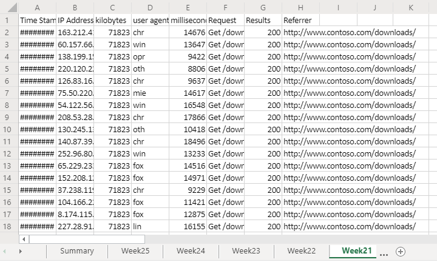
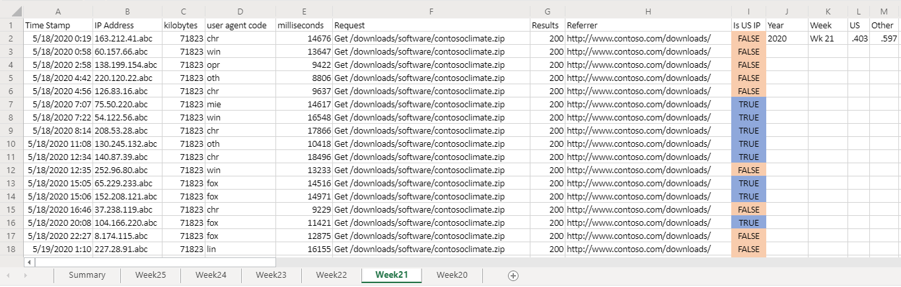
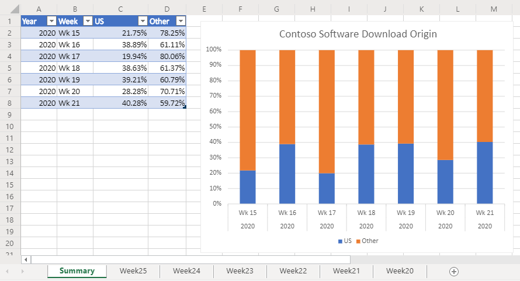

# <a name="office-scripts-sample-scenario-analyze-web-downloads"></a>Сценарий примера сценариев Office: анализ загружаемых веб-файлов

В этом сценарии вы являетесь задачей анализа загрузки отчетов с веб-сайта компании. Цель этого анализа — определить, поступает ли веб-трафик из Соединенных Штатов Америки или других стран мира.

Ваши коллеги отправляют необработанные данные в вашу книгу. В наборе данных каждой недели есть собственный лист. Кроме того, существует **сводный** лист с таблицей и диаграммой, в которой показаны тенденции за неделю.

Вы разрабатываете сценарий, который анализирует еженедельные загрузки данных на активном листе. Он будет анализировать IP-адрес, связанный с каждым загружаемым пакетом, и определять, был ли он передан из США. Ответ будет вставлен на лист в виде логического значения ("TRUE" или "FALSE"), а условное форматирование будет применено к этим ячейкам. Результаты размещения IP-адресов будут суммироваться на листе и скопированы в сводную таблицу.

## <a name="scripting-skills-covered"></a>Охваченные навыки работы со сценариями

- Синтаксический анализ текста
- Подфункции в скриптах
- Условное форматирование
- таблицы;

## <a name="demo-video"></a>Демонстрационное видео

В этом примере показана демонстрация при вызове сообщества разработчиков надстроек Office в течение февраля 2020.

> [!VIDEO https://www.youtube.com/embed/vPEqbb7t6-Y?start=154]

## <a name="setup-instructions"></a>Инструкции по настройке

1. Скачайте <a href="analyze-web-downloads.xlsx">анализе-веб-довнлоадс. xlsx</a> в свой OneDrive.

2. Откройте книгу с помощью Excel для веб-сайта.

3. На вкладке **Автоматизация** откройте **Редактор кода**.

4. В области задач **Редактор кода** нажмите **новый скрипт** и вставьте следующий скрипт в редактор.

    ```TypeScript
      async function main(context: Excel.RequestContext) {
        let currentWorksheet = context.workbook.worksheets
          .getActiveWorksheet();
        // Get the values of the active range of the active worksheet.
        let logRange = currentWorksheet.getUsedRange().load("values");

        // Get the Summary worksheet and table.
        let summaryWorksheet = context.workbook.worksheets.getItem("Summary");
        let summaryTable = context.workbook.tables.getItem("Table1");

        // Get the range that will contain TRUE/FALSE if the IP address is from the United States (US).
        let isUSColumn = logRange
          .getLastColumn()
          .getOffsetRange(0, 1)
          .load("address");

        // Get the values of all the US IP addresses.
        let ipRange = context.workbook.worksheets
          .getItem("USIPAddresses")
          .getUsedRange()
          .load("values");
        await context.sync();

        // Remove the first row.
        let topRow = logRange.values.shift();

        // Create a new array to contain the boolean representing if this is a US IP address.
        let newCol = [[]];

        // Go through each row in worksheet and add Boolean.
        for (let i = 0; i < logRange.values.length; i++) {
          let curRowIP = logRange.values[i][1];
          if (findIP(ipRange.values, ipAddressToInteger(curRowIP)) > 0) {
            newCol.push([true]);
          } else {
            newCol.push([false]);
          }
        }

        // Remove the empty column header and add proper heading.
        newCol.shift();
        newCol.unshift(["Is US IP"]);

        // Write the result to the spreadsheet.
        isUSColumn.values = newCol;
        addSummaryData();
        applyConditionalFormatting();
        currentWorksheet.getUsedRange().format.autofitColumns();

        // Get the calculated summary data.
        let summaryRange = currentWorksheet.getRange("J2:M2").load("values");
        await context.sync();

        // Add the corresponding row to the summary table.
        summaryTable.rows.add(null, summaryRange.values);

        // Function to apply conditional formatting to the new column.
        function applyConditionalFormatting() {
          // Add conditional formatting to the new column.
          let conditionalFormatTrue = isUSColumn.conditionalFormats.add(
            Excel.ConditionalFormatType.cellValue
          );
          let conditionalFormatFalse = isUSColumn.conditionalFormats.add(
            Excel.ConditionalFormatType.cellValue
          );
          // Set TRUE to light blue and FALSE to light orange.
          conditionalFormatTrue.cellValue.format.fill.color = "#8FA8DB";
          conditionalFormatTrue.cellValue.rule = {
            formula1: "=TRUE",
            operator: "EqualTo"
          };
          conditionalFormatFalse.cellValue.format.fill.color = "#F8CCAD";
          conditionalFormatFalse.cellValue.rule = {
            formula1: "=FALSE",
            operator: "EqualTo"
          };
        }

        // Adds the summary data to the current sheet and to the summary table.
        function addSummaryData() {
          // Add a summary row and table.
          let summaryHeader = [["Year", "Week", "US", "Other"]];
          let countTrueFormula =
            "=COUNTIF(" + isUSColumn.address + ', "=TRUE")/' + (newCol.length - 1);
          let countFalseFormula =
            "=COUNTIF(" + isUSColumn.address + ', "=FALSE")/' + (newCol.length - 1);

          let summaryContent = [
            [
              '=TEXT(A2,"YYYY")',
              '=TEXTJOIN(" ", FALSE, "Wk", WEEKNUM(A2))',
              countTrueFormula,
              countFalseFormula
            ]
          ];
          let summaryHeaderRow = context.workbook.worksheets
            .getActiveWorksheet()
            .getRange("J1:M1");
          let summaryContentRow = context.workbook.worksheets
            .getActiveWorksheet()
            .getRange("J2:M2");
          summaryHeaderRow.values = summaryHeader;
          summaryContentRow.values = summaryContent;
          let formats = [[".000", ".000"]];
          summaryContentRow
            .getOffsetRange(0, 2)
            .getResizedRange(0, -2).numberFormat = formats;
        }
      }

      // Translate an IP address into an integer.
      function ipAddressToInteger(ipAddress: string) {
        // Split the IP address into octets.
        let octets = ipAddress.split(".");

        // Create a number for each octet and do the math to create the integer value of the IP address.
        let fullNum =
          // Define an arbitrary number for the last octet.
          111 +
          parseInt(octets[2]) * 256 +
          parseInt(octets[1]) * 65536 +
          parseInt(octets[0]) * 16777216;
        return fullNum;
      }

      // Return the row number where the ip address is found.
      function findIP(ipLookupTable: number[][], n: number) {
        for (let i = 0; i < ipLookupTable.length; i++) {
          if (ipLookupTable[i][0] <= n && ipLookupTable[i][1] >= n) {
            return i;
          }
        }
        return -1;
      }
    ```

5. Переименуйте сценарий, чтобы **проанализировать загрузку веб-файлов** и сохранить его.

## <a name="running-the-script"></a>Выполнение скрипта

Перейдите к любому листу **недели\* ** и запустите скрипт **анализа веб-загрузки** . Сценарий применит условное форматирование и расположение лабеллинг к текущему листу. Кроме того, будет обновлен лист **сводки** .

### <a name="before-running-the-script"></a>Перед выполнением скрипта



### <a name="after-running-the-script"></a>После выполнения скрипта




