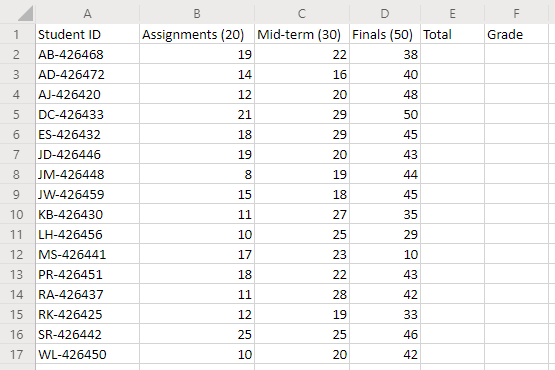
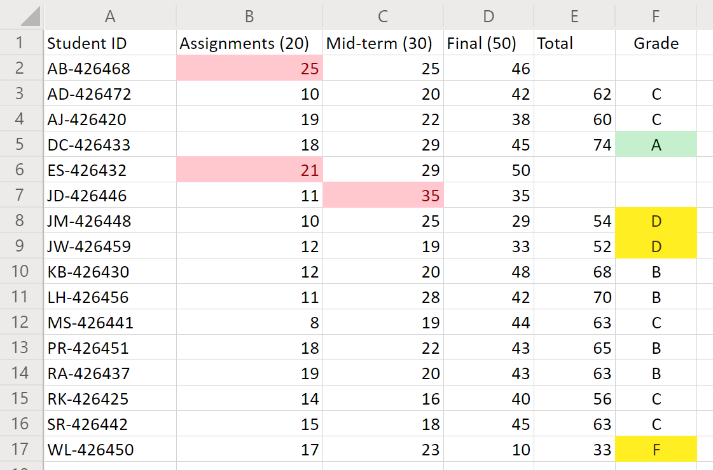

# <a name="office-scripts-sample-scenario-grade-calculator"></a>Пример сценария Office Scripts: Калькулятор производительности

В этом сценарии лектор Таллинг каждый из оценок на конце каждого учащегося. Вы ввели оценки для своих назначений и тестов при переходе. Теперь можно определить учащихся "фатес".

Вы разрабатываете сценарий, который суммирует оценки для каждой категории точек. Затем каждый учащийся будет назначать буквенную оценку на основе итогового значения. Чтобы обеспечить точность, вы добавляете пару проверок, чтобы определить, слишком низкие или высокие показатели. Если показатель учащегося меньше нуля или больше возможного значения точки, то сценарий помечает ячейку красной заливкой, а не итоговым баллам учащегося. Это будет ясно указывает, какие записи необходимо проверить. Вы также добавите в оценки некоторые базовые параметры, чтобы можно было быстро просмотреть верхнюю и нижнюю часть класса.

## <a name="scripting-skills-covered"></a>Охваченные навыки работы со сценариями

- Форматирование ячеек
- Проверка ошибок
- Регулярные выражения
- Условное форматирование

## <a name="setup-instructions"></a>Инструкции по настройке

1. Скачайте <a href="grade-calculator.xlsx">grade-calculator.xlsx</a> в OneDrive.

2. Откройте книгу с помощью Excel для веб-сайта.

3. На вкладке **Автоматизация** откройте **Редактор кода**.

4. В области задач **Редактор кода** нажмите **новый скрипт** и вставьте следующий скрипт в редактор.

    ```TypeScript
    function main(workbook: ExcelScript.Workbook) {
      // Get the worksheet and validate the data.
      let studentsRange = workbook.getActiveWorksheet().getUsedRange();
      if (studentsRange.getColumnCount() !== 6) {
        throw new Error(`The required columns are not present. Expected column headers: "Student ID | Assignment score | Mid-term | Final | Total | Grade"`);
      }

      let studentData = studentsRange.getValues();

      // Clear the total and grade columns.
      studentsRange.getColumn(4).getCell(1, 0).getAbsoluteResizedRange(studentData.length - 1, 2).clear();

      // Clear all conditional formatting.
      workbook.getActiveWorksheet().getUsedRange().clearAllConditionalFormats();

      // Use regular expressions to read the max score from the assignment, mid-term, and final scores columns.
      let maxScores: string[] = [];
      const assignmentMaxMatches = studentData[0][1].match(/\d+/);
      const midtermMaxMatches = studentData[0][2].match(/\d+/);
      const finalMaxMatches = studentData[0][3].match(/\d+/);

      // Check the matches happened before proceeding.
      if (!(assignmentMaxMatches && midtermMaxMatches && finalMaxMatches)) {
        throw new Error(`The scores are not present in the column headers. Expected format: "Assignments (n)|Mid-term (n)|Final (n)"`);
      }

      // Use the first (and only) match from the regular expressions as the max scores.
      maxScores = [assignmentMaxMatches[0], midtermMaxMatches[0], finalMaxMatches[0]];

      // Set conditional formatting for each of the assignment, mid-term, and final scores columns.
      maxScores.forEach((score, i) => {
        let range = studentsRange.getColumn(i + 1).getCell(0, 0).getRowsBelow(studentData.length - 1);
        setCellValueConditionalFormatting(
          score,
          range,
          "#9C0006",
          "#FFC7CE",
          ExcelScript.ConditionalCellValueOperator.greaterThan
        )
      });

      // Store the current range information to avoid calling the workbook in the loop.
      let studentsRangeFormulas = studentsRange.getColumn(4).getFormulasR1C1();
      let studentsRangeValues = studentsRange.getColumn(5).getValues();

      /* Iterate over each of the student rows and compute the total score and letter grade.
      * Note that iterator starts at index 1 to skip first (header) row.
      */
      for (let i = 1; i < studentData.length; i++) {
        // If any of the scores are invalid, skip processing it.
        if (studentData[i][1] > maxScores[0] ||
          studentData[i][2] > maxScores[1] ||
          studentData[i][3] > maxScores[2]) {
          continue;
        }
        const total = studentData[i][1] + studentData[i][2] + studentData[i][3];
        let grade: string;
        switch (true) {
          case total < 60:
            grade = "F";
            break;
          case total < 70:
            grade = "D";
            break;
          case total < 80:
            grade = "C";
            break;
          case total < 90:
            grade = "B";
            break;
          default:
            grade = "A";
            break;
        }

        // Set total score formula.
        studentsRangeFormulas[i][0] = '=RC[-2]+RC[-1]';
        // Set grade cell.
        studentsRangeValues[i][0] = grade;
      }

      // Set the formulas and values outside the loop.
      studentsRange.getColumn(4).setFormulasR1C1(studentsRangeFormulas);
      studentsRange.getColumn(5).setValues(studentsRangeValues);

      // Put a conditional formatting on the grade column.
      let totalRange = studentsRange.getColumn(5).getCell(0, 0).getRowsBelow(studentData.length - 1);
      setCellValueConditionalFormatting(
        "A",
        totalRange,
        "#001600",
        "#C6EFCE",
        ExcelScript.ConditionalCellValueOperator.equalTo
      );
      ["D", "F"].forEach((grade) => {
        setCellValueConditionalFormatting(
          grade,
          totalRange,
          "#443300",
          "#FFEE22",
          ExcelScript.ConditionalCellValueOperator.equalTo
        );
      })
      // Center the grade column.
      studentsRange.getColumn(5).getFormat().setHorizontalAlignment(ExcelScript.HorizontalAlignment.center);
    }

    /**
     * Helper function to apply conditional formatting.
     * @param value Cell value to use in conditional formatting formula1.
     * @param range Target range.
     * @param fontColor Font color to use.
     * @param fillColor Fill color to use.
     * @param operator Operator to use in conditional formatting.
     */
    function setCellValueConditionalFormatting(
      value: string,
      range: ExcelScript.Range,
      fontColor: string,
      fillColor: string,
      operator: ExcelScript.ConditionalCellValueOperator) {
      // Determine the formula1 based on the type of value parameter.
      let formula1: string;
      if (isNaN(Number(value))) {
        // For cell value equalTo rule, use this format: formula1: "=\"A\"",
        formula1 = `=\"${value}\"`;
      } else {
        // For number input (greater-than or less-than rules), just append '='.
        formula1 = `=${value}`;
      }

      // Apply conditional formatting.
      let conditionalFormatting : ExcelScript.ConditionalFormat;
      conditionalFormatting = range.addConditionalFormat(ExcelScript.ConditionalFormatType.cellValue);
      conditionalFormatting.getCellValue().getFormat().getFont().setColor(fontColor);
      conditionalFormatting.getCellValue().getFormat().getFill().setColor(fillColor);
      conditionalFormatting.getCellValue().setRule({formula1, operator});
    }
    ```

5. Переименуйте сценарий на **Оценка калькулятора** и сохраните его.

## <a name="running-the-script"></a>Выполнение скрипта

Запустите сценарий **калькулятора** на листе. Сценарий выполнит итоговые оценки и присвоит каждому студенте буквенную оценку. Если для какого-либо из конкретных оценок задано больше баллов, чем стоит на назначении или тестировании, то несвязанное с ним помечается красным, а итоговое значение не вычисляется. Кроме того, все оценки "A" выделены зеленым цветом, а "оценки" и "F" выделены в желтом цвете.

### <a name="before-running-the-script"></a>Перед выполнением скрипта



### <a name="after-running-the-script"></a>После выполнения скрипта


