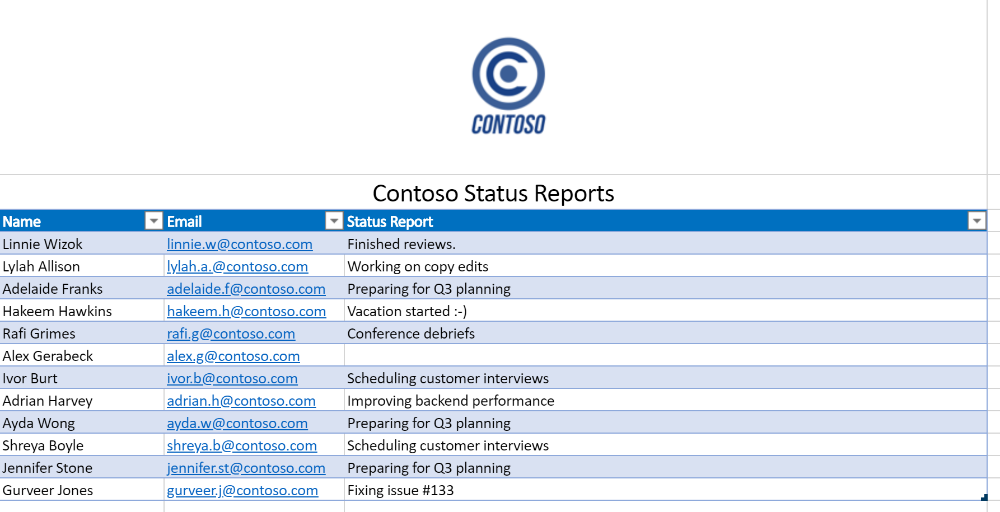
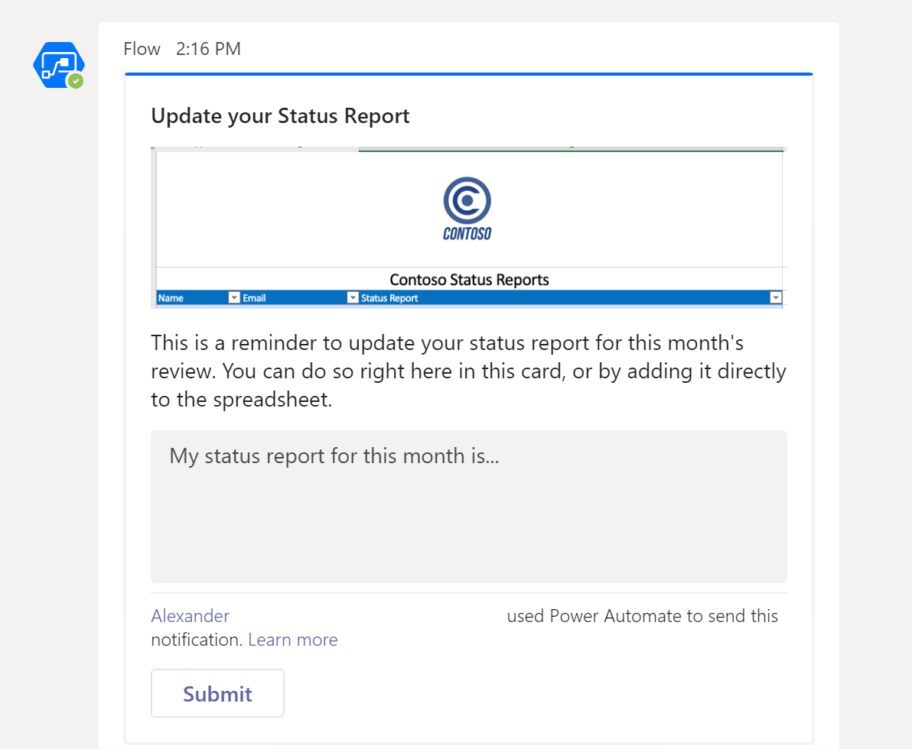
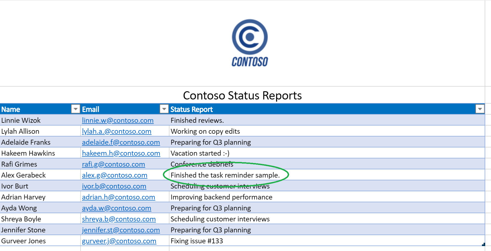

# <a name="office-scripts-sample-scenario-automated-task-reminders"></a>Сценарий примера сценариев Office: автоматические напоминания о задачах

В этом сценарии управление проектом осуществляется с помощью. Лист Excel используется для отслеживания состояния сотрудников каждый месяц. Часто приходится напоминать пользователям о своем состоянии, поэтому вы решили автоматизировать этот процесс напоминания.

Вы создадите блок автоматизации Power, чтобы отправлять сообщения людям с отсутствующими состояниями и применить их ответы к электронной таблице. Для этого вы разрабатываете сочетание сценариев для работы с книгой. Первый сценарий получает список людей с пустыми состояниями, а второй добавляет строку состояния в правую строку. Вы также можете использовать [адаптивные карты Teams](/microsoftteams/platform/task-modules-and-cards/what-are-cards) , чтобы сотрудники вводили свое состояние непосредственно из уведомления.

## <a name="scripting-skills-covered"></a>Охваченные навыки работы со сценариями

- Создание потоков в автоматизации управления питанием
- Передача данных в скрипты
- Возвращение данных из скриптов
- Адаптивные карты Teams
- Таблицы

## <a name="prerequisites"></a>Необходимые компоненты

В этом сценарии используется [Power автоматизировать](https://flow.microsoft.com) и [Microsoft Teams](https://www.microsoft.com/microsoft-365/microsoft-teams/group-chat-software). Вам потребуется связать с учетной записью, используемой для разработки сценариев Office. Чтобы получить бесплатный доступ к подписке Майкрософт для изучения и работы с этими приложениями, рассмотрите возможность присоединения к [программе для разработчиков microsoft 365](https://developer.microsoft.com/microsoft-365/dev-program).

## <a name="setup-instructions"></a>Инструкции по настройке

1. Скачайте <a href="task-reminders.xlsx">task-reminders.xlsx</a> в OneDrive.

2. Откройте книгу в Excel в Интернете.

3. На вкладке **Автоматизация** откройте **Редактор кода**.

4. Для начала нам нужен сценарий для получения всех сотрудников с отчетами о состоянии, отсутствующими в электронной таблице. В области задач **Редактор кода** нажмите **новый скрипт** и вставьте следующий скрипт в редактор.

    ```typescript
    /**
     * This script looks for missing status reports in a project management table.
     *
     * @returns An array of Employee objects (containing their names and emails).
     */
    function main(workbook: ExcelScript.Workbook): Employee[] {
      // Get the first worksheet and the first table on that worksheet.
      let sheet = workbook.getFirstWorksheet()
      let table = sheet.getTables()[0];

      // Give the column indices names matching their expected content.
      const NAME_INDEX = 0;
      const EMAIL_INDEX = 1;
      const STATUS_REPORT_INDEX = 2;

      // Get the data for the whole table.
      let bodyRangeValues = table.getRangeBetweenHeaderAndTotal().getValues();

      // Create the array of Employee objects to return.
      let people: Employee[] = [];

      // Loop through the table and check each row for completion.
      for (let i = 0; i < bodyRangeValues.length; i++) {
        let row = bodyRangeValues[i];
        if (row[STATUS_REPORT_INDEX] === "") {
          // Save the email to return.
          people.push({ name: row[NAME_INDEX], email: row[EMAIL_INDEX] });
        }
      }

      // Log the array to verify we're getting the right rows.
      console.log(people);

      // Return the array of Employees.
      return people;
    }

    /**
     * An interface representing an employee.
     * An array of Employees will be returned from the script
     * for the Power Automate flow.
     */
    interface Employee {
      name: string;
      email: string;
    }
    ```

5. Сохраните сценарий с именем **получить людей**.

6. Далее нам нужен второй скрипт для обработки карточек отчетов о состоянии и размещения новых данных в электронной таблице. В области задач **Редактор кода** нажмите **новый скрипт** и вставьте следующий скрипт в редактор.

    ```typescript
    /**
     * This script applies the results of a Teams Adaptive Card about
     * a status update to a project management table.
     *
     * @param senderEmail - The email address of the employee updating their status.
     * @param statusReportResponse - The employee's status report.
     */
    function main(workbook: ExcelScript.Workbook,
      senderEmail: string,
      statusReportResponse: string) {

      // Get the first worksheet and the first table in that worksheet.
      let sheet = workbook.getFirstWorksheet();
      let table = sheet.getTables()[0];

      // Give the column indices names matching their expected content.
      const NAME_INDEX = 0;
      const EMAIL_INDEX = 1;
      const STATUS_REPORT_INDEX = 2;

      // Get the range and data for the whole table.
      let bodyRange = table.getRangeBetweenHeaderAndTotal();
      let tableRowCount = bodyRange.getRowCount();
      let bodyRangeValues = bodyRange.getValues();

      // Create a flag to denote success.
      let statusAdded = false;

      // Loop through the table and check each row for a matching email address.
      for (let i = 0; i < tableRowCount && !statusAdded; i++) {
        let row = bodyRangeValues[i];

        // Check if the row's email address matches.
        if (row[EMAIL_INDEX] === senderEmail) {
          // Add the Teams Adaptive Card response to the table.
          bodyRange.getCell(i, STATUS_REPORT_INDEX).setValues([
            [statusReportResponse]
          ]);
          statusAdded = true;
        }
      }

      // If successful, log the status update.
      if (statusAdded) {
        console.log(
          `Successfully added status report for ${senderEmail} containing: ${statusReportResponse}`
        );
      }
    }
    ```

7. Сохраните скрипт с именем **Сохранение состояния**.

8. Теперь необходимо создать блок. Откройте компонент " [Автоматизация Power](https://flow.microsoft.com/)".

    > [!TIP]
    > Если вы еще не создали потоки, ознакомьтесь со статьей начало работы с [помощью сценариев в Power Автоматизация](../../tutorials/excel-power-automate-manual.md) , чтобы изучить основные принципы.

9. Создайте новый **мгновенный процесс**.

10. Выберите **вручную активировать потоки** из параметров и нажмите кнопку **создать**.

11. Для этого необходимо вызвать сценарий **Get люди** , чтобы получить все сотрудники с пустыми полями состояния. Нажмите кнопку **создать шаг** и выберите **Excel Online (бизнес)**. В разделе **Действия** выберите **Запустить сценарий (предварительная версия)**. Введите следующие записи для шага процесса:

    - **Расположение**: OneDrive для бизнеса
    - **Библиотека документов**: OneDrive
    - **Файл**: task-reminders.xlsx
    - **Сценарий**: получение людей

    

12. Затем необходимо обработать каждого сотрудника в массиве, возвращенном сценарием. Нажмите кнопку **создать шаг** и выберите **Отправить адаптивную карту пользователю Teams и дождитесь ответа**.

13. В поле **получатель** добавьте **электронную почту** из динамического содержимого (выделенный фрагмент будет содержать логотип Excel). Добавление **электронной почты** приводит к тому, что этап процесса будет отключаться от **применения к каждому** блоку. Это означает, что массив будет перебираться по автоматизации управления питанием.

14. Для отправки адаптивной карточки необходимо, чтобы в качестве **сообщения**было предоставлено значение JSON карты. Для создания настраиваемых карточек можно использовать [адаптивный конструктор карточек](https://adaptivecards.io/designer/) . Для этого примера используйте приведенный ниже код JSON.  

    ```json
    {
      "$schema": "http://adaptivecards.io/schemas/adaptive-card.json",
      "type": "AdaptiveCard",
      "version": "1.0",
      "body": [
        {
          "type": "TextBlock",
          "size": "Medium",
          "weight": "Bolder",
          "text": "Update your Status Report"
        },
        {
          "type": "Image",
          "altText": "",
          "url": "https://i.imgur.com/f5RcuF3.png"
        },
        {
          "type": "TextBlock",
          "text": "This is a reminder to update your status report for this month's review. You can do so right here in this card, or by adding it directly to the spreadsheet.",
          "wrap": true
        },
        {
          "type": "Input.Text",
          "placeholder": "My status report for this month is...",
          "id": "response",
          "isMultiline": true
        }
      ],
      "actions": [
        {
          "type": "Action.Submit",
          "title": "Submit",
          "id": "submit"
        }
      ]
    }
    ```

15. Заполните оставшиеся поля следующим образом:

    - **Сообщение об обновлении**: Благодарим вас за отправку отчета о состоянии. Ваш ответ успешно добавлен в электронную таблицу.
    - **Обновите карточку**: Да

16. В разделе **Применить к каждому** блоку **после отправки адаптивной карты пользователю Teams и ожидания ответа**нажмите **Добавить действие**. Выберите **Excel Online (бизнес)**. В разделе **Действия** выберите **Запустить сценарий (предварительная версия)**. Введите следующие записи для шага процесса:

    - **Расположение**: OneDrive для бизнеса
    - **Библиотека документов**: OneDrive
    - **Файл**: task-reminders.xlsx
    - **Сценарий**: сохранение состояния
    - **сендеремаил**: Электронная почта *(динамическое содержимое из Excel)*
    - **статусрепортреспонсе**: отклик *(динамический контент из Teams)*

    

17. Сохраните ход выполнения.

## <a name="running-the-flow"></a>Выполнение процесса

Чтобы протестировать потоки, убедитесь, что все строки таблицы с пустым состоянием используют адрес электронной почты, связанный с учетной записью Teams (при тестировании вам, возможно, потребуется использовать свой собственный адрес электронной почты).

Вы можете выбрать **тест** из конструктора потоков или запустить поток из страницы " **мои потоки** ". После запуска процесса и приема использования необходимых подключений необходимо получить адаптивную карту Power автоматизировать через Teams. Когда вы заполните поле Status на карточке, этот процесс продолжится и обновит электронную таблицу, указав предоставленное вами состояние.

### <a name="before-running-the-flow"></a>Перед запуском процесса



### <a name="receiving-the-adaptive-card"></a>Получение адаптивной карточки



### <a name="after-running-the-flow"></a>После выполнения последовательности


