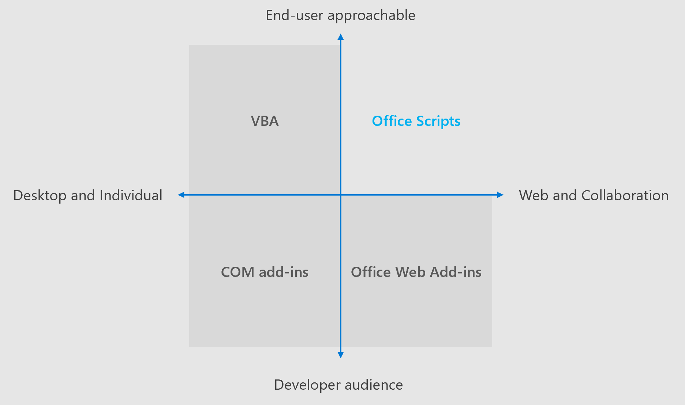

# Различия между сценариями Office и макросами VBADifferences between Office Scripts and VBA macros

Сценарии Office и макросы VBA часто встречаются довольно часто.Office Scripts and VBA macros have a lot in common. Они оба позволяют пользователям автоматизировать решения с помощью удобного средства записи действий и разрешить изменение этих записей.They both allow users to automate solutions through an easy-to-use action recorder and allow edits of those recordings. Обе платформы предназначены для того, чтобы помочь людям, которые не могут думать, как создавать небольшие программы в Excel.Both frameworks are designed to empower people who may not consider themselves programmers to create small programs in Excel.
Основное различие заключается в том, что макросы VBA разрабатываются для решений для настольных ПК и сценариев Office, разработанных с помощью поддержки нескольких платформ и безопасности в качестве принципов GUID.The fundamental difference is that VBA macros are developed for desktop solutions and Office Scripts are designed with cross-platform support and security as the guiding principles. В настоящее время сценарии Office поддерживаются только в Excel в Интернете.Currently, Office Scripts are only supported in Excel on the web.

В этой статье описываются основные различия между макросами VBA (а также VBA в целом) и сценариями Office.This article describes the main differences between VBA macros (as well as VBA in general) and Office Scripts. Так как скрипты Office доступны только для Excel, это единственный рассматриваемый узел.Since Office Scripts are only available for Excel, that is the only host being discussed here.

## Платформа и экосистемаPlatform and ecosystem

VBA предназначен для настольных систем и сценариев Office, предназначенных для Интернета.VBA is designed for the desktop and Office Scripts are designed for the web. VBA может взаимодействовать с настольным компьютером пользователя для связи с аналогичными технологиями, такими как COM и OLE.VBA can interact with a user's desktop to connect with similar technologies, such as COM and OLE. Однако VBA не имеет удобного способа позвонить в Интернет.However, VBA has no convenient way to call out to the internet.

Сценарии Office используют универсальную среду выполнения или JavaScript.Office Scripts use a universal runtime or JavaScript. Это обеспечивает согласованное поведение и специальные возможности, независимо от компьютера, используемого для запуска сценария.This gives consistent behavior and accessibility, regardless of the machine being used to run the script. Они также могут совершать вызовы другим веб-службам.They can also make calls to other web services.

## БезопасностьSecurity

Макросы VBA имеют тот же зазор безопасности, что и Excel.VBA macros have the same security clearance as Excel. Это дает им полный доступ к рабочему столу.This gives them full access to your desktop. Сценарии Office имеют доступ только к книге, а не к компьютеру, на котором размещена книга.Office Scripts only have access to the workbook, not the machine hosting the workbook. Кроме того, с скриптами нельзя предоставлять доступ к маркерам проверки подлинности JavaScript, поэтому сценарии никогда не проходят проверку подлинности с помощью внешней службы.Additionally, no JavaScript authentication tokens can be shared with scripts, so scripts can never authenticate with an external service.

У администраторов есть три варианта макросов VBA: разрешить все макросы в клиенте, не разрешать макросы в клиенте или разрешать только макросы с подписанными сертификатами.Admins have three options for VBA macros: allow all macros on the tenant, allow no macros on the tenant, or allow only macros with signed certificates. Такой недостаток детализации заключается в том, чтобы изолировать одного неисправного субъекта.This lack of granularity makes it hard to isolate a single bad actor. В настоящее время сценарии Office либо включены, либо отключены для клиента.Currently, Office Scripts are either on or off for a tenant. Однако мы работаем над предоставлением администраторам более контроля над отдельными сценариями и авторами сценариев.However, we are working to give admins more control over individual scripts and script creators.

## ПотребностейCoverage

В настоящее время VBA предлагает более полное покрытие функций Excel, особенно доступных на настольном клиенте.Currently, VBA offers a more complete coverage of Excel features, particularly those available on the desktop client. Сценарии Office охватывают практически все сценарии для Excel в Интернете.Office Scripts cover nearly all of the scenarios for Excel on the web. Кроме того, когда новые функции появятся в Интернете, сценарии Office будут поддерживать их как для средства записи действий, так и для API JavaScript.Additionally, as new features debut on the web, Office Scripts will support them for both the Action Recorder and JavaScript APIs.

## Power AutomatePower Automate

Сценарии Office можно запускать с помощью автоматизации управления питанием.Office Scripts can be run through Power Automate. Книгу можно обновить с помощью запланированных или управляемых событиями потоков, позволяя автоматизировать рабочие процессы, даже не открывая Excel.Your workbook can be updated through scheduled or event-driven flows, letting you automate workflows without even opening Excel. Это означает, что если книга хранится в OneDrive (и доступна для автоматизации), поток может выполнять свои сценарии независимо от того, используете ли вы и ваша организация, Office, Mac или веб-клиент.This means that as long as your workbook is stored in OneDrive (and accessible to Power Automate), a flow can run your scripts regardless of whether you and your organization use Excel's desktop, Mac, or web client.

В VBA нет соединителя автоматизации Power.VBA doesn't have a Power Automate connector. Все поддерживаемые сценарии VBA применяют пользователя к выполнению макроса.All supported VBA scenarios involved a user attending to the macro's execution.

## См. такжеSee also

- [Сценарии Office в Excel в ИнтернетеOffice Scripts in Excel on the web](../overview/excel.md)
- [Различия между сценариями Office и надстройками OfficeDifferences between Office Scripts and Office Add-ins](add-ins-differences.md)
- [Устранение неполадок в сценариях OfficeTroubleshooting Office Scripts](../testing/troubleshooting.md)
- [Справочник по VBA для ExcelExcel VBA reference](/office/vba/api/overview/excel)
