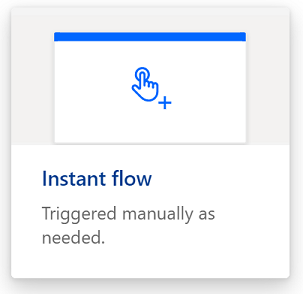
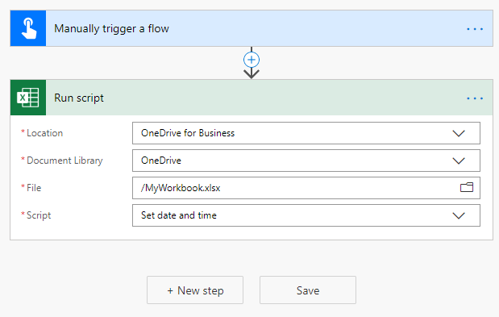
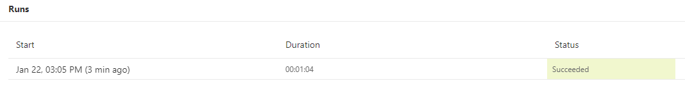

# <a name="start-using-scripts-with-power-automate-preview"></a>Начало работы со сценариями с помощью автоматизации управления (Предварительная версия)

В этом руководстве рассказывается, как запускать скрипт Office для Excel в Интернете с помощью [автоматизации Powering](https://flow.microsoft.com).

## <a name="prerequisites"></a>Необходимые компоненты

[!INCLUDE [Tutorial prerequisites](../includes/tutorial-prerequisites.md)]

> [!IMPORTANT]
> В этом руководстве предполагается, что вы выполнили [запись, редактирование и создание сценариев Office в Excel в Интернете](excel-tutorial.md) .

## <a name="prepare-the-workbook"></a>Подготовка книги

Автоматизация управления питанием не может использовать относительные ссылки, такие как `Workbook.getActiveWorksheet` доступ к компонентам книги. Поэтому нам нужна книга и лист с согласованными именами, на которые может ссылаться Автоматизация управления питанием.

1. Создайте новую книгу с именем **миворкбук**.

2. В книге **миворкбук** Создайте лист под названием **туториалворкшит**.

## <a name="create-an-office-script"></a>Создание скрипта Office

1. Перейдите на вкладку **Автоматизация** и выберите **Редактор кода**.

2. Выберите пункт **создать скрипт**.

3. Замените стандартный сценарий следующим. Этот сценарий добавляет текущую дату и время в первые две ячейки листа **туториалворкшит** .

    ```TypeScript
    function main(workbook: ExcelScript.Workbook) {
      // Get the "TutorialWorksheet" worksheet from the workbook.
      let worksheet = workbook.getWorksheet("TutorialWorksheet");

      // Get the cells at A1 and B1.
      let dateRange = worksheet.getRange("A1");
      let timeRange = worksheet.getRange("B1");

      // Get the current date and time using the JavaScript Date object.
      let date = new Date(Date.now());

      // Add the date string to A1.
      dateRange.setValue(date.toLocaleDateString());

      // Add the time string to B1.
      timeRange.setValue(date.toLocaleTimeString());
    }
    ```

4. Переименуйте сценарий, чтобы **задать дату и время**. Нажмите имя скрипта, чтобы изменить его.

5. Сохраните скрипт, нажав **Сохранить скрипт**.

## <a name="create-an-automated-workflow-with-power-automate"></a>Создание автоматизированного рабочего процесса с помощью автоматизации управления питанием

1. Войдите на [сайт Power автоматизированного просмотра](https://flow.microsoft.com).

2. В меню, которое отображается в левой части экрана, нажмите кнопку **создать**. В этом списке приводится список способов создания новых рабочих процессов.

    

3. В разделе **начать с пустого** раздела выберите **мгновенный ход**. При этом создается рабочий процесс, активированный вручную.

    

4. В появившемся диалоговом окне введите имя для своего процесса в текстовом поле **имя процесса** , выберите **вручную запустить потоки** из списка **выберите способ запуска процесса**и нажмите кнопку **создать**.

    

5. Нажмите кнопку **создать шаг**.

6. Перейдите на вкладку **Стандартная** и выберите **Excel Online (бизнес)**.

    

7. В разделе **действия**выберите команду **выполнить скрипт (Предварительная версия)**.

    

8. Укажите следующие параметры для соединителя **сценария запуска** :

    - **Расположение**: OneDrive для бизнеса
    - **Библиотека документов**: OneDrive
    - **Файл**: MyWorkbook.xlsx
    - **Сценарий**: Установка даты и времени

    

9. Нажмите кнопку **сохранить**.

Теперь ваш поток готов к выполнению с помощью автоматизации управления питанием. Вы можете протестировать его с помощью кнопки **тест** в редакторе потока или выполнить оставшиеся шаги руководства для запуска потока из коллекции потока.

## <a name="run-the-script-through-power-automate"></a>Запуск скрипта с помощью Power автоматизиру

1. На главной странице Power Автоматизация выберите пункт **мои потоки**.

    

2. Выберите **мой поток обучения** в списке потоков, отображаемых на вкладке **мои потоки** . Здесь отображаются сведения о созданном ранее блоке.

3. Нажмите кнопку **выполнить**.

    

4. Откроется область задач для запуска процесса. Если вам будет предложено **войти** в Excel Online, сделайте это, нажав кнопку **Continue (продолжить**).

5. Нажмите кнопку **поток выполнения**. При этом выполняется поток, который запускает связанный сценарий Office.

6. Нажмите кнопку **done (Готово**). Раздел **запуски** должен быть обновлен соответствующим образом.

7. Обновите страницу, чтобы увидеть результаты автоматизации Power. Если она была успешно выполнена, перейдите в книгу, чтобы просмотреть обновленные ячейки. Если это не удалось, проверьте параметры потока и запустите его еще раз.

    

## <a name="next-steps"></a>Дальнейшие действия

Выполните [сценарии автоматического запуска с автоматизированным руководством Power автоматизированных потоков](excel-power-automate-trigger.md) . В нем рассказывается, как передавать данные из службы рабочих процессов в сценарий Office.
