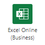

# <a name="automatically-run-scripts-with-power-automate-preview"></a>Автоматический запуск сценариев с помощью автоматизации управления (Предварительная версия)

В этом руководстве рассказывается, как использовать скрипт Office для Excel в Интернете с автоматизированным рабочим процессом [Power автоматизировать](https://flow.microsoft.com) . Ваш сценарий будет автоматически запускаться при каждом получении сообщения электронной почты, записи данных из электронной почты в книгу Excel.

## <a name="prerequisites"></a>Необходимые действия

[!INCLUDE [Tutorial prerequisites](../includes/tutorial-prerequisites.md)]

> [!IMPORTANT]
> В этом руководстве предполагается, что вы завершили [работу со сценариями Office в Excel в Интернете с помощью руководства Power автоматизиру](excel-power-automate-manual.md) .

## <a name="prepare-the-workbook"></a>Подготовка книги

Автоматизация управления питанием не может использовать [относительные ссылки](../develop/power-automate-integration.md#avoid-using-relative-references) , такие как `Workbook.getActiveWorksheet` доступ к компонентам книги. Поэтому нам потребуется книга и лист с согласованными именами для автоматизации управления питанием.

1. Создайте новую книгу с именем **миворкбук**.

2. Перейдите на вкладку **Автоматизация** и выберите **Редактор кода**.

3. Выберите пункт **создать скрипт**.

4. Замените существующий код приведенным ниже скриптом и нажмите кнопку **выполнить**. Это приведет к настройке книги с одинаковыми именами листа, таблицы и сводной таблицы.

    ```TypeScript
    function main(workbook: ExcelScript.Workbook) {
      // Add a new worksheet to store our email table
      let emailsSheet = workbook.addWorksheet("Emails");

      // Add data and create a table
      emailsSheet.getRange("A1:D1").setValues([
        ["Date", "Day of the week", "Email address", "Subject"]
      ]);
      let newTable = workbook.addTable(emailsSheet.getRange("A1:D2"), true);
      newTable.setName("EmailTable");

      // Add a new PivotTable to a new worksheet
      let pivotWorksheet = workbook.addWorksheet("SubjectPivot");
      let newPivotTable = workbook.addPivotTable("Pivot", "EmailTable", pivotWorksheet.getRange("A3:C20"));

      // Setup the pivot hierarchies
      newPivotTable.addRowHierarchy(newPivotTable.getHierarchy("Day of the week"));
      newPivotTable.addRowHierarchy(newPivotTable.getHierarchy("Email address"));
      newPivotTable.addDataHierarchy(newPivotTable.getHierarchy("Subject"));
    }
    ```

## <a name="create-an-office-script-for-your-automated-workflow"></a>Создание скрипта Office для автоматического рабочего процесса

Давайте создадим сценарий, который записывает данные из сообщения электронной почты. Мы хотим узнать, каким из дней недели мы получаем самую большую часть почты и сколько уникальных отправители отправляют эту почту. Книга содержит таблицу с **датой**, **днем недели**, **адресом электронной почты**и столбцами **subject** . На листе также имеется сводная таблица, сводная в **день недели** и **адрес электронной почты** (иерархии строк). Количество уникальных **субъектов** — это сводные сведения, отображаемые (иерархия данных). После обновления таблицы электронной почты мы будем обновлять сценарий в виде сводной таблицы.

1. В **редакторе кода**выберите **создать скрипт**.

2. В процессе, который мы создадим в руководстве ниже, будут отправляться сведения о скрипте для каждого полученного сообщения. Сценарий должен принимать эти данные с помощью параметров в `main` функции. Замените стандартный сценарий следующим:

    ```TypeScript
    function main(
      workbook: ExcelScript.Workbook,
      from: string,
      dateReceived: string,
      subject: string) {

    }
    ```

3. Скрипту требуется доступ к таблице и сводной таблице книги. Добавьте следующий код в текст скрипта после открытия `{` :

    ```TypeScript
    // Get the email table.
    let emailWorksheet = workbook.getWorksheet("Emails");
    let table = emailWorksheet.getTable("EmailTable");
  
    // Get the PivotTable.
    let pivotTableWorksheet = workbook.getWorksheet("SubjectPivot");
    let pivotTable = pivotTableWorksheet.getPivotTable("Pivot");
    ```

4. `dateReceived`Параметр имеет тип `string` . Давайте преобразуйте его в [ `Date` объект](../develop/javascript-objects.md#date) , чтобы мы могли легко получить день недели. После этого необходимо сопоставить значение числа дней недели с более удобочитаемой версией. Добавьте следующий код в конец скрипта перед закрытием `}` :

    ```TypeScript
    // Parse the received date string.
    let date = new Date(dateReceived);

    // Convert number representing the day of the week into the name of the day.
    let dayText : string;
    switch (date.getDay()) {
      case 0:
        dayText = "Sunday";
        break;
      case 1:
        dayText = "Monday";
        break;
      case 2:
        dayText = "Tuesday";
        break;
      case 3:
        dayText = "Wednesday";
        break;
      case 4:
        dayText = "Thursday";
        break;
      case 5:
        dayText = "Friday";
        break;
      default:
        dayText = "Saturday";
        break;
    }
    ```

5. `subject`Строка может содержать тег ответа "Re:". Удалим это значение из строки, чтобы сообщения электронной почты в одном и том же потоке совпадали с темой таблицы. Добавьте следующий код в конец скрипта перед закрытием `}` :

    ```TypeScript
    // Remove the reply tag from the email subject to group emails on the same thread.
    let subjectText = subject.replace("Re: ", "");
    subjectText = subjectText.replace("RE: ", "");
    ```

6. Теперь, когда данные электронной почты были отформатированы по своему вкусу, добавим строку в таблицу электронной почты. Добавьте следующий код в конец скрипта перед закрытием `}` :

    ```TypeScript
    // Add the parsed text to the table.
    table.addRow(-1, [dateReceived, dayText, from, subjectText]);
    ```

7. Теперь убедитесь, что сводная таблица обновлена. Добавьте следующий код в конец скрипта перед закрытием `}` :

    ```TypeScript
    // Refresh the PivotTable to include the new row.
    pivotTable.refresh();
    ```

8. Переименуйте **запись** в сценарии и нажмите кнопку **Сохранить скрипт**.

Теперь ваш сценарий готов к работе с рабочими процессами Power автоматизировать. Он должен выглядеть так, как показано в следующем сценарии:

```TypeScript
function main(
  workbook: ExcelScript.Workbook,
  from: string,
  dateReceived: string,
  subject: string) {
  // Get the email table.
  let emailWorksheet = workbook.getWorksheet("Emails");
  let table = emailWorksheet.getTable("EmailTable");

  // Get the PivotTable.
  let pivotTableWorksheet = workbook.getWorksheet("Pivot");
  let pivotTable = pivotTableWorksheet.getPivotTable("SubjectPivot");

  // Parse the received date string.
  let date = new Date(dateReceived);

  // Convert number representing the day of the week into the name of the day.
  let dayText: string;
  switch (date.getDay()) {
    case 0:
      dayText = "Sunday";
      break;
    case 1:
      dayText = "Monday";
      break;
    case 2:
      dayText = "Tuesday";
      break;
    case 3:
      dayText = "Wednesday";
      break;
    case 4:
      dayText = "Thursday";
      break;
    case 5:
      dayText = "Friday";
      break;
    default:
      dayText = "Saturday";
      break;
  }

  // Remove the reply tag from the email subject to group emails on the same thread.
  let subjectText = subject.replace("Re: ", "");
  subjectText = subjectText.replace("RE: ", "");

  // Add the parsed text to the table.
  table.addRow(-1, [dateReceived, dayText, from, subjectText]);

  // Refresh the PivotTable to include the new row.
  pivotTable.refresh();
}
```

## <a name="create-an-automated-workflow-with-power-automate"></a>Создание автоматизированного рабочего процесса с помощью автоматизации управления питанием

1. Войдите на [сайт Power автоматизированного просмотра](https://flow.microsoft.com).

2. В меню, которое отображается в левой части экрана, нажмите кнопку **создать**. В этом списке приводится список способов создания новых рабочих процессов.

    

3. В разделе **начать с пустого** раздела выберите **автоматизированный процесс**. При этом создается рабочий процесс, запущенный событием, например получение сообщения электронной почты.

    

4. В появившемся диалоговом окне введите имя для своего процесса в текстовом поле **имя процесса** . Затем выберите **, когда новое сообщение поступает** из списка вариантов в разделе **Выберите триггер вашего процесса**. Вам может потребоваться выполнить поиск параметра с помощью поля поиска. Наконец, нажмите кнопку **создать**.

    

    > [!NOTE]
    > В этом руководстве используется Outlook. Вместо этого вы можете использовать предпочтительную почтовую службу, хотя некоторые варианты могут отличаться.

5. Нажмите кнопку **создать шаг**.

6. Перейдите на вкладку **Стандартная** и выберите **Excel Online (бизнес)**.

    

7. В разделе **действия**выберите команду **выполнить скрипт (Предварительная версия)**.

    

8. Укажите следующие параметры для соединителя **сценария запуска** :

    - **Расположение**: OneDrive для бизнеса
    - **Библиотека документов**: OneDrive
    - **Файл**: MyWorkbook.xlsx
    - **Сценарий**: запись электронной почты
    - **от**: from *(динамическое содержимое из Outlook)*
    - **датерецеивед**: время получения *(динамическое содержимое из Outlook)*
    - **Тема**: subject *(динамическое содержимое из Outlook)*

    *Обратите внимание, что параметры для сценария будут отображаться только после выбора сценария.*

    

9. Нажмите кнопку **сохранить**.

Теперь ваш процесс включен. При каждом получении электронного сообщения через Outlook он будет автоматически запускаться.

## <a name="manage-the-script-in-power-automate"></a>Управление сценарием в Power Автоматизация

1. На главной странице Power Автоматизация выберите пункт **мои потоки**.

    

2. Выберите свой ход. Здесь вы можете просмотреть историю запуска. Вы можете обновить страницу или нажать кнопку обновить **все запуски** , чтобы обновить журнал. Процесс будет запущен вскоре после получения сообщения электронной почты. Протестируйте процесс отправки почты.

При активации этого процесса и успешном выполнении сценария должна отобразиться таблица книги и обновление сводной таблицы.


## <a name="next-steps"></a>Дальнейшие действия

Для получения дополнительных сведений о подключении сценариев Office к автоматизации управления питанием посетите страницу [Запуск сценариев Office с помощью Power автоматизировать](../develop/power-automate-integration.md) .

Вы также можете ознакомиться с [примером сценария автоматизированных напоминаний](../resources/scenarios/task-reminders.md) о том, как объединять сценарии Office и автоматизацию управления питанием с помощью адаптивных карточек Teams.
