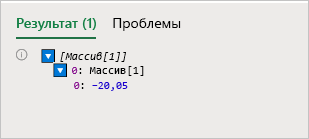
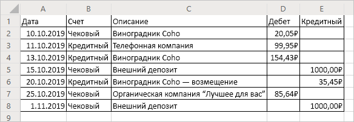

# <a name="read-workbook-data-with-office-scripts-in-excel-on-the-web"></a><span data-ttu-id="6868f-103">Чтение данных книги с помощью сценариев Office в Excel в Интернете</span><span class="sxs-lookup"><span data-stu-id="6868f-103">Read workbook data with Office Scripts in Excel on the web</span></span>

<span data-ttu-id="6868f-104">В этом учебнике объясняется, как читать данные из книги с помощью сценария Office для Excel в Интернете.</span><span class="sxs-lookup"><span data-stu-id="6868f-104">This tutorial will teach you how to read data from a workbook with an Office Script for Excel on the web.</span></span> <span data-ttu-id="6868f-105">После этого вы сможете отредактировать прочитанные данные и вернуть их в книгу.</span><span class="sxs-lookup"><span data-stu-id="6868f-105">You'll then edit the data you read and put it back in the workbook.</span></span>

> [!TIP]
> <span data-ttu-id="6868f-106">Если вы только приступили к работе со сценариями Office, рекомендуем начать с учебника [Запись, редактирование и создание сценариев Office в Excel в Интернете](excel-tutorial.md).</span><span class="sxs-lookup"><span data-stu-id="6868f-106">If you are new to Office Scripts, we recommend starting with the [Record, edit, and create Office Scripts in Excel on the web](excel-tutorial.md) tutorial.</span></span>

## <a name="prerequisites"></a><span data-ttu-id="6868f-107">Необходимые компоненты</span><span class="sxs-lookup"><span data-stu-id="6868f-107">Prerequisites</span></span>

[!INCLUDE [Preview note](../includes/preview-note.md)]

<span data-ttu-id="6868f-108">Перед началом работы с этим учебником у вас должен быть доступ к сценариям Office. Для этого требуется следующее:</span><span class="sxs-lookup"><span data-stu-id="6868f-108">Before starting this tutorial, you'll need access to Office Scripts, which requires the following:</span></span>

- <span data-ttu-id="6868f-109">[Excel в Интернете](https://www.office.com/launch/excel).</span><span class="sxs-lookup"><span data-stu-id="6868f-109">[Excel on the web](https://www.office.com/launch/excel).</span></span>
- <span data-ttu-id="6868f-110">Попросите своего администратора [включить сценарии Office для организации](https://support.office.com/article/office-scripts-settings-in-m365-19d3c51a-6ca2-40ab-978d-60fa49554dcf), в результате чего на ленту добавится вкладка **Автоматизировать**.</span><span class="sxs-lookup"><span data-stu-id="6868f-110">Ask your administrator to [enable Office Scripts for your organization](https://support.office.com/article/office-scripts-settings-in-m365-19d3c51a-6ca2-40ab-978d-60fa49554dcf), which adds the **Automate** tab to the ribbon.</span></span>

> [!IMPORTANT]
> <span data-ttu-id="6868f-111">Этот учебник предназначен для пользователей с начальным и средним уровнем знаний по JavaScript или TypeScript.</span><span class="sxs-lookup"><span data-stu-id="6868f-111">This tutorial is intended for people with beginner to intermediate-level knowledge of JavaScript or TypeScript.</span></span> <span data-ttu-id="6868f-112">Если вы впервые работаете с JavaScript, рекомендуем прочесть [учебник Mozilla по JavaScript](https://developer.mozilla.org/docs/Web/JavaScript/Guide/Introduction).</span><span class="sxs-lookup"><span data-stu-id="6868f-112">If you're new to JavaScript, we recommend reviewing the [Mozilla JavaScript tutorial](https://developer.mozilla.org/docs/Web/JavaScript/Guide/Introduction).</span></span> <span data-ttu-id="6868f-113">Чтобы получить дополнительные сведения о среде сценариев, ознакомьтесь со статьей [Сценарии Office в Excel в Интернете](../overview/excel.md).</span><span class="sxs-lookup"><span data-stu-id="6868f-113">Visit [Office Scripts in Excel on the web](../overview/excel.md) to learn more about the script environment.</span></span>

## <a name="read-a-cell"></a><span data-ttu-id="6868f-114">Чтение ячейки</span><span class="sxs-lookup"><span data-stu-id="6868f-114">Read a cell</span></span>

<span data-ttu-id="6868f-115">Сценарии, созданные с помощью средства записи действий, могут только записывать информацию в книгу.</span><span class="sxs-lookup"><span data-stu-id="6868f-115">Scripts made with the Action Recorder can only write information to the workbook.</span></span> <span data-ttu-id="6868f-116">С помощью редактора кода можно редактировать и создавать сценарии, которые также читают данные из книги.</span><span class="sxs-lookup"><span data-stu-id="6868f-116">With the Code Editor, you can edit and make scripts that also read data from a workbook.</span></span>

<span data-ttu-id="6868f-117">Давайте создадим сценарий, читающий данные и действующий на основе прочитанного.</span><span class="sxs-lookup"><span data-stu-id="6868f-117">Let's make a script that reads data and acts based on what was read.</span></span> <span data-ttu-id="6868f-118">Мы будем работать с примером банковской выписки.</span><span class="sxs-lookup"><span data-stu-id="6868f-118">We're going to work with a sample banking statement.</span></span> <span data-ttu-id="6868f-119">Эта выписка объединяет чековую выписку и выписку по кредиту.</span><span class="sxs-lookup"><span data-stu-id="6868f-119">This statement is a combined checking and credit statement.</span></span> <span data-ttu-id="6868f-120">К сожалению, изменения баланса в них указываются по-разному.</span><span class="sxs-lookup"><span data-stu-id="6868f-120">Unfortunately, they report balance changes differently.</span></span> <span data-ttu-id="6868f-121">В чековой выписке доходы указываются как положительный кредит, а расходы — в виде отрицательного дебета.</span><span class="sxs-lookup"><span data-stu-id="6868f-121">The checking statement gives income as positive credit and costs as negative debit.</span></span> <span data-ttu-id="6868f-122">В выписке по кредиту все наоборот.</span><span class="sxs-lookup"><span data-stu-id="6868f-122">The credit statement does the opposite.</span></span>

<span data-ttu-id="6868f-123">В остальной части учебника мы нормализуем эти данные с помощью сценария.</span><span class="sxs-lookup"><span data-stu-id="6868f-123">Over the rest of the tutorial, we will normalize this data using a script.</span></span> <span data-ttu-id="6868f-124">Сначала научимся читать данные из книги.</span><span class="sxs-lookup"><span data-stu-id="6868f-124">First, let's learn how to read data from the workbook.</span></span>

1. <span data-ttu-id="6868f-125">Создайте лист в книге, которую вы использовали в остальной части учебника.</span><span class="sxs-lookup"><span data-stu-id="6868f-125">Create a new worksheet in the workbook you've used for the rest of the tutorial.</span></span>
2. <span data-ttu-id="6868f-126">Скопируйте следующие данные и вставьте их на новый лист, начиная с ячейки **A1**.</span><span class="sxs-lookup"><span data-stu-id="6868f-126">Copy the following data and paste it into the new worksheet, starting at cell **A1**.</span></span>

    |<span data-ttu-id="6868f-127">Дата</span><span class="sxs-lookup"><span data-stu-id="6868f-127">Date</span></span> |<span data-ttu-id="6868f-128">Счет</span><span class="sxs-lookup"><span data-stu-id="6868f-128">Account</span></span> |<span data-ttu-id="6868f-129">Описание</span><span class="sxs-lookup"><span data-stu-id="6868f-129">Description</span></span> |<span data-ttu-id="6868f-130">Дебет</span><span class="sxs-lookup"><span data-stu-id="6868f-130">Debit</span></span> |<span data-ttu-id="6868f-131">Кредит</span><span class="sxs-lookup"><span data-stu-id="6868f-131">Credit</span></span> |
    |:--|:--|:--|:--|:--|
    |<span data-ttu-id="6868f-132">10.10.2019</span><span class="sxs-lookup"><span data-stu-id="6868f-132">10/10/2019</span></span> |<span data-ttu-id="6868f-133">Чековый</span><span class="sxs-lookup"><span data-stu-id="6868f-133">Checking</span></span> |<span data-ttu-id="6868f-134">Виноградник Coho</span><span class="sxs-lookup"><span data-stu-id="6868f-134">Coho Vineyard</span></span> |<span data-ttu-id="6868f-135">–20,05</span><span class="sxs-lookup"><span data-stu-id="6868f-135">-20.05</span></span> | |
    |<span data-ttu-id="6868f-136">11.10.2019</span><span class="sxs-lookup"><span data-stu-id="6868f-136">10/11/2019</span></span> |<span data-ttu-id="6868f-137">Кредитный</span><span class="sxs-lookup"><span data-stu-id="6868f-137">Credit</span></span> |<span data-ttu-id="6868f-138">Телефонная компания</span><span class="sxs-lookup"><span data-stu-id="6868f-138">The Phone Company</span></span> |<span data-ttu-id="6868f-139">99,95</span><span class="sxs-lookup"><span data-stu-id="6868f-139">99.95</span></span> | |
    |<span data-ttu-id="6868f-140">13.10.2019</span><span class="sxs-lookup"><span data-stu-id="6868f-140">10/13/2019</span></span> |<span data-ttu-id="6868f-141">Кредитный</span><span class="sxs-lookup"><span data-stu-id="6868f-141">Credit</span></span> |<span data-ttu-id="6868f-142">Виноградник Coho</span><span class="sxs-lookup"><span data-stu-id="6868f-142">Coho Vineyard</span></span> |<span data-ttu-id="6868f-143">154,43</span><span class="sxs-lookup"><span data-stu-id="6868f-143">154.43</span></span> | |
    |<span data-ttu-id="6868f-144">15.10.2019</span><span class="sxs-lookup"><span data-stu-id="6868f-144">10/15/2019</span></span> |<span data-ttu-id="6868f-145">Чековый</span><span class="sxs-lookup"><span data-stu-id="6868f-145">Checking</span></span> |<span data-ttu-id="6868f-146">Внешний депозит</span><span class="sxs-lookup"><span data-stu-id="6868f-146">External Deposit</span></span> | |<span data-ttu-id="6868f-147">1000</span><span class="sxs-lookup"><span data-stu-id="6868f-147">1000</span></span> |
    |<span data-ttu-id="6868f-148">20.10.2019</span><span class="sxs-lookup"><span data-stu-id="6868f-148">10/20/2019</span></span> |<span data-ttu-id="6868f-149">Кредитный</span><span class="sxs-lookup"><span data-stu-id="6868f-149">Credit</span></span> |<span data-ttu-id="6868f-150">Виноградник Coho — возмещение</span><span class="sxs-lookup"><span data-stu-id="6868f-150">Coho Vineyard - Refund</span></span> | |<span data-ttu-id="6868f-151">–35,45</span><span class="sxs-lookup"><span data-stu-id="6868f-151">-35.45</span></span> |
    |<span data-ttu-id="6868f-152">25.10.2019</span><span class="sxs-lookup"><span data-stu-id="6868f-152">10/25/2019</span></span> |<span data-ttu-id="6868f-153">Чековый</span><span class="sxs-lookup"><span data-stu-id="6868f-153">Checking</span></span> |<span data-ttu-id="6868f-154">Органическая компания "Лучшее для вас"</span><span class="sxs-lookup"><span data-stu-id="6868f-154">Best For You Organics Company</span></span> | <span data-ttu-id="6868f-155">–85,64</span><span class="sxs-lookup"><span data-stu-id="6868f-155">-85.64</span></span> | |
    |<span data-ttu-id="6868f-156">01.11.2019</span><span class="sxs-lookup"><span data-stu-id="6868f-156">11/01/2019</span></span> |<span data-ttu-id="6868f-157">Чековый</span><span class="sxs-lookup"><span data-stu-id="6868f-157">Checking</span></span> |<span data-ttu-id="6868f-158">Внешний депозит</span><span class="sxs-lookup"><span data-stu-id="6868f-158">External Deposit</span></span> | |<span data-ttu-id="6868f-159">1000</span><span class="sxs-lookup"><span data-stu-id="6868f-159">1000</span></span> |

3. <span data-ttu-id="6868f-160">Откройте **Редактор кода** и выберите **Создать сценарий**.</span><span class="sxs-lookup"><span data-stu-id="6868f-160">Open the **Code Editor** and select **New Script**.</span></span>
4. <span data-ttu-id="6868f-161">Давайте очистим форматирование.</span><span class="sxs-lookup"><span data-stu-id="6868f-161">Let's clean up the formatting.</span></span> <span data-ttu-id="6868f-162">Это финансовый документ, поэтому изменим числовой формат в столбцах **Дебет** и **Кредит**, чтобы отобразить значения в долларах.</span><span class="sxs-lookup"><span data-stu-id="6868f-162">This is a financial document, so let's change the number formatting in the **Debit** and **Credit** columns to show values as dollar amounts.</span></span> <span data-ttu-id="6868f-163">Также настроим ширину столбца по данным.</span><span class="sxs-lookup"><span data-stu-id="6868f-163">Let's also fit the column width to the data.</span></span>

    <span data-ttu-id="6868f-164">Замените содержимое сценария следующим кодом:</span><span class="sxs-lookup"><span data-stu-id="6868f-164">Replace the script contents with the following code:</span></span>

    ```TypeScript
    async function main(context: Excel.RequestContext) {
      // Get the current worksheet.
      let workbook = context.workbook;
      let worksheets = workbook.worksheets;
      let selectedSheet = worksheets.getActiveWorksheet();

      // Format the range to display numerical dollar amounts.
      selectedSheet.getRange("D2:E8").numberFormat = [["$#,##0.00"]];

      // Fit the width of all the used columns to the data.
      selectedSheet.getUsedRange().format.autofitColumns();
    }
    ```

5. <span data-ttu-id="6868f-165">Теперь прочитаем значение в одном из числовых столбцов.</span><span class="sxs-lookup"><span data-stu-id="6868f-165">Now let's read a value from one of the number columns.</span></span> <span data-ttu-id="6868f-166">Добавьте следующий код в конце сценария:</span><span class="sxs-lookup"><span data-stu-id="6868f-166">Add the following code to the end of the script:</span></span>

    ```TypeScript
    // Get the value of cell D2.
    let range = selectedSheet.getRange("D2");
    range.load("values");
    await context.sync();
  
    // Print the value of D2.
    console.log(range.values);
    ```

    <span data-ttu-id="6868f-167">Обратите внимание на вызовы `load` и `sync`.</span><span class="sxs-lookup"><span data-stu-id="6868f-167">Note the calls to `load` and `sync`.</span></span> <span data-ttu-id="6868f-168">Подробные сведения об этих методах можно найти в статье [Основные сведения о сценариях Office в Excel в Интернете](../develop/scripting-fundamentals.md#sync-and-load).</span><span class="sxs-lookup"><span data-stu-id="6868f-168">You can learn the details of those methods in [Scripting Fundamentals for Office Scripts in Excel on the web](../develop/scripting-fundamentals.md#sync-and-load).</span></span> <span data-ttu-id="6868f-169">Пока же учитывайте, что требуется запросить данные для чтения, а затем синхронизировать сценарий с книгой, чтобы прочесть эти данные.</span><span class="sxs-lookup"><span data-stu-id="6868f-169">For now, know that you must request data to be read and then sync your script with the workbook to read that data.</span></span>

6. <span data-ttu-id="6868f-170">Запустите сценарий.</span><span class="sxs-lookup"><span data-stu-id="6868f-170">Run the script.</span></span>
7. <span data-ttu-id="6868f-171">Откройте консоль.</span><span class="sxs-lookup"><span data-stu-id="6868f-171">Open the console.</span></span> <span data-ttu-id="6868f-172">Откройте меню **Многоточие** и нажмите **Журналы...**.</span><span class="sxs-lookup"><span data-stu-id="6868f-172">Go to the **Ellipses** menu and press **Logs...**.</span></span>
8. <span data-ttu-id="6868f-173">В консоли должно отображаться следующее: `[Array[1]]`.</span><span class="sxs-lookup"><span data-stu-id="6868f-173">You should see `[Array[1]]` in the console.</span></span> <span data-ttu-id="6868f-174">Это не число, так как диапазоны являются двухмерными массивами данных.</span><span class="sxs-lookup"><span data-stu-id="6868f-174">This is not a number because ranges are two-dimensional arrays of data.</span></span> <span data-ttu-id="6868f-175">Этот двухмерный диапазон напрямую регистрируется в консоли.</span><span class="sxs-lookup"><span data-stu-id="6868f-175">That two-dimensional range is being logged to the console directly.</span></span> <span data-ttu-id="6868f-176">К счастью, редактор кода позволяет просмотреть содержимое массива.</span><span class="sxs-lookup"><span data-stu-id="6868f-176">Luckily, the Code Editor does let you see the contents of the array.</span></span>
9. <span data-ttu-id="6868f-177">Когда двухмерный массив регистрируется в консоли, она группирует значения столбцов под каждой строкой.</span><span class="sxs-lookup"><span data-stu-id="6868f-177">When a two-dimensional array is logged to the console, it groups column values under each row.</span></span> <span data-ttu-id="6868f-178">Разверните журнал массива, нажав синий треугольник.</span><span class="sxs-lookup"><span data-stu-id="6868f-178">Expand the array log by pressing the blue triangle.</span></span>
10. <span data-ttu-id="6868f-179">Разверните второй уровень массива, нажав появившийся синий треугольник.</span><span class="sxs-lookup"><span data-stu-id="6868f-179">Expand the second level of the array by pressing the newly revealed blue triangle.</span></span> <span data-ttu-id="6868f-180">Должно отобразиться следующее:</span><span class="sxs-lookup"><span data-stu-id="6868f-180">You should now see this:</span></span>

    

## <a name="modify-the-value-of-a-cell"></a><span data-ttu-id="6868f-182">Изменение значения ячейки</span><span class="sxs-lookup"><span data-stu-id="6868f-182">Modify the value of a cell</span></span>

<span data-ttu-id="6868f-183">Теперь, когда мы можем читать данные, воспользуемся ими, чтобы изменить книгу.</span><span class="sxs-lookup"><span data-stu-id="6868f-183">Now that we can read data, let's use that data to modify the workbook.</span></span> <span data-ttu-id="6868f-184">Мы сделаем значение ячейки **D2** положительным с помощью функции `Math.abs`.</span><span class="sxs-lookup"><span data-stu-id="6868f-184">We'll make the value of the cell **D2** positive with the `Math.abs` function.</span></span> <span data-ttu-id="6868f-185">Объект [Math](https://developer.mozilla.org/docs/web/javascript/reference/global_objects/math) содержит множество функций, к которым имеют доступ сценарии.</span><span class="sxs-lookup"><span data-stu-id="6868f-185">The [Math](https://developer.mozilla.org/docs/web/javascript/reference/global_objects/math) object contains many functions to which your scripts have access.</span></span> <span data-ttu-id="6868f-186">Дополнительные сведения о `Math` и других встроенных объектах можно найти в статье [Использование встроенных объектов JavaScript в сценариях Office](../develop/javascript-objects.md).</span><span class="sxs-lookup"><span data-stu-id="6868f-186">More information about `Math` and other built-in objects can be found at [Using built-in JavaScript objects in Office Scripts](../develop/javascript-objects.md).</span></span>

1. <span data-ttu-id="6868f-187">Добавьте следующий код в конце сценария:</span><span class="sxs-lookup"><span data-stu-id="6868f-187">Add the following code to the end of the script:</span></span>

    ```TypeScript
    // Run the `Math.abs` function with the value at D2 and apply that value back to D2.
    let positiveValue = Math.abs(range.values[0][0]);
    range.values = [[positiveValue]];
    ```

2. <span data-ttu-id="6868f-188">Значение ячейки **D2** теперь должно быть положительным.</span><span class="sxs-lookup"><span data-stu-id="6868f-188">The value of cell **D2** should now be positive.</span></span>

## <a name="modify-the-values-of-a-column"></a><span data-ttu-id="6868f-189">Изменение значений столбца</span><span class="sxs-lookup"><span data-stu-id="6868f-189">Modify the values of a column</span></span>

<span data-ttu-id="6868f-190">Теперь, когда вы знаете, как читать и записывать данные в одной ячейке, давайте обобщим сценарий для работы со всеми столбцами **Дебет** и **Кредит**.</span><span class="sxs-lookup"><span data-stu-id="6868f-190">Now that we know how to read and write to a single cell, let's generalize the script to work on the entire **Debit** and **Credit** columns.</span></span>

1. <span data-ttu-id="6868f-191">Удалите код, влияющий только на одну ячейку (предыдущий код с абсолютным значением), чтобы ваш сценарий выглядел следующим образом:</span><span class="sxs-lookup"><span data-stu-id="6868f-191">Remove the code that affects only a single cell (the previous absolute value code), such that your script now looks like this:</span></span>

    ```TypeScript
    async function main(context: Excel.RequestContext) {
      // Get the current worksheet.
      let workbook = context.workbook;
      let worksheets = workbook.worksheets;
      let selectedSheet = worksheets.getActiveWorksheet();

      // Format the range to display numerical dollar amounts.
      selectedSheet.getRange("D2:E8").numberFormat = [["$#,##0.00"]];

      // Fit the width of all the used columns to the data.
      selectedSheet.getUsedRange().format.autofitColumns();
    }
    ```

2. <span data-ttu-id="6868f-192">Добавьте цикл, выполняющий итерацию в строках двух последних столбцов.</span><span class="sxs-lookup"><span data-stu-id="6868f-192">Add a loop that iterates through the rows in the last two columns.</span></span> <span data-ttu-id="6868f-193">Для каждой ячейки сценарий устанавливает текущее абсолютное значение.</span><span class="sxs-lookup"><span data-stu-id="6868f-193">For each cell, the script sets the value to the current value's absolute value.</span></span>

    <span data-ttu-id="6868f-194">Обратите внимание, что массив, определяющий расположения ячеек, отсчитывается от нуля.</span><span class="sxs-lookup"><span data-stu-id="6868f-194">Note that the array defining cell locations is zero-based.</span></span> <span data-ttu-id="6868f-195">Это означает, что ячейка **A1** имеет значение `range[0][0]`.</span><span class="sxs-lookup"><span data-stu-id="6868f-195">That means cell **A1** is `range[0][0]`.</span></span>

    ```TypeScript
    // Get the values of the used range.
    let range = selectedSheet.getUsedRange();
    range.load("rowCount,values");
    await context.sync();

    // Iterate over the fourth and fifth columns and set their values to their absolute value.
    for (let i = 1; i < range.rowCount; i++) {
      // The column at index 3 is column "4" in the worksheet.
      if (range.values[i][3] != 0) {
        let positiveValue = Math.abs(range.values[i][3]);
        selectedSheet.getCell(i, 3).values = [[positiveValue]];
      }

      // The column at index 4 is column "5" in the worksheet.
      if (range.values[i][4] != 0) {
        let positiveValue = Math.abs(range.values[i][4]);
        selectedSheet.getCell(i, 4).values = [[positiveValue]];
      }
    }
    ```

    <span data-ttu-id="6868f-196">Эта часть сценария выполняет несколько важных задач.</span><span class="sxs-lookup"><span data-stu-id="6868f-196">This portion of the script does several important tasks.</span></span> <span data-ttu-id="6868f-197">Сначала она загружает значения и количество строк используемого диапазона.</span><span class="sxs-lookup"><span data-stu-id="6868f-197">First, it loads the values and row count of the used range.</span></span> <span data-ttu-id="6868f-198">Это позволяет просматривать значения и определять момент остановки.</span><span class="sxs-lookup"><span data-stu-id="6868f-198">This lets us look at values and know when to stop.</span></span> <span data-ttu-id="6868f-199">Затем выполняется итерация в используемом диапазоне с проверкой каждой ячейки в столбцах **Дебет** или **Кредит**.</span><span class="sxs-lookup"><span data-stu-id="6868f-199">Second, it iterates through the used range, checking each cell in the **Debit** or **Credit** columns.</span></span> <span data-ttu-id="6868f-200">Наконец, если значение в ячейке не равно 0, оно заменяется абсолютным значением.</span><span class="sxs-lookup"><span data-stu-id="6868f-200">Finally, if the value in the cell is not 0, it is replaced by its absolute value.</span></span> <span data-ttu-id="6868f-201">Мы избегаем использования нулей, поэтому можно оставить пустые ячейки неизменными.</span><span class="sxs-lookup"><span data-stu-id="6868f-201">We're avoiding zeroes so we can leave the blank cells as they were.</span></span>

3. <span data-ttu-id="6868f-202">Запустите сценарий.</span><span class="sxs-lookup"><span data-stu-id="6868f-202">Run the script.</span></span>

    <span data-ttu-id="6868f-203">Теперь банковская выписка должна выглядеть следующим образом:</span><span class="sxs-lookup"><span data-stu-id="6868f-203">Your banking statement should now look like this:</span></span>

    

## <a name="next-steps"></a><span data-ttu-id="6868f-205">Дальнейшие действия</span><span class="sxs-lookup"><span data-stu-id="6868f-205">Next steps</span></span>

<span data-ttu-id="6868f-206">Откройте редактор кода и попробуйте некоторые [примеры сценариев Office в Excel в Интернете](../resources/excel-samples.md).</span><span class="sxs-lookup"><span data-stu-id="6868f-206">Open the Code Editor and try out some of our [Sample scripts for Office Scripts in Excel on the web](../resources/excel-samples.md).</span></span> <span data-ttu-id="6868f-207">Дополнительные сведения о создании сценариев Office доступны в статье [Основные сведения о сценариях Office в Excel в Интернете](../develop/scripting-fundamentals.md).</span><span class="sxs-lookup"><span data-stu-id="6868f-207">You can also visit [Scripting Fundamentals for Office Scripts in Excel on the web](../develop/scripting-fundamentals.md) to learn more about creating Office Scripts.</span></span>
