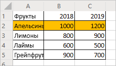
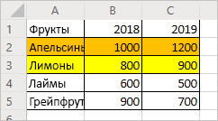
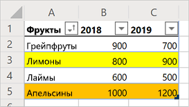

# <a name="record-edit-and-create-office-scripts-in-excel-on-the-web"></a><span data-ttu-id="2085e-103">Запись, редактирование и создание сценариев Office в Excel в Интернете</span><span class="sxs-lookup"><span data-stu-id="2085e-103">Record, edit, and create Office Scripts in Excel on the web</span></span>

<span data-ttu-id="2085e-104">В этом учебнике вы ознакомитесь с основами записи, редактирования и создания сценария Office для Excel в Интернете.</span><span class="sxs-lookup"><span data-stu-id="2085e-104">This tutorial will teach you the basics of recording, editing, and writing an Office Script for Excel on the web.</span></span>

## <a name="prerequisites"></a><span data-ttu-id="2085e-105">Необходимые компоненты</span><span class="sxs-lookup"><span data-stu-id="2085e-105">Prerequisites</span></span>

[!INCLUDE [Preview note](../includes/preview-note.md)]

<span data-ttu-id="2085e-106">Перед началом работы с этим учебником у вас должен быть доступ к сценариям Office. Для этого требуется следующее:</span><span class="sxs-lookup"><span data-stu-id="2085e-106">Before starting this tutorial, you'll need access to Office Scripts, which requires the following:</span></span>

- <span data-ttu-id="2085e-107">[Excel в Интернете](https://www.office.com/launch/excel).</span><span class="sxs-lookup"><span data-stu-id="2085e-107">[Excel on the web](https://www.office.com/launch/excel).</span></span>
- <span data-ttu-id="2085e-108">Попросите своего администратора [включить сценарии Office для организации](https://support.office.com/article/office-scripts-settings-in-m365-19d3c51a-6ca2-40ab-978d-60fa49554dcf), в результате чего на ленту добавится вкладка **Автоматизировать**.</span><span class="sxs-lookup"><span data-stu-id="2085e-108">Ask your administrator to [enable Office Scripts for your organization](https://support.office.com/article/office-scripts-settings-in-m365-19d3c51a-6ca2-40ab-978d-60fa49554dcf), which adds the **Automate** tab to the ribbon.</span></span>

> [!IMPORTANT]
> <span data-ttu-id="2085e-109">Этот учебник предназначен для пользователей с начальным и средним уровнем знаний по JavaScript или TypeScript.</span><span class="sxs-lookup"><span data-stu-id="2085e-109">This tutorial is intended for people with beginner to intermediate-level knowledge of JavaScript or TypeScript.</span></span> <span data-ttu-id="2085e-110">Если вы впервые работаете с JavaScript, рекомендуем прочесть [учебник Mozilla по JavaScript](https://developer.mozilla.org/docs/Web/JavaScript/Guide/Introduction).</span><span class="sxs-lookup"><span data-stu-id="2085e-110">If you're new to JavaScript, we recommend reviewing the [Mozilla JavaScript tutorial](https://developer.mozilla.org/docs/Web/JavaScript/Guide/Introduction).</span></span> <span data-ttu-id="2085e-111">Чтобы получить дополнительные сведения о среде сценариев, ознакомьтесь со статьей [Сценарии Office в Excel в Интернете](../overview/excel.md).</span><span class="sxs-lookup"><span data-stu-id="2085e-111">Visit [Office Scripts in Excel on the web](../overview/excel.md) to learn more about the script environment.</span></span>

## <a name="add-data-and-record-a-basic-script"></a><span data-ttu-id="2085e-112">Добавление данных и запись простого сценария</span><span class="sxs-lookup"><span data-stu-id="2085e-112">Add data and record a basic script</span></span>

<span data-ttu-id="2085e-113">Сначала нам потребуются некоторые данные и небольшой начальный сценарий.</span><span class="sxs-lookup"><span data-stu-id="2085e-113">First, we'll need some data and a small starting script.</span></span>

1. <span data-ttu-id="2085e-114">Создайте книгу в Excel в Интернете.</span><span class="sxs-lookup"><span data-stu-id="2085e-114">Create a new workbook in Excel for the Web.</span></span>
2. <span data-ttu-id="2085e-115">Скопируйте следующие данные о продаже фруктов и вставьте их на лист, начиная с ячейки **A1**.</span><span class="sxs-lookup"><span data-stu-id="2085e-115">Copy the following fruit sales data and paste it into the worksheet, starting at cell **A1**.</span></span>

    |<span data-ttu-id="2085e-116">Фрукты</span><span class="sxs-lookup"><span data-stu-id="2085e-116">Fruit</span></span> |<span data-ttu-id="2085e-117">2018</span><span class="sxs-lookup"><span data-stu-id="2085e-117">2018</span></span> |<span data-ttu-id="2085e-118">2019</span><span class="sxs-lookup"><span data-stu-id="2085e-118">2019</span></span> |
    |:---|:---|:---|
    |<span data-ttu-id="2085e-119">Апельсины</span><span class="sxs-lookup"><span data-stu-id="2085e-119">Oranges</span></span> |<span data-ttu-id="2085e-120">1000</span><span class="sxs-lookup"><span data-stu-id="2085e-120">1000</span></span> |<span data-ttu-id="2085e-121">1200</span><span class="sxs-lookup"><span data-stu-id="2085e-121">1200</span></span> |
    |<span data-ttu-id="2085e-122">Лимоны</span><span class="sxs-lookup"><span data-stu-id="2085e-122">Lemons</span></span> |<span data-ttu-id="2085e-123">800</span><span class="sxs-lookup"><span data-stu-id="2085e-123">800</span></span> |<span data-ttu-id="2085e-124">900</span><span class="sxs-lookup"><span data-stu-id="2085e-124">900</span></span> |
    |<span data-ttu-id="2085e-125">Лаймы</span><span class="sxs-lookup"><span data-stu-id="2085e-125">Limes</span></span> |<span data-ttu-id="2085e-126">600</span><span class="sxs-lookup"><span data-stu-id="2085e-126">600</span></span> |<span data-ttu-id="2085e-127">500</span><span class="sxs-lookup"><span data-stu-id="2085e-127">500</span></span> |
    |<span data-ttu-id="2085e-128">Грейпфруты</span><span class="sxs-lookup"><span data-stu-id="2085e-128">Grapefruits</span></span> |<span data-ttu-id="2085e-129">900</span><span class="sxs-lookup"><span data-stu-id="2085e-129">900</span></span> |<span data-ttu-id="2085e-130">700</span><span class="sxs-lookup"><span data-stu-id="2085e-130">700</span></span> |

3. <span data-ttu-id="2085e-131">Откройте вкладку **Автоматизировать**. Если вы не видите вкладку **Автоматизировать**, проверьте переполнение ленты, нажав стрелку раскрывающегося списка.</span><span class="sxs-lookup"><span data-stu-id="2085e-131">Open the **Automate** tab. If you do not see the **Automate** tab, check the ribbon overflow by pressing the drop-down arrow.</span></span>
4. <span data-ttu-id="2085e-132">Нажмите кнопку **Записать действия**.</span><span class="sxs-lookup"><span data-stu-id="2085e-132">Press the **Record Actions** button.</span></span>
5. <span data-ttu-id="2085e-133">Выделите ячейки **A2:C2** (строка "Апельсины") и установите оранжевый цвет заливки.</span><span class="sxs-lookup"><span data-stu-id="2085e-133">Select cells **A2:C2** (the "Oranges" row) and set the fill color to orange.</span></span>
6. <span data-ttu-id="2085e-134">Чтобы остановить запись, нажмите кнопку **Остановить**.</span><span class="sxs-lookup"><span data-stu-id="2085e-134">Stop the recording by pressing the **Stop** button.</span></span>
7. <span data-ttu-id="2085e-135">Введите в поле **Имя сценария** запоминающееся имя.</span><span class="sxs-lookup"><span data-stu-id="2085e-135">Fill in the **Script Name** field with a memorable name.</span></span>
8. <span data-ttu-id="2085e-136">*Необязательно.* Введите в поле **Описание** понятное описание.</span><span class="sxs-lookup"><span data-stu-id="2085e-136">*Optional:* Fill in the **Description** field with a meaningful description.</span></span> <span data-ttu-id="2085e-137">Оно используется для предоставления контекста в отношении действий сценария.</span><span class="sxs-lookup"><span data-stu-id="2085e-137">This is used to provide context as to what the script does.</span></span> <span data-ttu-id="2085e-138">Для этого учебника можно использовать описание "Цветовая кодировка строк таблицы".</span><span class="sxs-lookup"><span data-stu-id="2085e-138">For the tutorial, you can use "Color-codes rows of a table".</span></span>

   > [!TIP]
   > <span data-ttu-id="2085e-139">Вы можете изменить описание сценария позже в области **Сведения о сценарии**, расположенной в меню **...** редактора кода.</span><span class="sxs-lookup"><span data-stu-id="2085e-139">You can edit a script's description later from the **Script Details** pane, which is located under the Code Editor's **...** menu.</span></span>

9. <span data-ttu-id="2085e-140">Сохраните сценарий, нажав кнопку **Сохранить**.</span><span class="sxs-lookup"><span data-stu-id="2085e-140">Save the script by pressing the **Save** button.</span></span>

    <span data-ttu-id="2085e-141">Ваш лист должен выглядеть, как показано ниже (не волнуйтесь, если цвет отличается):</span><span class="sxs-lookup"><span data-stu-id="2085e-141">Your worksheet should look like this (don't worry if the color is different):</span></span>

    

## <a name="edit-an-existing-script"></a><span data-ttu-id="2085e-143">Редактирование существующего сценария</span><span class="sxs-lookup"><span data-stu-id="2085e-143">Edit an existing script</span></span>

<span data-ttu-id="2085e-144">Предыдущий сценарий окрасил строку "Апельсины" в оранжевый цвет.</span><span class="sxs-lookup"><span data-stu-id="2085e-144">The previous script colored the "Oranges" row to be orange.</span></span> <span data-ttu-id="2085e-145">Давайте добавим желтый цвет для строки "Лимоны".</span><span class="sxs-lookup"><span data-stu-id="2085e-145">Let's add a yellow row for the "Lemons".</span></span>

1. <span data-ttu-id="2085e-146">Откройте вкладку **Автоматизировать**.</span><span class="sxs-lookup"><span data-stu-id="2085e-146">Open the **Automate** tab.</span></span>
2. <span data-ttu-id="2085e-147">Нажмите кнопку **Редактор кода**.</span><span class="sxs-lookup"><span data-stu-id="2085e-147">Press the **Code Editor** button.</span></span>
3. <span data-ttu-id="2085e-148">Откройте сценарий, записанный в предыдущем разделе.</span><span class="sxs-lookup"><span data-stu-id="2085e-148">Open the script you recorded in the previous section.</span></span> <span data-ttu-id="2085e-149">Должен отобразится примерно такой код:</span><span class="sxs-lookup"><span data-stu-id="2085e-149">You should see something similar to this code:</span></span>

    ```TypeScript
    async function main(context: Excel.RequestContext) {
      // Set fill color to FFC000 for range Sheet1!A2:C2
      let workbook = context.workbook;
      let worksheets = workbook.worksheets;
      let selectedSheet = worksheets.getActiveWorksheet();
      selectedSheet.getRange("A2:C2").format.fill.color = "FFC000";
    }
    ```

    <span data-ttu-id="2085e-150">Этот код получает текущий лист, сначала обращаясь к коллекции листов книги.</span><span class="sxs-lookup"><span data-stu-id="2085e-150">This code gets the current worksheet by first accessing the workbook's worksheet collection.</span></span> <span data-ttu-id="2085e-151">Затем он настраивает цвет заливки диапазона **A2:C2**.</span><span class="sxs-lookup"><span data-stu-id="2085e-151">Then, it sets the fill color of the range **A2:C2**.</span></span>

    <span data-ttu-id="2085e-152">Диапазоны — это фундаментальная часть сценариев Office в Excel в Интернете.</span><span class="sxs-lookup"><span data-stu-id="2085e-152">Ranges are a fundamental part of Office Scripts in Excel on the web.</span></span> <span data-ttu-id="2085e-153">Диапазон — это непрерывный прямоугольный блок ячеек, содержащий значения, формулы и форматирование.</span><span class="sxs-lookup"><span data-stu-id="2085e-153">A range is a contiguous, rectangular block of cells that contains values, formula, and formatting.</span></span> <span data-ttu-id="2085e-154">Они представляют собой базовую структуру ячеек, в которой можно выполнять большинство задач сценариев.</span><span class="sxs-lookup"><span data-stu-id="2085e-154">They are the basic structure of cells through which you'll perform most of your scripting tasks.</span></span>

4. <span data-ttu-id="2085e-155">Добавьте следующую строку в конце сценария (между местом настройки значения `color` и закрывающей скобкой `}`):</span><span class="sxs-lookup"><span data-stu-id="2085e-155">Add the following line to the end of the script (between where the `color` is set and the closing `}`):</span></span>

    ```TypeScript
    selectedSheet.getRange("A3:C3").format.fill.color = "yellow";
    ```

5. <span data-ttu-id="2085e-156">Протестируйте сценарий, нажав **Запустить**.</span><span class="sxs-lookup"><span data-stu-id="2085e-156">Test the script by pressing **Run**.</span></span> <span data-ttu-id="2085e-157">Книга должна выглядеть следующим образом:</span><span class="sxs-lookup"><span data-stu-id="2085e-157">Your workbook should now look like this:</span></span>

    

## <a name="create-a-table"></a><span data-ttu-id="2085e-159">Создание таблицы</span><span class="sxs-lookup"><span data-stu-id="2085e-159">Create a table</span></span>

<span data-ttu-id="2085e-160">Давайте преобразуем эти данные продаж фруктов в таблицу.</span><span class="sxs-lookup"><span data-stu-id="2085e-160">Let's convert this fruit sales data into a table.</span></span> <span data-ttu-id="2085e-161">Мы воспользуемся собственным сценарием для всего процесса.</span><span class="sxs-lookup"><span data-stu-id="2085e-161">We'll use our script for the entire process.</span></span>

1. <span data-ttu-id="2085e-162">Добавьте следующую строку в конце сценария (перед закрывающей скобкой `}`):</span><span class="sxs-lookup"><span data-stu-id="2085e-162">Add the following line to the end of the script (before the closing `}`):</span></span>

    ```TypeScript
    let table = selectedSheet.tables.add("A1:C5", true);
    ```

2. <span data-ttu-id="2085e-163">Этот вызов возвращает объект `Table`.</span><span class="sxs-lookup"><span data-stu-id="2085e-163">That call returns a `Table` object.</span></span> <span data-ttu-id="2085e-164">Воспользуемся этой таблицей, чтобы отсортировать данные.</span><span class="sxs-lookup"><span data-stu-id="2085e-164">Let's use that table to sort the data.</span></span> <span data-ttu-id="2085e-165">Отсортируем данные по возрастанию на основе значений в столбце "Фрукты".</span><span class="sxs-lookup"><span data-stu-id="2085e-165">We'll sort the data in ascending order based on the values in the "Fruit" column.</span></span> <span data-ttu-id="2085e-166">Добавьте следующую строку после создания таблицы:</span><span class="sxs-lookup"><span data-stu-id="2085e-166">Add the following line after the table creation:</span></span>

    ```TypeScript
    table.sort.apply([{ key: 0, ascending: true }]);
    ```

    <span data-ttu-id="2085e-167">Ваш сценарий должен выглядеть так:</span><span class="sxs-lookup"><span data-stu-id="2085e-167">Your script should look like this:</span></span>

    ```TypeScript
    async function main(context: Excel.RequestContext) {
      // Set fill color to FFC000 for range Sheet1!A2:C2
      let workbook = context.workbook;
      let worksheets = workbook.worksheets;
      let selectedSheet = worksheets.getActiveWorksheet();
      selectedSheet.getRange("A2:C2").format.fill.color = "FFC000";
      selectedSheet.getRange("A3:C3").format.fill.color = "yellow";
      let table = selectedSheet.tables.add("A1:C5", true);
      table.sort.apply([{ key: 0, ascending: true }]);
    }
    ```

    <span data-ttu-id="2085e-168">В таблицах есть объект `TableSort`, доступный с помощью свойства `Table.sort`.</span><span class="sxs-lookup"><span data-stu-id="2085e-168">Tables have a `TableSort` object, accessed through the `Table.sort` property.</span></span> <span data-ttu-id="2085e-169">Вы можете применить условия сортировки к этому объекту.</span><span class="sxs-lookup"><span data-stu-id="2085e-169">You can apply sorting criteria to that object.</span></span> <span data-ttu-id="2085e-170">Метод `apply` использует массив объектов `SortField`.</span><span class="sxs-lookup"><span data-stu-id="2085e-170">The `apply` method takes in an array of `SortField` objects.</span></span> <span data-ttu-id="2085e-171">В этом случае у нас есть только одно условие сортировки, поэтому мы используем только один параметр `SortField`.</span><span class="sxs-lookup"><span data-stu-id="2085e-171">In this case, we only have one sorting criteria, so we only use one `SortField`.</span></span> <span data-ttu-id="2085e-172">`key: 0` присваивает столбцу со значениями, определяющими сортировку, значение "0" (это первый столбец в таблице, в данном случае: **A**).</span><span class="sxs-lookup"><span data-stu-id="2085e-172">`key: 0` sets the column with the sort-defining values to "0" (which is the first column on the table, **A** in this case).</span></span> <span data-ttu-id="2085e-173">`ascending: true` сортирует данные по возрастанию (вместо порядка по убыванию).</span><span class="sxs-lookup"><span data-stu-id="2085e-173">`ascending: true` sorts the data in ascending order (instead of descending order).</span></span>

3. <span data-ttu-id="2085e-174">Запустите сценарий.</span><span class="sxs-lookup"><span data-stu-id="2085e-174">Run the script.</span></span> <span data-ttu-id="2085e-175">Вы увидите следующую таблицу:</span><span class="sxs-lookup"><span data-stu-id="2085e-175">You should see a table like this:</span></span>

    

    > [!NOTE]
    > <span data-ttu-id="2085e-177">При повторном запуске сценария возникнет ошибка.</span><span class="sxs-lookup"><span data-stu-id="2085e-177">If you re-run the script, you'll get an error.</span></span> <span data-ttu-id="2085e-178">Это связано с тем, что вы не можете создать таблицу поверх другой таблицы.</span><span class="sxs-lookup"><span data-stu-id="2085e-178">This is because you cannot create a table on top of another table.</span></span> <span data-ttu-id="2085e-179">Однако вы можете запустить этот сценарий на другом листе или в другой книге.</span><span class="sxs-lookup"><span data-stu-id="2085e-179">However, you can run the script on a different worksheet or workbook.</span></span>

### <a name="re-run-the-script"></a><span data-ttu-id="2085e-180">Повторный запуск сценария</span><span class="sxs-lookup"><span data-stu-id="2085e-180">Re-run the script</span></span>

1. <span data-ttu-id="2085e-181">Создайте лист в текущей книге.</span><span class="sxs-lookup"><span data-stu-id="2085e-181">Create a new worksheet in the current workbook.</span></span>
2. <span data-ttu-id="2085e-182">Скопируйте данные фруктов из начала учебника и вставьте их на новый лист, начиная с ячейки **A1**.</span><span class="sxs-lookup"><span data-stu-id="2085e-182">Copy the fruit data from the beginning of the tutorial and paste it into the new worksheet, starting at cell **A1**.</span></span>
3. <span data-ttu-id="2085e-183">Запустите сценарий.</span><span class="sxs-lookup"><span data-stu-id="2085e-183">Run the script.</span></span>

## <a name="next-steps"></a><span data-ttu-id="2085e-184">Дальнейшие действия</span><span class="sxs-lookup"><span data-stu-id="2085e-184">Next steps</span></span>

<span data-ttu-id="2085e-185">Выполните инструкции учебника [Чтение данных книги с помощью сценариев Office в Excel в Интернете](excel-read-tutorial.md).</span><span class="sxs-lookup"><span data-stu-id="2085e-185">Complete the [Read workbook data with Office Scripts in Excel on the web](excel-read-tutorial.md) tutorial.</span></span> <span data-ttu-id="2085e-186">С его помощью вы научитесь читать данные из книги с помощью сценариев Office.</span><span class="sxs-lookup"><span data-stu-id="2085e-186">It teaches you how to read data from a workbook with an Office Script.</span></span>
